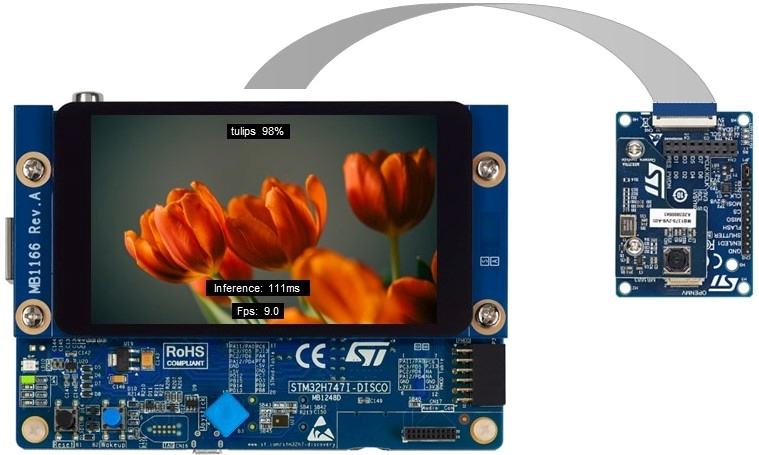
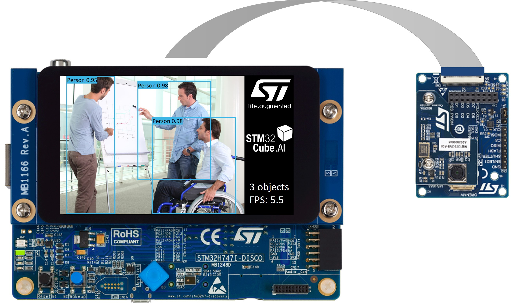
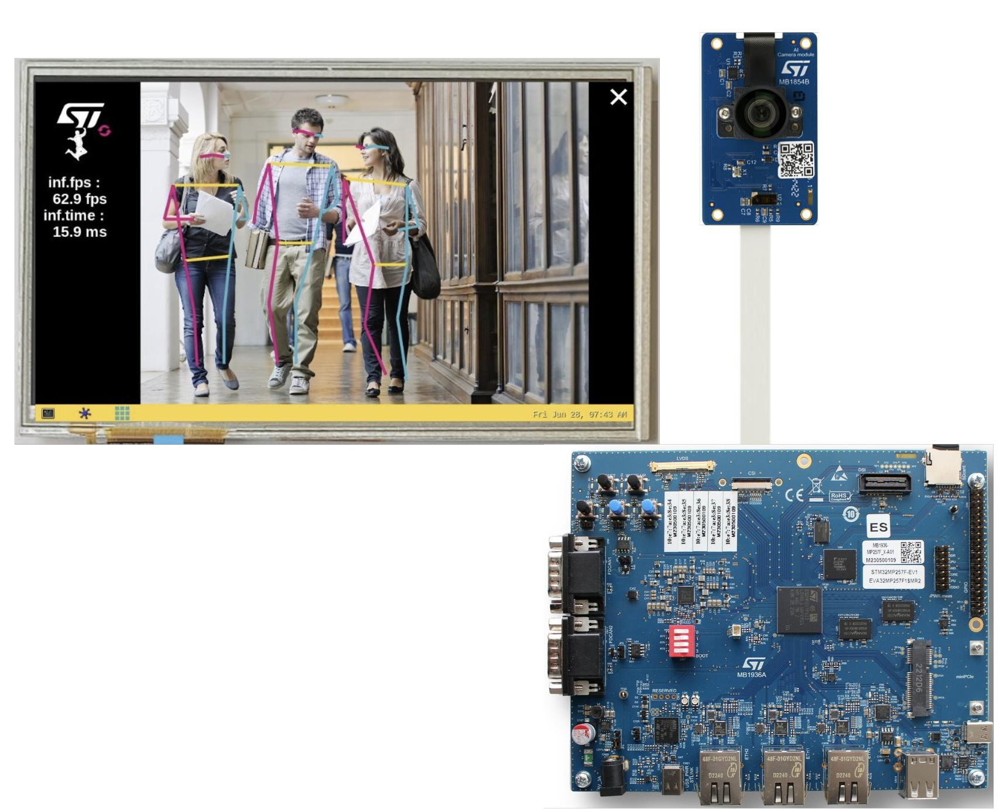
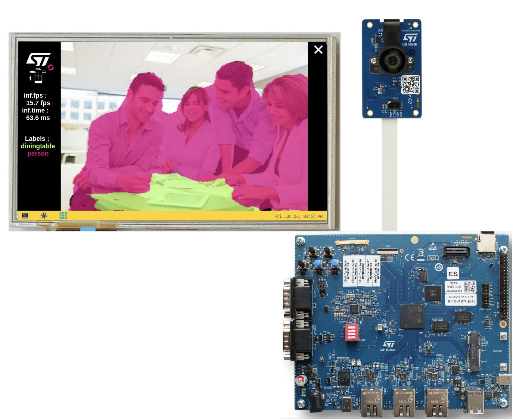
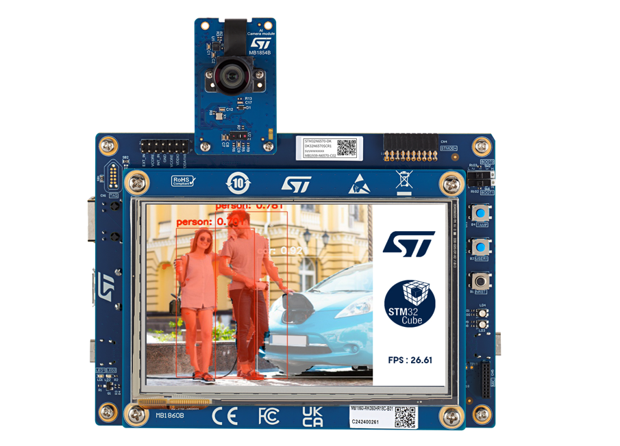
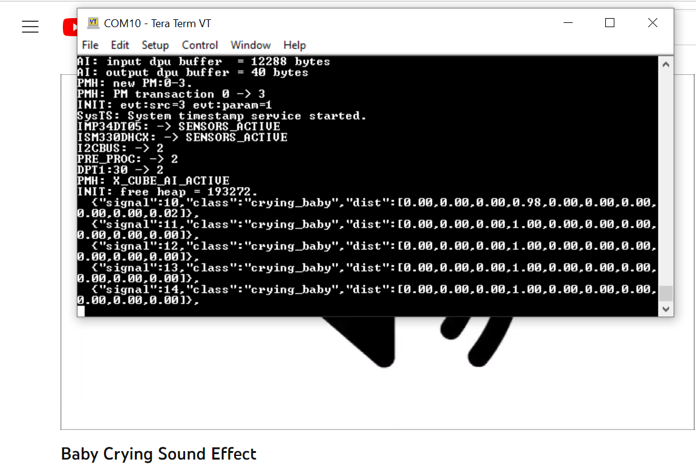
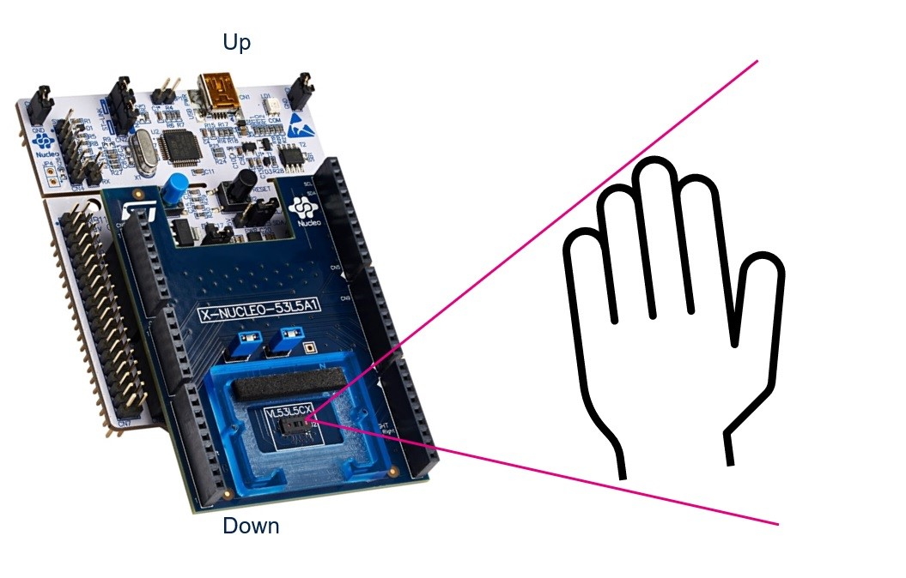

# STMicroelectronics – STM32 model zoo

Welcome to STM32 model zoo!

The STM32 AI model zoo is a collection of reference machine learning models that are optimized to run on STM32
microcontrollers.
Available on GitHub, this is a valuable resource for anyone looking to add AI capabilities to their STM32-based
projects.

- A large collection of application-oriented models ready for re-training
- Pre-trained models on reference datasets

**Scripts to easily retrain, quantize, evaluate or benchmark any model from user datasets as well as application code examples automatically generated from user AI model can be found in the  [stm32ai-modelzoo-services GitHub](https://github.com/STMicroelectronics/stm32ai-modelzoo-services)** 


These models can be useful for quick deployment if you are interested in the categories that they were trained. We also provide training scripts to do transfer learning or to train your own model from scratch on your custom dataset.

The performances on reference STM32 MCU, NPU and MPU are provided for float and quantized models.

## What's new in releases :
</details>
<details open><summary><b>3.0:</b></summary>

* Included additional models compatible with the [STM32N6570-DK](https://www.st.com/en/evaluation-tools/stm32n6570-dk) board.
* Expanded models in all use cases.
* Expanded use case support to include `Instance Segmentation` and `Speech Enhancement`.
* Added `Pytorch` support through the speech enhancement Use Case.
* Model Zoo hosted on <a href="#Hugging Face">Hugging Face</a>
</details>
<details><summary><b>2.1:</b></summary>

* Included additional models compatible with the [STM32MP257F-EV1](https://www.st.com/en/evaluation-tools/stm32mp257f-ev1) board.
* Expanded use case support to include `Pose Estimation` and `Semantic Segmentation`.
</details>
<details><summary><b>2.0:</b></summary>

* An aligned and `uniform architecture` for all the use case
</details>


## Find below a summary of available use cases
| Use Case             | Quick definition  | Suitable Targets for deployment |  Smart example  |
|--------------------|------------------|-----------------|------------ |
| [Image Classification](./image_classification/README.md)   | Classifies the content of an image within a predefined set of classes.     | [STM32H747I-DISCO](https://github.com/STMicroelectronics/stm32ai-modelzoo-services/blob/main/application_code/image_classification/STM32H7/README.md) <br> [NUCLEO-H743ZI2](https://github.com/STMicroelectronics/stm32ai-modelzoo-services/blob/main/application_code/image_classification/STM32H7/README.md) <br>  [STM32MP257F-EV1](https://github.com/STMicroelectronics/stm32ai-modelzoo-services/blob/main/application_code/image_classification/STM32MP-LINUX/STM32MP2/README.md) <br> [STM32N6570-DK](https://www.st.com/en/development-tools/stm32n6-ai.html) <br> | <div align="center" style="width:480px; margin: left;"> |
| [Object Detection](./object_detection/README.md)   | Detects, locates and estimates the occurences probability of predefined objects from input images.     | [STM32H747I-DISCO](https://github.com/STMicroelectronics/stm32ai-modelzoo-services/blob/main/application_code/object_detection/STM32H7/README.md) <br>  [STM32MP257F-EV1](https://github.com/STMicroelectronics/stm32ai-modelzoo-services/blob/main/application_code/object_detection/STM32MP-LINUX/STM32MP2/README.md) <br> [STM32N6570-DK](https://www.st.com/en/development-tools/stm32n6-ai.html) <br> | <div align="center" style="width:480px; margin: left;"> |
| [Pose Estimation](./pose_estimation/README.md)   | Detects key points on some specific objects (people, hand, face, ...).     | [STM32MP257F-EV1](https://github.com/STMicroelectronics/stm32ai-modelzoo-services/blob/main/application_code/pose_estimation/STM32MP-LINUX/STM32MP2/README.md) <br> [STM32N6570-DK](https://www.st.com/en/development-tools/stm32n6-ai.html) <br> | <div align="center" style="width:480px; margin: left;"> |
| [Semantic Segmentation](./semantic_segmentation/README.md)   | Associates a label to every pixel in an image to recognize a collection of pixels that form distinct categories.     | [STM32MP257F-EV1](https://github.com/STMicroelectronics/stm32ai-modelzoo-services/blob/main/application_code/STM32MP-LINUX/STM32MP2/README.md) <br> [STM32N6570-DK](https://www.st.com/en/development-tools/stm32n6-ai.html) <br> | <div align="center" style="width:480px; margin: left;"> |
| [Instance Segmentation](./instance_segmentation/README.md)   | Associates a label to every pixel in an image to recognize a collection of pixels that form distinct categories or instances of each category.     |  [STM32N6570-DK](https://www.st.com/en/development-tools/stm32n6-ai.html) <br> | <div align="center" style="width:480px; margin: left;"> |
| [Audio Event Detection](./audio_event_detection/README.md)   | Detection of a specific audio events.     | [B-U585I-IOT02A ThreadX](https://github.com/STMicroelectronics/stm32ai-modelzoo-services/blob/main/application_code/sensing_thread_x/STM32U5/README.md) <br> [B-U585I-IOT02A FreeRTOS](https://github.com/STMicroelectronics/stm32ai-modelzoo-services/blob/main/application_code/sensing_free_rtos/STM32U5/README.md) <br> [STM32N6570-DK](https://www.st.com/en/development-tools/stm32n6-ai.html) <br> | <div align="center" style="width:480px; margin: left;"> |
| [Speech Enhancement](./speech_enhancement/README.md)   | Enhancement of the audio perception in a noisy environment.     |  [STM32N6570-DK](https://www.st.com/en/development-tools/stm32n6-ai.html) <br> | <div align="center" style="width:480px; margin: left;"> |
| [Human Activity Recognition](./human_activity_recognition/README.md)   | Recognizes various activities like walking, running, ...     |  [B-U585I-IOT02A](https://github.com/STMicroelectronics/stm32ai-modelzoo-services/blob/main/application_code/sensing_thread_x/STM32U5/README.md) <br> | <div align="center" style="width:480px; margin: left;"> |
| [Hand Posture Recognition](./hand_posture/README.md)   | Recognizes a set of hand postures using Time of Flight (ToF) sensor     |  [NUCLEO-F401RE](https://github.com/STMicroelectronics/stm32ai-modelzoo-services/blob/main/application_code/hand_posture/STM32F4/README.md) <br> | <div align="center" style="width:480px; margin: left;"> |
</div>


## <a id="Hugging Face">Hugging Face host</a>
The Model Zoo Dashboard is hosted in a Docker environment under the [STMicroelectronics Organization](https://huggingface.co/STMicroelectronics). This dashboard is developed using Dash Plotly and Flask, and it operates within a Docker container.
It can also run locally if Docker is installed on your system. The dashboard provides the following features:

•	Training: Train machine learning models.
•	Evaluation: Evaluate the performance of models.
•	Benchmarking: Benchmark your model using ST Edge AI Developer Cloud
•	Visualization: Visualize model performance and metrics.
•	User Configuration Update: Update and modify user configurations directly from the dashboard.
•	Output Download: Download model results and outputs.

You can also find our models on Hugging Face under the [STMicroelectronics Organization](https://huggingface.co/STMicroelectronics). Each model from the STM32AI Model Zoo is represented by a model card on Hugging Face, providing all the necessary information about the model and linking to dedicated scripts.


## Before you start
The model zoo repo is using the `git lfs`, so the users need to install and set up the `git lfs` before cloning the repo. This can be done by following the instructions below.


- **On Ubuntu:**
    ```sh
    sudo apt-get install git-lfs
    ```

- **On Windows:**
    Download the Git LFS extension [here](https://git-lfs.github.com/).

Once downloaded and installed, set up Git LFS for your user account by running the following command:

```sh
git lfs install
```
You should see the message `Git LFS initialized.` if the command runs successfully. 

**NOTE:** If you do not see the message `Git LFS initialized.`, visit the [GitHub documentation page](https://docs.github.com/en/repositories/working-with-files/managing-large-files/installing-git-large-file-storage) for more details and support.

### Clone the Repository

```sh
git clone https://github.com/STMicroelectronics/stm32ai-modelzoo.git
```


