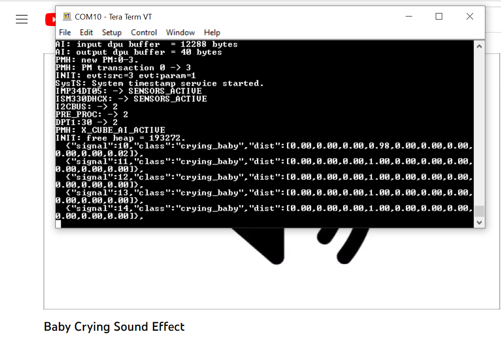

# Audio Event Detection STM32 model deployment

This tutorial shows how to deploy your pre-trained keras or sklearn (onnx) models on an STM32 board using *STM32Cube.AI*. It will also cover the quantization of the pretrained keras models, to have an even more effecient deployment. 

In addition, this tutorial will also explain how to deploy a model from **[ST public model zoo](../../models/README.md)** directly on your *STM32 target board*. In this version only deployment on the [B-U585I-IOT02A](https://www.st.com/en/evaluation-tools/b-u585i-iot02a.html) is supported.

## Table of contents
 - <a href='#prereqs'>Before you start</a><br>

 - <a href='#deploy'>Deploy a keras model on STM32 board</a><br>

 - <a href='#quantize'>Quantize your model before deployment</a><br>

<!-- [Validating the performance of the C application](#validation) -->

## Before you start
<a id='prereqs'></a>


Please check out [STM32 model zoo](../../models/README.md) for audio event detection (AED).

### **1. Hardware setup**

The [getting started](../../getting_started/README.md) is running on an STMicroelectronics evaluation kit board called [B-U585I-IOT02A](https://www.st.com/en/evaluation-tools/b-u585i-iot02a.html). The current version of the audio Getting Started only supports this board, and usage of the digital microphone.


### **2. Software requirements**

You need to download and install the following software:

- [STM32CubeIDE](https://www.st.com/en/development-tools/stm32cubeide.html)
- If using [STM32Cube.AI](https://www.st.com/en/embedded-software/x-cube-ai.html) locally, open link and download the package, then extract both `'.zip'` and `'.pack'` files.

### **3. Specifications**

- `serie` : STM32U5
- `IDE` : GCC
- `quantization_input_type` : int8
- `quantization_output_type` : float

<a name="deploy"></a>
# Deploy a Keras, tflite or .onnx model

### **1. Configure the yaml file**

You can run a demo using a pretrained model from [STM32 model zoo](../../models/README.md). Please refer to the yaml file provided alongside the tflite model to fill the following parameters in [user_config.yaml](user_config.yaml).

As an example, we will show how to deploy the [yamnet_256](../../models/yamnet/ST_pretrainedmodel_public_dataset/esc_10/yamnet_256_64x96/yamnet_256_64x96_int8.tflite) model pretrained on Audioset, using the pre-processing parameters specified in the [user_config.yaml](../../models/yamnet/ST_pretrainedmodel_public_dataset/esc_10/yamnet_256_64x96/yamnet_256_64x96_config.yaml) file.

**1.1. General settings:**

Configure the **general** section in **[user_config.yaml](user_config.yaml)** in the following way:


```python
general:
 project_name: AED_project

```

where:

- `project_name` - *String*, name of the project. `AED_project` or any other name of your choice.

**1.2. Dataset configuration:**

You need to specify some parameters related to the dataset and the preprocessing of the data in the **[user_config.yaml](user_config.yaml)** which will be parsed into a header file used to run the C application.

**1.2.1. Dataset info:**

Configure the **dataset** section in **[user_config.yaml](user_config.yaml)** as the following:
```python
 dataset:
  name: esc10
  class_names: ['dog', 'chainsaw', 'crackling_fire', 'helicopter', 'rain',
       'crying_baby', 'clock_tick', 'sneezing', 'rooster', 'sea_waves']
  audio_path: ..\training\datasets\ESC-50\audio
  csv_path: ..\training\datasets\ESC-50\meta\esc50.csv
  file_extension: .wav
  validation_split: 0.1
  test_split : 0.05
  test_path: 
```

where:

- `name` - Dataset name. We use `esc10` in this example
- `class_names` - A list containing the classes name. This will be used to show the inference result on the serial terminal. These are sorted alphabetically when training using the scripts in the model zoo, and before deployment as well. 
  
For example, if you followed the training tutorial, the class corresponding to [1, 0, 0, 0, 0, 0, 0, 0, 0, 0] would not be `dog`, but `chainsaw`. This sorting will also be performed during deployment, so you don't need to sort your classes inside the `user_config.yaml` file.

NOTE : All the following parameters are only taken into account if choosing to perform evaluation before deployment. 

- `audio_path` - Path to the folder containing the audio clips. Only taken into account if choosing to perform evaluation before deployment. 
- `csv_path` - Path to the .csv file containing the filenames and labels. Only taken into account if choosing to perform evaluation before deployment. 
- `file_extension` - Extension of the audio files. Will be automatically appended to the end of the filenames contained in the .csv file if necessary when fetching the audio files. Only taken into account if choosing to perform evaluation before deployment. 
- `validation_split` - Real number between 0 and 1. Proportion of the training set to use for validation. If left empty, defaults to 0.1 Only taken into account if choosing to perform evaluation before deployment. 
- `test_split` - Real number between 0 and 1. Proportion of the dataset to use as test set. If left empty, defaults to 0.2. Only taken into account if choosing to perform evaluation before deployment. 
- `test_path` - If you want to use a specific subset of data for testing, include a path to the csv file for this subset, in the same format as the one provided in `csv_path`. If this is not empty, `test_split` will be ignored. You will also need to make sure that there is no overlap between this specific test set and the dataset provided in `test_path`. Audio files must be put in the folder given in `audio_path`. Only taken into account if choosing to perform evaluation before deployment. 

**1.2.2. Preprocessing info:**

If using the deployment script to perform evaluation, you must specify the temporal domain preprocessing pipeline to be used for the evaluation data. 

IMPORTANT NOTE : Except for the `target_rate` parameter which lets you select the sampling rate of the on-board microphone, these parameters do not influence temporal domain preprocessing done on device. 

THEY ARE ONLY USED TO PRE-PROCESS EVALUATION DATA ON PC.

Please also note that the on-board digital microphone on the B-U585I-IOT02A board used for this tutorial only supports 16 kHz and 48 kHz sampling rates.

See the training or evaluation READMEs for more details on the temporal domain preprocessing pipeline.

To do so, you need to specify the **preprocessing** configuration in **[user_config.yaml](user_config.yaml)** in the following way : 


```python
pre_processing:
  min_length: 1
  max_length : 10
  target_rate: 16000
  top_db: 60
  frame_length: 3200
  hop_length: 3200
  trim_last_second: False
  lengthen : 'after'
```

where:

- `min_length` - Desired minimum length of the waveform, in seconds
- `max_length` - Desired maximum length of the waveform, in seconds
- `target_rate` - Desired sampling rate. Resulting waveform will be resampled to this rate.
  
  IMPORTANT NOTE : When deploying on the B-U585I-IOT02A board, this must be set to either 16000 or 48000.
- `top_db` - Decibel threshold for silence removal. Higher means stricter. For example, using `top_db=30` will remove more audio than using `top_db=60`, because in the second case, the average power of the signal in a frame must be below -60dB for it to be removed, instead of -30dB.
- `frame_length` - Length of frames used for silence removal, in number of samples.
- `hop_length` - Hop length used for silence removal, in number of samples.
- `trim_last_second` - Boolean. If True, will cut the waveform to an integer number of seconds. For example, if the resulting waveform would be 4s and 500 ms, this flag will instead cut it to 4s.
- `lengthen` - Valid values :  "before" or "after". If set to "before", audio repetition will be performed before silence removal. If set to "after", audio repetition will be performed after. 
WARNING : setting this option to "before" may result in the resulting waveform being shorter than `min_length`. Set to "after" if you are unsure.

**1.3. Log-melspectrogram computation and patch extraction info**

Unlike the section above, the majority of the parameters specified here WILL influence the feature extraction pipeline on device.
It is usually critical to model performance that these parameters are the same used during training.
Please also note that the on-board digital microphone on the B-U585I-IOT02A board used for this tutorial only supports 16 kHz and 48 kHz sampling rates.

For more details on the feature extraction pipeline, please refer to the training README.

You need to specify some parameters related to the frequency domain pre-processing of the data in the **[user_config.yaml](user_config.yaml)** which will be parsed into a header file used to run the C application, in the following way : 

```python
feature_extraction:
  patch_length: 96
  n_mels: 64
  overlap: 0.25
  n_fft: 512
  hop_length: 160
  window_length: 400
  window: hann
  center: False
  pad_mode: constant
  power: 1.0
  fmin: 125
  fmax: 7500
  norm: None
  htk : True
  to_db : False
  include_last_patch: False
  ```

  where : 

- `patch_length` - Number of frames to include in each patch. Patches will be of shape `n_mels` x `patch_length`
- `n_mels` - Number of mel filter bins. Patches will be of shape `n_mels` x `patch_length`
- `overlap` - Real number between 0 and 0.5. Proportion of overlap between patches. Note that the actual overlap will be double this value. For example, if `overlap` is set to 0.25, with `patch_length=40` then patch N will share its first 10 frames will patch N-1, and its last 10 frames with patch N+1, for a total of 20 frames shared with other patches, i.e. half its frames.
IMPORTANT NOTE : This parameter is only used for evaluation, and has no influence on the on-device pre-processing.
- `n_fft` - Size of the FFT, in number of samples. Must be a power of 2 for deployment.
- `hop_length` - Hop length (i.e. number of successive samples) between different frames, in number of samples.
- `window_length` - Size of the window. Set equal to `n_fft` if you want to avoid window padding
- `window` - Window type. Currently, only Hanning windows (`hann`) are supported for deployment.
- `center` - Boolean. If True, frames are centered, i.e. frame `n` is centered around sample number `n * hop_length`. If False, frames begin at sample number `n * hop_length`
- `pad_mode` - Padding mode used if center is True. If center is False, does nothing.
- `power` - Exponent for the magnitude spectrogram. Set to 1.0 for energy spectrogram, and 2.0 for power spectrogram.
- `fmin` - Minimum frequency used when computing mel filter bins
- `fmax` - Maximum frequency used when computing mel filter bins
- `norm` - Mel filter weights normalization. Set to "slaney" if you are unsure. Some models, like Yamnet, expect no normalization
- `htk` - If true, use the [HTK](https://htk.eng.cam.ac.uk/) formula to compute mel filter weights. Set to "False" if you are unsure. Some models, like Yamnet, expect this to be True.
- `to_db` - If set to True, logmelspectrograms are expressed in dB units.  Set to "True" if you are unsure. Some models, like Yamnet expect this to be False.
- `include_last_patch` - If set to False, discards the last patch if it does not contain `patch_length` frames. If true, this patch is returned. NOTE : Only used for evaluation, does not influence the on-device pre-processing.
WARNING : Setting this option to True will cause errors when using models with a fixed input size !

**1.4. Load model:**

You can run a demo using any of the pretrained models provided in [ST AED model zoo](../../models/README.md) for audio event detection. These models were trained and quantized on specific datasets (e.g. ESC10).

Also, you can directly deploy your own pretrained model if quantized using *TFlite Converter* and respecting the specified [intput/output types](#3-specifications), else you can quantize your model before deploying it by following these [steps](#quantize).

The next step in deployment of the model is to configure the **model** section in **[user_config.yaml](user_config.yaml)** as the following:

```python
model:
  model_type: {name : yamnet, embedding_size : 256}
  # Shape of a single patch.
  # Input shape must be [mels, frames]
  input_shape: [64, 96]
  expand_last_dim: True
  multi_label : False
  model_path: <path_to_your_model_here>
```

where:

- `model_type` - A *dictonary* with keys relative to the model topology (see [more](./doc/models.json)). Example for Yamnet :  *{name : yamnet, embedding_size=256}*, else for a custom model use *{name : custom}*.
- `input_shape` -  A *list of int* *[n_mels, patch_length]* for the input resolution, e.g. *[64, 96]*.
- `expand_last_dim` - *Boolean* Some models expect input of the shape *[n_mels, patch_length, 1]*, often because they are repurposed image classification architectures. Set this to True if that is the case.
If using a MiniResnet, MiniResnetv2 or Yamnet, set this to True.
- `multi_label` - *Boolean*. Set to True if you want to perform multilabel classification, i.e. if each sample can belong to more than 1 class at a time. 
This is not the case in ESC-10.
NOTE : this is currently unsupported, but will be in a future version.
- `model_path` - *Path* to the .h5 or .tflite file of the model to deploy. Please check out some pretrained models from STM32 model zoo [here](../../models/README.md).
- `ood_detection_threshold` - *float* between 0 and 1. If the maximum of the model output probabilities is below this threshold, then the sample is considered to belong to an unknown class.
Please note that this is a very naïve OOD detection / OSR baseline method, and does not exhibit great performance.
**NOTE** : Cannot be used conjointly with `dataset/use_other_class`. Set `dataset/use_other_class` to False if you wish to use this OOD detection method.
Improved methods will be forthcoming in the future.


**1.5. C project configuration:**

To deploy the model in **B-U585I-IOT02A** board, we will use *STM32Cube.AI* to convert the model into optimized C code and *STM32CubeIDE* to build the C application and flash the board.

Please note that there are two different versions of the Getting Started, with two different licences. The [FreeRTOS](../../getting_started/freertos/) version has an open-source BSD3 license, while the [ThreadX](../../getting_started/threadx/) does not. There is no difference in terms of model performance (accuracy) between both versions.

These steps will be done automatically by configuring the **stm32ai** section in **[user_config.yaml](user_config.yaml)** as the following:

```python
stm32ai:
  c_project_path: ../../getting_started
  serie: STM32U5
  IDE: GCC
  verbosity: 1
  version : 7.3.0
  optimization: balanced
  footprints_on_target: False
  path_to_stm32ai: C:/stmicroelectronics/STM32Cube/Repository/Packs/STMicroelectronics/X-CUBE-AI/7.3.0/Utilities/windows/stm32ai.exe
  path_to_cubeIDE: C:/ST/STM32CubeIDE_1.10.0/STM32CubeIDE/stm32cubeidec.exe
```
where:
- `c_project_path` - *Path* to [Getting Started](../../getting_started/freertos/README.md) project.
  There are two different versions of the Getting Started, with two different licences. The [FreeRTOS](../../getting_started/freertos/) version has an open-source BSD3 license, while the [ThreadX](../../getting_started/threadx/) does not. There is no difference in terms of model performance (accuracy) between both versions.
- `serie` - **B-U585I-IOT02A**, only supported option for *Getting Started*.
- `IDE` -**GCC**, only supported option for *Getting Started*.
- `verbosity` - *0* or *1*. Mode 0 is silent, and mode 1 displays messages when building and flashing the C applicaiton.
- `version` - Specify the **STM32Cube.AI** version used to benchmark the model, e.g. **7.3.0**.
- `optimization` - *String*, define the optimization used to generate the C model, options: "*balanced*", "*time*", "*ram*".
- `footprints_on_target` - **'B-U585I-IOT02A'** to use **Developer Cloud Services** to benchmark model and generate C code, else keep **False** (i.e. only local download of **STM32Cube.AI** will be used to get model footprints and C code w/o inference time).
- `path_to_stm32ai` - *Path* to stm32ai executable file.
- `path_to_cubeIDE` - *Path* to stm32cubeide executable file.


### **2. Run deployment:**

 **2.1 Attach the board:**

 To run build the project and flash the target board, connect a B-U585I-IOT02A to your computer using the microUSB port on the board.

 **2.2 Run deploy.py**

Then, run the following command:


```bash
python deploy.py
```

This will generate the C code, show the foot-prints (and inference time), copy the model files in the Getting Started project, build the C project, and flash the board.

### **3. Quantize and evaluate your model before deployment:**
<a id='quantize'></a>

 ### **3.1. Configure the yaml file**

 In addition to the [previous steps](#1-configure-the-yaml-file), you can configure the following sections to quantize your model provided as  an `h5` file. Also, you can evaluate its accuracy after quantization if a path to the `dataset.training_path` is provided and `quantize.evaluate` is set to *True*.

 **3.1.1. Loading the dataset:**

Note that we need to use the training dataset to perform quantization, thus it is important to specify it.

Configure the **dataset** section in **[user_config.yaml](user_config.yaml)** in the following way:

```python
 dataset:
  name: esc10
  class_names: ['dog', 'chainsaw', 'crackling_fire', 'helicopter', 'rain',
       'crying_baby', 'clock_tick', 'sneezing', 'rooster', 'sea_waves']
  audio_path: ..\training\datasets\ESC-50\audio
  csv_path: ..\training\datasets\ESC-50\meta\esc50.csv
  file_extension: .wav
  validation_split: 0.1
  test_split : 0.05
  test_path:
  use_other_class: False
  n_samples_per_other_class: 2 
```

where:

- `name` - Dataset name. We use `esc10` in this example
- `class_names` - A list containing the classes name. This will be used to show the inference result on the serial terminal. These are sorted alphabetically when training using the scripts in the model zoo, and before deployment as well. 
For example, if you followed the training tutorial, the class corresponding to [1, 0, 0, 0, 0, 0, 0, 0, 0, 0] would not be `dog`, but `chainsaw`. This sorting will also be performed during deployment, so you don't need to sort your classes inside the `user_config.yaml` file.

NOTE : All the following parameters are used to perfor

- `audio_path` - Path to the folder containing the audio clips. 
- `csv_path` - Path to the .csv file containing the filenames and labels. 
- `file_extension` - Extension of the audio files. Will be automatically appended to the end of the filenames contained in the .csv file if necessary when fetching the audio files. 
- `validation_split` - Real number between 0 and 1. Proportion of the training set to use for validation. If left empty, defaults to 0.1 
- `test_split` - Real number between 0 and 1. Proportion of the dataset to use as test set. If left empty, defaults to 0.2.
- `test_path` - If you want to use a specific subset of data for testing, include a path to the csv file for this subset, in the same format as the one provided in `csv_path`. If this is not empty, `test_split` will be ignored. You will also need to make sure that there is no overlap between this specific test set and the dataset provided in `test_path`. Audio files must be put in the folder given in `audio_path`. Only taken into account if choosing to perform evaluation before deployment.
- `use_other_class` -  **(Experimental)** *boolean*, If set to True, any samples not belonging to classes specified in `class_names` get lumped together in a new "Other" class, and the model is trained on the classes specified in `class_names` plus this new class.
**WARNING** : this will yield extremely poor results unless your dataset has a lot of classes, and you are using a small proportion of them in `class_names`. **If in doubt, set to False.**
- `n_samples_per_other_class` - **(Experimental)** *int*, number of samples of each unused class to lump into the "Other" class. Generally, when lumping all samples from all unused classes into the "Other" class, the resulting dataset is extremely unbalanced. If this parameter is not provided, the scripts will try to infer a number that results in a dataset that isn't too poorly balanced.

**2.2.1. Dataset-specific parameters**
<a id='fsd50k params'></a>

We provide support for using FSD50K in the model zoo. As FSD50K's structure is quite different to what is regularly expected by the model zoo, we provide pre-processing scripts to make it compatible.
These scripts require a few parameters, which are under the `dataset_specific/fsd50K` section of [user_config.yaml](user_config.yaml).
- `csv_folder` - Folder where the dev and eval csv files are located. The default name for this folder in the archives downloaded from Zenodo is `FSD50K.ground_truth`
- `dev_audio_folder` - Folder where the dev audio files are located. The default name for this folder in the archives downloaded from Zenodo is `FSD50K.dev_audio`
- `eval_audio_folder` - Folder where the eval audio files are located. The default name for this folder in the archives downloaded from Zenodo is `FSD50K.eval_audio`
- `audioset_ontology_path` - Path to the audioset ontology JSON file. The file is provided in the model zoo [here](../utils/dataset_utils/fsd50k/audioset_ontology.json), but you can also download it from https://github.com/audioset/ontology/blob/master/ontology.json
- `only_keep_monolabel` - *boolean* If set to True, discard all multi-label samples. This is a comparatively small proportion of all samples.


 **3.1.2. Model quantization:**

 Configure the **quantization** section in **[user_config.yaml](user_config.yaml)** as the following:

 ```python
 quantization:
   quantize: True
   evaluate: True
   quantizer: TFlite_converter
   quantization_type: PTQ
   quantization_input_type: int8
   quantization_output_type: float
   export_dir: quantized_models
 ```

 where:

 - `quantize` - *Boolean*, if True model will be quantized, else False.
 - `evaluate` - *Boolean*, if True evaluate float and quantized model on the test sets.
 - `quantizer` - *String*, only option is "TFlite_converter" which will convert model trained weights from float to integer values. The quantized model will be saved in TensorFlow Lite format.
 - `quantization_type` - *String*, only option is "PTQ",i.e. "post-training quantization".
 - `quantization_input_type` - **int8**, only supported options for *getting started*.
 - `quantization_output_type` - **float**, only supported option for *getting started*.
 - `export_dir` - *String*, directory name to save the quantized model.


### **4. See the output on the board:**
Once flashed the board can be connected through a serial terminal and the output of the inference can be seen in the serial terminal. 
To connect the serial port please follow the steps shown in the figure below:


After successful connection perform a reset using [RESET] button on the board. This will reset the board and start running the inference of the AI model on the board using real-time data from the digital microphone. Following figure shows a screenshot of [getting_started](../../getting_started/README.md) project running the inference running on the board:



Each of the line in the Tera Term terminal shows the output of one inference from the live data.
Inference is run once each second.
The labels `"signal"` shows the signal index or number, the `"class"` has the label of the class detected and `"dist"` shows the probability distribution of the confidence of the signal to belong to any given class, with classes sorted in alphabetical order.

# restrictions
- In this version getting started for deployment is only supported on the [B-U585I-IOT02A](https://www.st.com/en/evaluation-tools/steval-stwinkt1b.html).
- Only the *int8* type input is supported for the quantization operation.

## **Using FSD50K in the model zoo**
<a id='fsd50k dataset'></a>

**Download the dataset**
Download the dataset here : https://zenodo.org/record/4060432
The dataset is comprised of several archives. We suggest extracting them all in the same folder, for example `datasets/FSD50K/`.

After extraction you should end up with the following folders : 
- `FSD50K.dev_audio`
- `FSD50K.doc`
- `FSD50K.eval_audio`
- `FSD50K.ground_truth`
- `FSD50K.metadata`

Strictly speaking, `FSD50K.metadata` and `FSD50K.doc` are unnecessary, so they can be deleted.

**Set up the dataset-specific parameters**
First, set `dataset/name` to `fsd50k`.

You will need to set some dataset-specific parameters in [user_config.yaml](user_config.yaml).
See <a href='#fsd50k params'>the appropriate section</a> for a detailed description of each parameter.

**NOTE** The regular `audio_path` and `csv_path` are unused for FSD50K, so you can safely leave them blank.

**Pre-process the dataset**
In order to make FSD50K compatible with the model zoo's expected dataset format, we make a few changes to the dataset. 
Notably, we **unsmear** labels, and then convert the labels to monolabel.
FSD50K comes with smeared labels. This means that some labels are added automatically. For example, any sample with the Electric_guitar label, will automatically be assigned the Music label. Unsmearing simply undoes this process, e.g. only the Electric_guitar label would remain.

Then, we convert any multilabel sample to monolabel. You can choose in which way this is done by changing the appropriate parameter in [user_config.yaml](user_config.yaml).

Support for multilabel inference is coming, so you will be able to keep smeared labels and multilabel samples in the future.

All this happens automatically if you set `dataset/name` to `fsd50k`.

That's it !

## Out-of-distribution (OOD) detection in the model zoo.
A common issue in audio event detection applications is being able to reject samples which do not come from one of the classes the model is trained on.
The model zoo provides several baseline options for doing this. 

The first option consists of thresholding the network output probabilities at runtime. This is a naïve baseline which does not yield great results, but is a good starting point. 
You can set the threshold in the [deployment user_config.yaml](../deployment/user_config.yaml), using the `model/unknown_class_threshold` parameter.

The second option consists of adding an additional "Other" class to your model at training time, using samples from the dataset which do not belong to any of the classes specified in `class_names`.
**IMPORTANT NOTE** : This feature is **experimental**. It will yield **very poor results** if the dataset provided does not have a very large number of unused classes to lump into the "Other" class. Do not expect great results from this.
You can enable this option by setting `dataset/use_other_class` to True in [user_config.yaml](user_config.yaml).

**IMPORTANT NOTE** These two methods are **NOT COMPATIBLE**, and cannot be used together. You must enable one or the other, or none at all.
