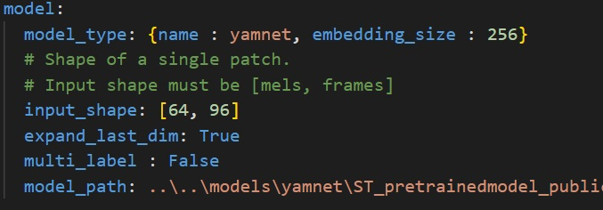
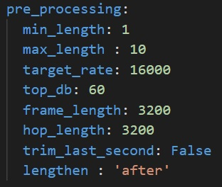
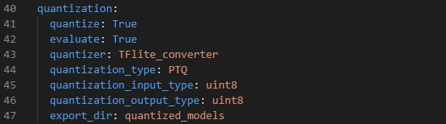
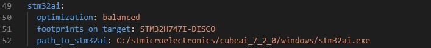
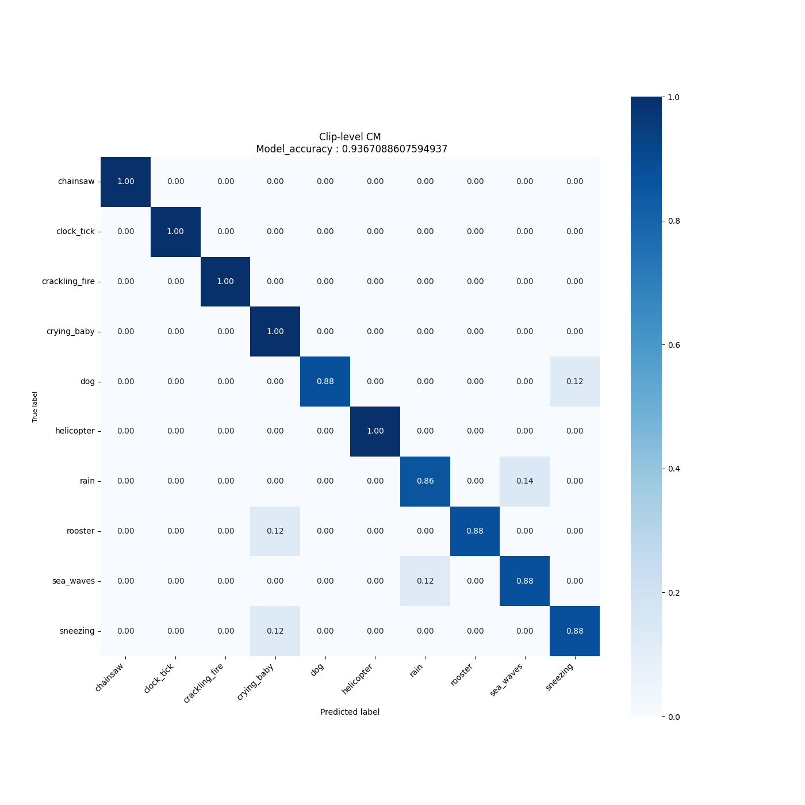
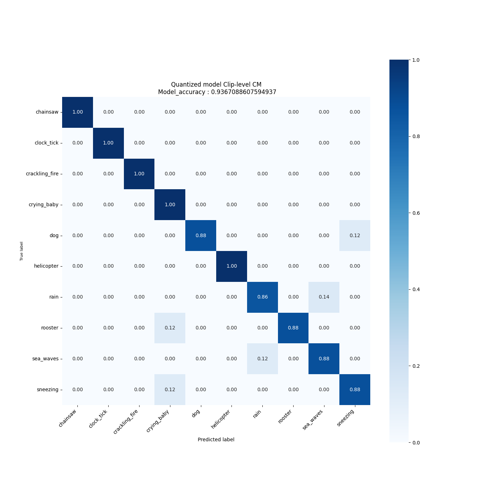

# Audio event detection STM32 model evaluate

This tutorial shows how to quantize and evaluate your pre-trained keras model using *STM32Cube.AI*.

## Table of contents

* <a href='#benchmark'>Benchmark your model using *STM32Cube.AI* </a><br>
* <a href='#Evaluate'>Evaluate the performance of your model</a><br>


## Benchmark your model using *STM32Cube.AI*
<a id='benchmark'></a>

### **1. Configure the yaml file**
**1.1. General settings:**

Configure the **general** section in **[user_config.yaml](user_config.yaml)** in the following way:

- `project_name` - *String*, name of the project.

**1.2. Load your model:**

Here you can define the model path to load and benchmark the model, also other parameters that will be useful for quantizing and evaluating the model if wanted.

To do so we will need to configure the **model** section in **[user_config.yaml](user_config.yaml)** in the following way : 



where:

- `model_type` - A *dictonary* with keys relative to the model topology (see [more](./doc/models.json)). Example for Miniresnets *{name : miniresnet, n_stacks=2}*, else for a custom model use *{name : custom}*.
- `input_shape` -  A *list of int* *[n_mels, patch_length]* for the input resolution, e.g. *[64, 50]*.
- `expand_last_dim` - *Boolean* Some models expect input of the shape *[n_mels, patch_length, 1]*, often because they are repurposed image classification architectures. Set this to True if that is the case.
If using a MiniResnet, MiniResnetv2 or Yamnet, set this to True.
- `multi_label` - *Boolean*. Set to True if you want to perform multilabel classification, i.e. if each sample can belong to more than 1 class at a time. 
This is not the case in ESC-10.
- `model_path` - *Path* to your model, the model can be in `.h5`, `SavedModel` or `.tflite` format.

**1.3. Preparing the dataset for quantization:**

If you are providing a float model, we suggest using Post-Training Quantization to optimize the model footprints. To do so, you need to provide the data used during training.

**1.3.1. Loading the dataset:**

Configure the **dataset** section in **[user_config.yaml](user_config.yaml)** in the following way:


where:

- `name` - Dataset name. Use `esc10` for ESC-10, and `custom` for a custom dataset. For instructions on how to use a custom dataset, see <a href='#custom_dataset'>the appropriate section</a><br>
- `class_names` - A list containing the names of the classes to use for training. This can be a subset of all available classes. If left empty, will default to using all available classes.
- `audio_path` - Path to the folder containing the audio clips
- `csv_path` - Path to the .csv file containing the filenames and labels.
- `file_extension` - Extension of the audio files. Will be automatically appended to the end of the filenames contained in the .csv file if necessary when fetching the audio files.
- `validation_split` - Real number between 0 and 1. Proportion of the training set to use for validation. If left empty, defaults to 0.1. For evaluation, it is recommended to set it at 0
- `test_split` - Real number between 0 and 1. Proportion of the dataset to use as test set. If left empty, defaults to 0.2. If you want to use the entire dataset for evaluation, set to 1.
- `test_path` - If you want to use a specific subset of data for testing, include a path to the csv file for this subset, in the same format as the one provided in `csv_path`. If this is not empty, `test_split` will be ignored. You will also need to make sure that there is no overlap between this specific test set and the dataset provided in `test_path`. Audio files must be put in the folder given in `audio_path`

**1.3.2. Temporal domain preprocessing:**

When performing AED, it is customary to perform some preprocessing directly on the input waveform before converting it to a spectrogram.

In our case, we keep it simple, by resampling the input waveform to a target sample rate, clipping it between a minimum and maximum duration, removing silence, and repeating the waveform if it is too short.

You can fine-tune this behaviour by modifying the **pre_processing** parameters in **[user_config.yaml](user_config.yaml)** in the following way:



- `min_length` - Desired minimum length of the waveform, in seconds
- `max_length` - Desired maximum length of the waveform, in seconds
- `target_rate` - Desired sampling rate. Resulting waveform will be resampled to this rate.
- `top_db` - Decibel threshold for silence removal. Higher means stricter. For example, using `top_db=30` will remove more audio than using `top_db=60`, because in the second case, the average power of the signal in a frame must be below -60dB for it to be removed, instead of -30dB.
- `frame_length` - Length of frames used for silence removal, in number of samples.
- `hop_length` - Hop length used for silence removal, in number of samples.
- `trim_last_second` - Boolean. If True, will cut the waveform to an integer number of seconds. For example, if the resulting waveform would be 4s and 500 ms, this flag will instead cut it to 4s.
- `lengthen` - Valid values :  "before" or "after". If set to "before", audio repetition will be performed before silence removal. If set to "after", audio repetition will be performed after. 
WARNING : setting this option to "before" may result in the resulting waveform being shorter than `min_length`. Set to "after" if you are unsure.

**1.3.3. Log-melspectogram computation and patch extraction**

After performing temporal domain preprocessing on the waveform, it is converted to a log-melspectrogram. This spectrogram is then cut up into patches of fixed size, which are then given as input to the neural network.
The patches given to the model will be of shape `n_mels` x `patch_length`.

You can fine-tune the behaviour of spectrogram computation and patch extraction by configuring the **feature_extraction** section in **[user_config.yaml](user_config.yaml)**:


- `patch_length` - Number of frames to include in each patch. Patches will be of shape `n_mels` x `patch_length`
- `n_mels` - Number of mel filter bins. Patches will be of shape `n_mels` x `patch_length`
- `overlap` - Real number between 0 and 0.5. Proportion of overlap between patches. Note that the actual overlap will be double this value. For example, if `overlap` is set to 0.25, with `patch_length=40` then patch N will share its first 10 frames will patch N-1, and its last 10 frames with patch N+1, for a total of 20 frames shared with other patches, i.e. half its frames.
- `n_fft` - Size of the FFT, in number of samples
- `hop_length` - Hop length (i.e. number of successive samples) between different frames, in number of samples.
- `window_length` - Size of the window. Set equal to `n_fft` if you want to avoid window padding
- `window` - Window type
- `center` - Boolean. If True, frames are centered, i.e. frame `n` is centered around sample number `n * hop_length`. If False, frames begin at sample number `n * hop_length`
- `pad_mode` - Padding mode used if center is True. If center is False, does nothing.
- `power` - Exponent for the magnitude spectrogram. Set to 1.0 for energy spectrogram, and 2.0 for power spectrogram.
- `fmin` - Minimum frequency used when computing mel filter bins
- `fmax` - Maximum frequency used when computing mel filter bins
- `norm` - Mel filter weights normalization. Set to "slaney" if you are unsure. Some models, like Yamnet, expect no normalization
- `htk` - If true, use the [HTK](https://htk.eng.cam.ac.uk/) formula to compute mel filter weights. Set to "False" if you are unsure. Some models, like Yamnet, expect this to be True.
- `to_db` - If set to True, logmelspectrograms are expressed in dB units.  Set to "True" if you are unsure. Some models, like Yamnet expect this to be False.
- `include_last_patch` - If set to False, discards the last patch if it does not contain `patch_length` frames. If true, this patch is returned.
WARNING : Setting this option to True will cause errors when using models with a fixed input size !

**1.4. Model Quantization:**

Quantization optimizes your model to be deployed more efficiently on your embedded device by reducing its memory usage(Flash/RAM) and accelerating its inference time, with little degradation in model accuracy.

If your model is already quantized into TensorFlow `.tflite` format, please skip this step.

Configure the **quantization** section in **[user_config.yaml](user_config.yaml)** as the following:  



where:

- `quantize` - *Boolean*, set to True to quantize your model.
- `evaluate` - *Boolean*, if True evaluate quantized model if validation or test sets are provided, else False.
- `quantizer` - *String*, only option is "TFlite_converter" which will convert model trained weights from float to integer values. The quantized model will be saved in TensorFlow Lite format.
- `quantization_type` - *String*, only option is "PTQ",i.e. "Post-Training Quantization". 
- `quantization_input_type` - *String*, can be "int8", "uint8" or "float", represents the quantization type for the model input. For AED, as spectrograms include negative values, it is recommended to use "int8" or "float"
- `quantization_output_type` - *String*, can be "int8", "uint8" or "float", represents the quantization type for the model output.
- `export_dir` - *String*, referres to directory name to save the quantized model.


**1.5. Benchmark your model with STM32Cube.AI:**

CubeAI will allow you to benchmark your model and estimate its footprints for STM32 target devices.

Make Sure to add the path to the stm32ai excutable under **path_to_stm32ai**, else you will need to provide your credentials to use the **Developer Cloud Services**:



where:
- `optimization` - *String*, define the optimization used to generate the C model, options: "*balanced*", "*time*", "*ram*".
- `footprints_on_target` - Specify board name to evaluate the model inference time on real stm32 target, e.g. **'STM32H747I-DISCO'** (see [more](../training/doc/boards.json)), else keep **False**.
- `path_to_stm32ai` - *Path* to stm32ai executable file.

### **2. Run benchmark**

Then, run the following command:


```bash
python evaluate.py
```

## Evaluate the performance of your model
<a id='Evaluate'></a>

### **1. Configure the yaml file**

First, you need to follow the previous steps in the [benchmark](#benchmark) section to configure your **[user_config.yaml](user_config.yaml)**.

In addition to the previous configurations, you need to make sure to provide a test split >=0, or the path to a test set. 

As mentioned before, you can skip the quantization section if your model is already quantized using Tflite Converter.

### **2. Run evaluation**

Then, run the following command:

```bash
python evaluate.py
```

### **3. Visualize results**

**3.1. Saved results**

All evaluation artificats are saved under the current output simulation directory **"outputs/{run_time}"**.

For example, you can retrieve the confusion matrix generated after evaluating the float/quantized model on the validation/test set as follows:





**3.2. Run MLFlow**

MLflow is an API for logging parameters, code versions, metrics, and artifacts while running machine learning code and for visualizing results.
To view and examine the results of multiple trainings, you can simply access the MLFlow Webapp by running the following command:

```bash
mlflow ui
```
And open the given IP adress in your browser.