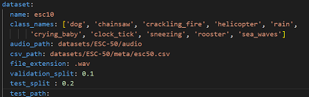
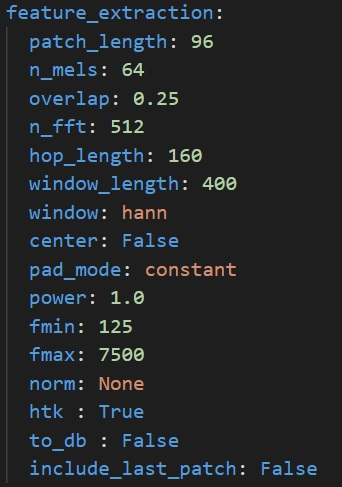
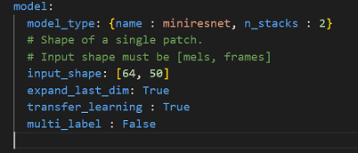
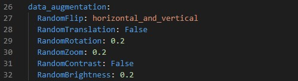
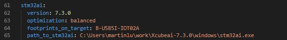
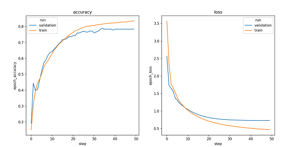
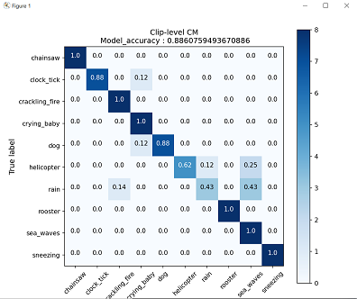

# Audio event detection STM32 model training

This tutorial shows how to train from scratch or apply transfer learning on an AED model using a custom dataset.
As an example we will demonstrating the workflow on the [ESC-10]("https://github.com/karolpiczak/ESC-50") classification dataset.

## Table of contents

* <a href='#Data'>Prepare Dataset</a><br>
* <a href='#training'>Train and Evaluate Model</a><br>
* <a href='#results'>Visualize Training Results</a><br>

## Prepare Dataset
<a id='Data'></a>

### **1. Download the dataset and extract it**

ESC-10 is distributed as part of a larger dataset, ESC-50. In this tutorial, we will download the ESC-50 dataset, but only use the ESC-10 subset for training, evaluating or performing transfer learning on the models.

Download the latest dataset release from https://github.com/karolpiczak/ESC-50#download

Then, extract the archive to a folder of your choice. The default location expected by the model zoo is the [datasets](datasets/) folder, but this can be configured.

If you want to use FSD50K, download the latest release from https://zenodo.org/record/4060432

Then, extract the several archives you have downloaded to a folder of your choice. The default location expected by the model zoo is the [datasets](datasets/) folder, but this can be configured.
You will need to specify additional parameters (such as filepaths) in [user_config.yaml](user_config.yaml). 
For instructions on how to use the model zoo with FSD50K, see the <a href='#fsd50k dataset'> Using FSD50K in the model zoo </a> section.

For instructions on how to use a custom dataset, see <a href='#custom_dataset'>the appropriate section</a><br>


### **2. Configure the yaml file**

## **2.0. Using a pre-made yaml file**
The [models](../../models/) directory contains several subfolders, one for each model architecture.
Some of these models need quite different pre-processing, feature extraction and training parameters, and using different ones could lead to wildly varying performance.

**Each of these subdirectories contains a config.yaml file used to train the model**.
**To use these in training, copy them over to the [training](./) folder, and rename them to `user_config.yaml`

**If you want to reproduce the listed performance, we recommend you use these premade .yaml files**

**Performance may be quite different if you use different parameters**

**2.1. General settings:**

Configure the **general** section in **[user_config.yaml](user_config.yaml)** in the following way


- `project_name` - *String*, name of the project.
- `logs_dir` - Path to save tensorboard logs.
- `saved_models_dir` - Path to save the trained model.

**2.1.1 TensorFlow deterministic operations**

If you want your experiments to be fully reproducible, you need to activate the `deterministic_ops` attribute.
```yaml
general:
   deterministic_ops: True
```
Enabling the `deterministic_ops` attribute will restrict TensorFlow to use only deterministic operations on the device, but it may lead to a drop in training performance. It should be noted that not all operations in the used version of TensorFlow can be computed deterministically. If your case involves any such operation, a warning message will be displayed and the attribute will be ignored.

**2.2. Loading the dataset:**

Configure the **dataset** section in **[user_config.yaml](user_config.yaml)** in the following way



where:

- `name` - Dataset name. Use `esc10` for ESC-10, `fsd50k` for FSD50K and `custom` for a custom dataset. For instructions on how to use a custom dataset, see <a href='#custom_dataset'>the appropriate section</a><br>
- `class_names` - A list containing the names of the classes to use for training. This can be a subset of all available classes. If left empty, will default to using all available classes.
- `audio_path` - Path to the folder containing the audio clips
- `csv_path` - Path to the .csv file containing the filenames and labels.
- `file_extension` - Extension of the audio files. Will be automatically appended to the end of the filenames contained in the .csv file if necessary when fetching the audio files.
- `validation_split` - Real number between 0 and 1. Proportion of the training set to use for validation. If left empty, defaults to 0.1
- `test_split` - Real number between 0 and 1. Proportion of the dataset to use as test set. If left empty, defaults to 0.2.
- `test_path` - If you want to use a specific subset of data for testing, include a path to the csv file for this subset, in the same format as the one provided in `csv_path`. If this is not empty, `test_split` will be ignored. You will also need to make sure that there is no overlap between this specific test set and the dataset provided in `test_path`. Audio files must be put in the folder given in `audio_path`
- `use_other_class` -  **(Experimental)** *boolean*, If set to True, any samples not belonging to classes specified in `class_names` get lumped together in a new "Other" class, and the model is trained on the classes specified in `class_names` plus this new class. 
**WARNING** : this will yield extremely poor results unless your dataset has a lot of classes, and you are using a small proportion of them in `class_names`. **If in doubt, set to False.**
- `n_samples_per_other_class` - **(Experimental)** *int*, number of samples of each unused class to lump into the "Other" class. Generally, when lumping all samples from all unused classes into the "Other" class, the resulting dataset is extremely unbalanced. If this parameter is not provided, the scripts will try to infer a number that results in a dataset that isn't too poorly balanced.

**2.2.1. Dataset-specific parameters**
<a id='fsd50k params'></a>

We provide support for using FSD50K in the model zoo. As FSD50K's structure is quite different to what is regularly expected by the model zoo, we provide pre-processing scripts to make it compatible.
These scripts require a few parameters, which are under the `dataset_specific/fsd50K` section of [user_config.yaml](user_config.yaml).
- `csv_folder` - Folder where the dev and eval csv files are located. The default name for this folder in the archives downloaded from Zenodo is `FSD50K.ground_truth`
- `dev_audio_folder` - Folder where the dev audio files are located. The default name for this folder in the archives downloaded from Zenodo is `FSD50K.dev_audio`
- `eval_audio_folder` - Folder where the eval audio files are located. The default name for this folder in the archives downloaded from Zenodo is `FSD50K.eval_audio`
- `audioset_ontology_path` - Path to the audioset ontology JSON file. The file is provided in the model zoo [here](../utils/dataset_utils/fsd50k/audioset_ontology.json), but you can also download it from https://github.com/audioset/ontology/blob/master/ontology.json
- `only_keep_monolabel` - *boolean* If set to True, discard all multi-label samples. This is a comparatively small proportion of all samples.
 

**2.3. Temporal domain preprocessing:**

When performing AED, it is customary to perform some preprocessing directly on the input waveform before converting it to a spectrogram.

In our case, we keep it simple, by resampling the input waveform to a target sample rate, clipping it between a minimum and maximum duration, removing silence, and repeating the waveform if it is too short.

You can fine-tune this behaviour by modifying the **pre_processing** parameters in **[user_config.yaml](user_config.yaml)** in the following way:


- `min_length` - Desired minimum length of the waveform, in seconds
- `max_length` - Desired maximum length of the waveform, in seconds
- `target_rate` - Desired sampling rate. Resulting waveform will be resampled to this rate.
- `top_db` - Decibel threshold for silence removal. Higher means stricter. For example, using `top_db=30` will remove more audio than using `top_db=60`, because in the second case, the average power of the signal in a frame must be below -60dB for it to be removed, instead of -30dB.
- `frame_length` - Length of frames used for silence removal, in number of samples.
- `hop_length` - Hop length used for silence removal, in number of samples.
- `trim_last_second` - Boolean. If True, will cut the waveform to an integer number of seconds. For example, if the resulting waveform would be 4s and 500 ms, this flag will instead cut it to 4s.
- `lengthen` - Valid values :  "before" or "after". If set to "before", audio repetition will be performed before silence removal. If set to "after", audio repetition will be performed after. 
WARNING : setting this option to "before" may result in the resulting waveform being shorter than `min_length`. Set to "after" if you are unsure.

**2.4. Log-melspectogram computation and patch extraction**

After performing temporal domain preprocessing on the waveform, it is converted to a log-melspectrogram. This spectrogram is then cut up into patches of fixed size, which are then given as input to the neural network.
The patches given to the model will be of shape `n_mels` x `patch_length`.

You can fine-tune the behaviour of spectrogram computation and patch extraction by configuring the **feature_extraction** section in **[user_config.yaml](user_config.yaml)**:



- `patch_length` - Number of frames to include in each patch. Patches will be of shape `n_mels` x `patch_length`
- `n_mels` - Number of mel filter bins. Patches will be of shape `n_mels` x `patch_length`
- `overlap` - Real number between 0 and 0.5. Proportion of overlap between patches. Note that the actual overlap will be double this value. For example, if `overlap` is set to 0.25, with `patch_length=40` then patch N will share its first 10 frames will patch N-1, and its last 10 frames with patch N+1, for a total of 20 frames shared with other patches, i.e. half its frames.
- `n_fft` - Size of the FFT, in number of samples
- `hop_length` - Hop length (i.e. number of successive samples) between different frames, in number of samples.
- `window_length` - Size of the window. Set equal to `n_fft` if you want to avoid window padding
- `window` - Window type
- `center` - Boolean. If True, frames are centered, i.e. frame `n` is centered around sample number `n * hop_length`. If False, frames begin at sample number `n * hop_length`
- `pad_mode` - Padding mode used if center is True. If center is False, does nothing.
- `power` - Exponent for the magnitude spectrogram. Set to 1.0 for energy spectrogram, and 2.0 for power spectrogram.
- `fmin` - Minimum frequency used when computing mel filter bins
- `fmax` - Maximum frequency used when computing mel filter bins
- `norm` - Mel filter weights normalization. Set to "slaney" if you are unsure. Some models, like Yamnet, expect no normalization
- `htk` - If true, use the [HTK](https://htk.eng.cam.ac.uk/) formula to compute mel filter weights. Set to "False" if you are unsure. Some models, like Yamnet, expect this to be True.
- `to_db` - If set to True, logmelspectrograms are expressed in dB units.  Set to "True" if you are unsure. Some models, like Yamnet expect this to be False.
- `include_last_patch` - If set to False, discards the last patch if it does not contain `patch_length` frames. If true, this patch is returned.
WARNING : Setting this option to True will cause errors when using models with a fixed input size !

## Train and Evaluate Model
<a id='training'></a>

### **1. Configure training parameters**

**1.1. Transfer learning : choose a model with pre-trained weights:**

We provide pre-trained models which you can use for transfer learning.
As an example, we will pick a *Yamnet* model, and perform transfer learning on ESC-10.

To do so we will need to configure the **model** section in **[user_config.yaml](user_config.yaml)** in the following way : 


where:

- `model_type` - A *dictonary* with keys relative to the model topology (see [more](./doc/models.json)). Example for Yamnet :  *{name : yamnet, embedding_size=256}*, else for a custom model use *{name : custom}*.
- `input_shape` -  A *list of int* *[n_mels, patch_length]* for the input resolution, e.g. *[64, 96]*.
- `expand_last_dim` - *Boolean* Some models expect input of the shape *[n_mels, patch_length, 1]*, often because they are repurposed image classification architectures. Set this to True if that is the case.
If using a MiniResnet, MiniResnetv2 or Yamnet, set this to True.
- `transfer_learning` - *Boolean*, if True, a pretrained model is loaded, its layers are frozen, a classification head is added and trained. If False, the entire network is trained from scratch.
**NOTE** : Yamnet can only be used with `transfer_learning=True` or `fine_tune=True`
- `fine_tune` : *boolean* If True, a pretrained model is loaded and a classification head is added, but the layers of the backbone are NOT frozen. **WARNING :** Models have a severe tendency to overfit when using this option with too little data, which leads to worse performance when deploying on board. Use with caution. This parameter does nothing if `transfer_learning` is set to `False`
- `dropout` : *float between 0 and 1* If > 0, adds dropout to the classification head, with probability equal to this parameter.
- `multi_label` - *Boolean*. Set to True if you want to perform multilabel classification, i.e. if each sample can belong to more than 1 class at a time. 
This is not the case in ESC-10.
**NOTE : Currently unsupported, but will be in an upcoming version.**

**1.2. Choose a custom model:**

If you want to define and train your custom model, you need set the `model_type` argument to `custom`.

Under [utils](../utils/models/custom_model/custom_model.py), we provide a template `custom_model.py` where you can define the feature extraction layers of your custom model in Keras/Tensorflow. Your topology should be described in the function  `get_model(cfg)` as follows:


**1.3. Set training hyperparameters:**

To choose the right hyperparameters for training your model, simply modify the **train_parameters** section in **[user_config.yaml](user_config.yaml)** as the following:


where:

- `batch_size` - *int*. Size of the batches of data, e.g. 64.
- `training_epochs` - *int*. Number of epochs to train the model. You will want to set this to a larger number when training from scratch.
- `optimizer` - One of "Adam", "SGD" or "RMSprop".
- `initial_learning` - A *float* value, e.g. 0.001.
- `patience` - *int*, Number of epochs where the validation accuracy can plateau without early stopping. Specifically, if the validation accuracy has not reached a new maximum in this number of epochs, then training will be stopped.
- `learning_rate_scheduler` - One of "Constant", "ReduceLROnPlateau", "Exponential" or "Cosine".
- `restore_best_weights` - *bool*, set to True to restore the weights with the best validation accuracy at the end of training. If set to False, weights from the last epoch will be kept instead.

**1.4 Configure data augmentation:**
If you want your model's performance to transfer well to real world, real-time inference, it is important to apply data augmentation during training, in order to make your model robust to various perturbations.

To change data augmentation parameters, configure the **data_augmentation** section in **[user_config.yaml](user_config.yaml)** in the following way :



where :

- `GaussianNoise`: *Float or None or False* : Amplitude of Gaussian noise to add to spectrograms. Set to False or None to disable Gaussian noise addition.
Be careful, as the amplitude of values in your spectrograms can change greatly depending on normalization and whether or not decibel scale is used. Make sure to set this parameter in accordance.

- `VolumeAugment`: *bool*, set to True to enable random volume scaling on spectrograms. Set to False to disable. The random scale is picked for each batch uniformly between min_scale and max_scale

- `min_scale`: *float*, minimum scale for random volume scaling
- `max_scale`: *float*, maximum scale for random volume scaling
  
- `SpecAug`: *bool*, set to True to enable SpecAugment (https://arxiv.org/abs/1904.08779). SpecAugment randomly masks contiguous columns or rows in a spectrogram. Implementation by MichaelisTrofficus, taken from https://github.com/MichaelisTrofficus/spec_augment
Warning : This can really degrade your model performance if used improperly. When in doubt, set to False.
- `freq_mask_param`: *int*, number of rows to mask in each contiguous block
- `time_mask_param`: *int* , number of columns to mask in each contiguous block
- `n_freq_mask`: *int*, number of contiguous blocks to mask on the frequency axis
- `n_time_mask`: *int*, number of contiguous blocks to mask on the time axis
- `mask_value` : *float*, value to replace masked values with. Be sure to set this properly relative to the scale of values in your spectrogram, unless you want to get terrible performance.

### **2. Configure evaluation parameters**

**2.1. Model Quantization:**

Quantization optimizes your model to be deployed more efficiently on your embedded device by reducing its memory usage(Flash/RAM) and accelerating its inference time, with little degradation in model accuracy.

Configure the **quantization** section in **[user_config.yaml](user_config.yaml)** in the following way:  


where:

- `quantize` - *Boolean*, if True model will be quantized, else False.
- `evaluate` - *Boolean*, if True evaluate quantized model, else False.
- `quantizer` - *String*, only option is "TFlite_converter" which will convert model trained weights from float to integer values. The quantized model will be saved in TensorFlow Lite format.
- `quantization_type` - *String*, only option is "PTQ",i.e. "Post-Training Quantization". 
- `quantization_input_type` - *String*, can be "int8", "uint8" or "float", represents the quantization type for the model input. For audio, should be "int8" or "float" as melspectrograms have negative values
- `quantization_output_type` - *String*, can be "int8", "uint8" or "float", represents the quantization type for the model output.
- `export_dir` - *String*, referres to directory name to save the quantized model.

**2.2. Benchmark your model with STM32Cube.AI:**

CubeAI will allow you to benchmark your model and estimate its footprints for STM32 target devices.

Make Sure to add the path to the stm32ai excutable under **path_to_stm32ai**, else you will need to provide your credentials to use the **Developer Cloud Services**:



where:
- `version` - Specify the **STM32Cube.AI** version used to benchmark the model, e.g. **7.3.0**.
- `optimization` - *String*, define the optimization used to generate the C model, options: "*balanced*", "*time*", "*ram*".
- `footprints_on_target` - Specify board name to evaluate the model inference time on real stm32 target, e.g. **'B-U585I-IOT02A'** (see [more](./doc/boards.json)), else keep **False**.
For example, specify **'B-U585I-IOT02A'** to use **Developer Cloud Services** to benchmark model and generate C code, else keep **False** (i.e. only local download of **STM32Cube.AI** will be used to get model footprints and C code w/o inference time)
- `path_to_stm32ai` - *Path* to stm32ai executable file.


### **3. Train your model** 


Run the following command:


```bash
python train.py
```


## Visualize Training Results
<a id='results'></a>

### **1. Saved results**

All training and evaluation artificats are saved under the current output simulation directory **"outputs/{run_time}"**.

For example, you can retrieve the plots of the accuracy/loss curves, as well as the confusion matrix generated after evaluating the float/quantized model on the test set as follows:






### **2. Run Tensorboard**

To visualize the training curves logged by tensorboard, go to **"outputs/{run_time}"** and run the following command:

```bash
tensorboard --logdir logs
```

And open the URL `http://localhost:6006` in your brower.

### **3. Run MLFlow**

MLflow is an API for logging parameters, code versions, metrics, and artifacts while running machine learning code and for visualizing results.
To view and examine the results of multiple trainings, you can simply access the MLFlow Webapp by running the following command:
```bash
mlflow ui
```
And open the given IP adress in your browser.

## **Using a custom dataset**
<a id='custom_dataset'></a>

To use a custom dataset, you must format it in a similar way to ESC-10.
This means a few things.

- Have all the audio files in the same extension (for example, no mixing .wav and .flac), and in the same folder. Provide a path to this folder in the `audio_path` parameter of the config file
- Have a csv file with at least two columns : `filename` and `category`. The `filename` column must contain the filename of the audio files, and the `category` column the labels in string format. For multi-label datasets, the `category` column should have the labels as a list of strings. Provide a path to this csv file in the `csv_path` parameter of the config file.
- Then all you have left to do is to change the `name` parameter- in the config file to `custom`.

## **Using FSD50K in the model zoo**
<a id='fsd50k dataset'></a>

**Download the dataset**
Download the dataset here : https://zenodo.org/record/4060432
The dataset is comprised of several archives. We suggest extracting them all in the same folder, for example `datasets/FSD50K/`.

After extraction you should end up with the following folders : 
- `FSD50K.dev_audio`
- `FSD50K.doc`
- `FSD50K.eval_audio`
- `FSD50K.ground_truth`
- `FSD50K.metadata`

Strictly speaking, `FSD50K.metadata` and `FSD50K.doc` are unnecessary, so they can be deleted.

**Set up the dataset-specific parameters**
First, set `dataset/name` to `fsd50k`.

You will need to set some dataset-specific parameters in [user_config.yaml](user_config.yaml).
See <a href='#fsd50k params'>the appropriate section</a> for a detailed description of each parameter.

**NOTE** The regular `audio_path` and `csv_path` are unused for FSD50K, so you can safely leave them blank.

**Pre-process the dataset**
In order to make FSD50K compatible with the model zoo's expected dataset format, we make a few changes to the dataset. 
Notably, we **unsmear** labels, and then convert the labels to monolabel.
FSD50K comes with smeared labels. This means that some labels are added automatically. For example, any sample with the Electric_guitar label, will automatically be assigned the Music label. Unsmearing simply undoes this process, e.g. only the Electric_guitar label would remain.

Then, we convert any multilabel sample to monolabel. You can choose in which way this is done by changing the appropriate parameter in [user_config.yaml](user_config.yaml).

Support for multilabel inference is coming, so you will be able to keep smeared labels and multilabel samples in the future.

All this happens automatically if you set `dataset/name` to `fsd50k`.

That's it !


## Out-of-distribution (OOD) detection in the model zoo.
A common issue in audio event detection applications is being able to reject samples which do not come from one of the classes the model is trained on.
The model zoo provides several baseline options for doing this. 

The first option consists of thresholding the network output probabilities at runtime. This is a naïve baseline which does not yield great results, but is a good starting point. 
You can set the threshold in the [deployment user_config.yaml](../deployment/user_config.yaml), using the `model/unknown_class_threshold` parameter.

The second option consists of adding an additional "Other" class to your model at training time, using samples from the dataset which do not belong to any of the classes specified in `class_names`.
**IMPORTANT NOTE** : This feature is **experimental**. It will yield **very poor results** if the dataset provided does not have a very large number of unused classes to lump into the "Other" class. Do not expect great results from this.
You can enable this option by setting `dataset/use_other_class` to True in [user_config.yaml](user_config.yaml).

**IMPORTANT NOTE** These two methods are **NOT COMPATIBLE**, and cannot be used together. You must enable one or the other, or none at all.

