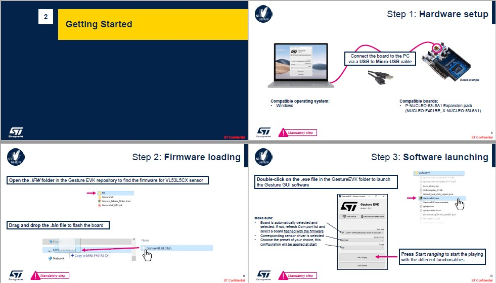
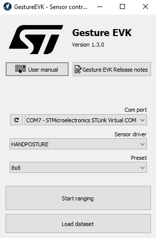
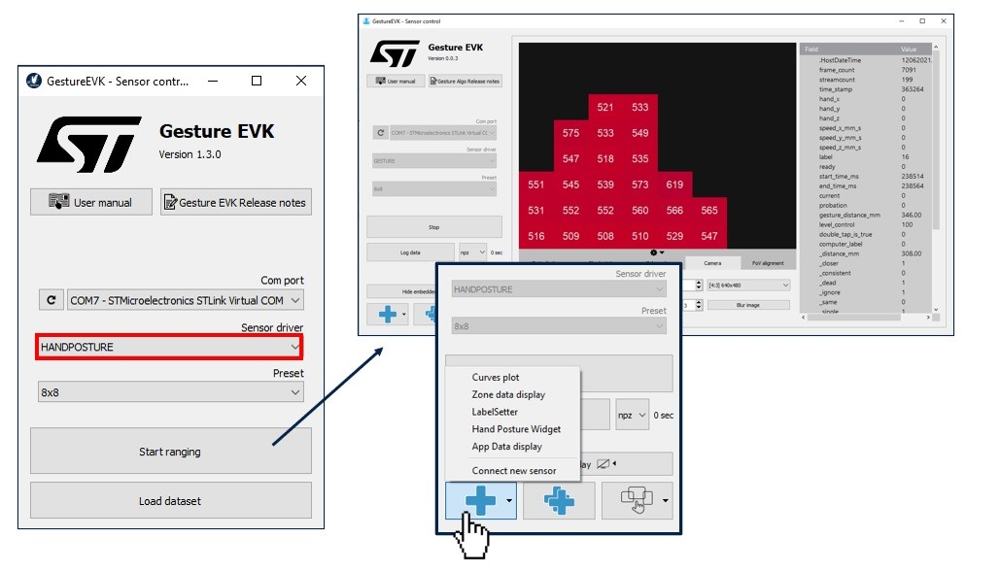
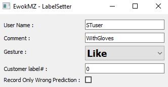
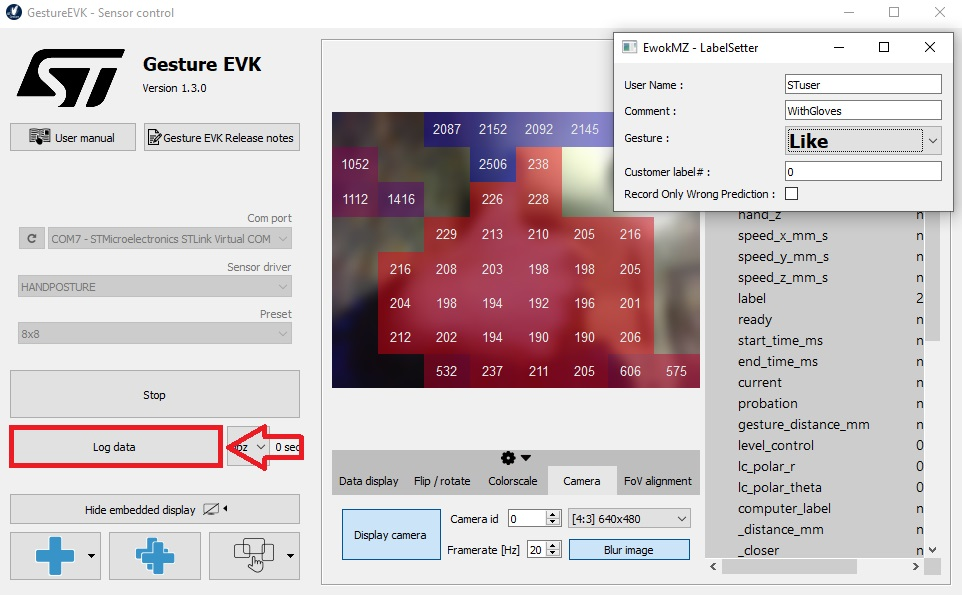

# ST multi-zone Time-of-Flight sensors hand posture recognition STM32 model zoo

This directory contains the ST Public datasets based on ST multi-zone Time-of-Light sensors.

| Dataset                         | ST Sensors | Numbers of classes | Hand Postures list                                                 | Hand Distance | Number of frames |
|---------------------------------|------------|--------------------|--------------------------------------------------------------------|---------------|------------------|
| ST_VL53L8CX_handposture_dataset | VL53L8CX   | 8                  | [None, Like, Dislike, FlatHand, Fist, Love, BreakTime, CrossHands] | 100 to 400mm  |11 448  (3.3MB)  |


----------------------------------------

## Create your own ST ToF dataset
<a id='Create'></a>

### **1. Download the hand posture ST datalog tool**
ST datalog tool: STSW-IMG035_EVK (Gesture EVK).

This tool can be downloaded on [ST.com](https://www.st.com/en/embedded-software/stsw-img035.html)

### **2. Launch the hand posture ST datalog tool**
Launch the tool and connect your sensor to get the following windows:


All the procedure to connect your hardware and to use the software is detailed in the documentation of the tool.  



The User Manual is available on [ST.com](https://www.st.com/en/embedded-software/stsw-img035.html#documentation)

Or directly on the User Interface of the tool: 



### **3. Record a Posture**

The implementation and the dataset are done with the following sensor orientation:


To access to the widgets:


Use the LabelSetter widget and fill the fields:
- `User Name`: The name or an identifier for the user who is recording the hand posture, used only in the datalog name (e.g. *"STuser*)
- `Comment`: If you want to add any comments in your datalog name (e.g. *"WithGloves"*)
- `Gesture`: Combobox to select your hand posture in a predefined list, it is possible to add your own posture by using "Custom"
- `Customer label#`: Used only if the "Custom" option is selected
- `Record Only Wrong Prediction`: is recording only the frames not well predicted by the tested model, useful when you will test your model and if you want to enrich your dataset



Then, put your hand in the field of view of the ToF sensor and start/stop logging:


A datalog has been saved in the GestureEVK folder:


## Prepare dataset
<a id='Data'></a>

### **1. Download the dataset and extract it**

The dataset directory should look as the following:
```bash
ST_VL53L38CX_handposture_dataset/
  None/
  FlatHand/
  Like/
  Dislike/
  Fist/
  Love/
  BreakTime/
  CrossHands/
```
- In general your dataset should respect the following structure:
```bash
dataset_directory/
...class_a/
......log__class_a__xxx/ (***)
.........npz/
............data_class_a_xxx_1.npz
............data_class_a_xxx_2.npz
......log__class_a__xxy/
.........npz/
............data_class_a_xxy_1.npz
............data_class_a_xxy_2.npz
...class_b/
......log__class_b__xxx/
.........npz/
............data_class_b_xxx_1.npz
............data_class_b_xxx_2.npz
......log__class_b__xxy/
.........npz/
............data_class_b_xxy_1.npz
............data_class_b_xxy_2.npz
```

(***): The log directory is an architecture generated by the ST datalog tool: STSW-IMG035_EVK (Gesture EVK).
This tool can be downloaded on [ST.com](https://www.st.com/en/embedded-software/stsw-img035.html)
A dedicated documentation is available for this tool and to know how to create your own ST multi-zone Time-of-Flight dataset for hand posture recognition.
