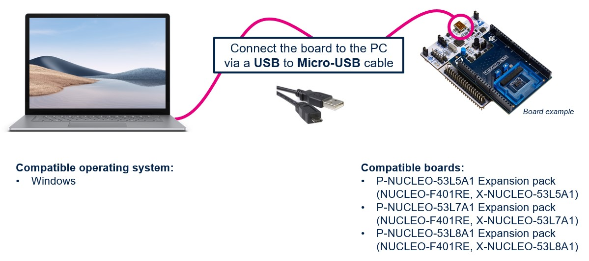
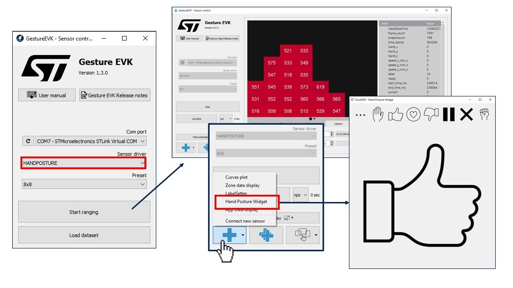
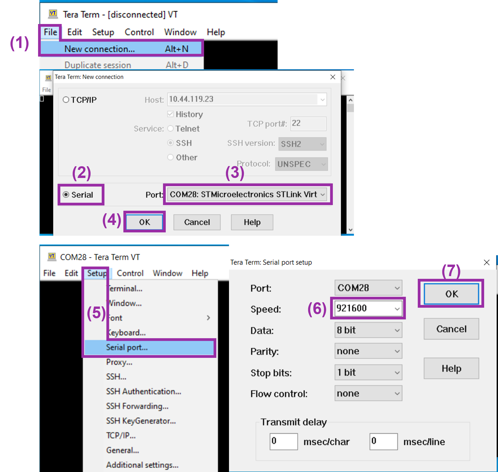
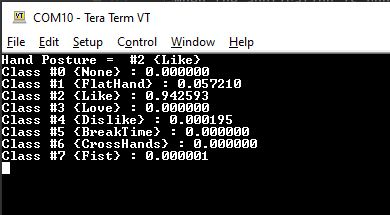

# Hand Posture STM32 Model Deployment

This tutorial demonstrates how to deploy a pre-trained Hand Posture model built with Keras (.h5) on an STM32 board using STM32Cube.AI.

## <a id="">Table of contents</a>
### <a href="#1">1. Before You Start</a>
#### <a href="#1-1">1.1 Hardware Setup</a>
#### <a href="#1-2">1.2 Software Requirements</a>
#### <a href="#1-3">1.3 Specifications</a>
### <a href="#2">2. Configure the yaml file</a>
#### <a href="#2-1">2.1 Setting the model and the operation mode</a>
#### <a href="#2-2">2.2 Dataset Configuration</a>
#### <a href="#2-3">2.3 Deployment Parameters</a>
### <a href="#3">3. Deploy pretrained model on STM32 board</a>
### <a href="#4">4. Run the application in the Gesture EVK GUI</a>
### <a href="#5">5. Run the application in a serial terminal</a>

__________________________________________

### <a id="1">1. Before You Start</a>
#### <a id="1-1">1.1 Hardware Setup</a>

The [stm32ai application code](../../stm32ai_application_code/hand_posture/README.md) runs on a hardware setup consisting of an STM32 microcontroller board connected to a ST ToF board. This version supports the following boards only:

- [NUCLEO-F401RE](https://www.st.com/en/evaluation-tools/nucleo-f401re.html) Nucleo board
- [X-NUCLEO-53LxA1](https://www.st.com/en/ecosystems/x-nucleo-53l8a1.html) Nucleo expansion board

#### <a id="1-2">1.2 Software Requirements</a>

You need to download and install the following software:

- [STM32CubeIDE](https://www.st.com/en/development-tools/stm32cubeide.html)
- If using [STM32Cube.AI](https://www.st.com/en/embedded-software/x-cube-ai.html) locally, open the link and download the package, then extract both `.zip` and `.pack` files.

#### <a id="1-3"> 1.3 Specifications</a>

- `serie`: STM32F4
- `IDE`: GCC

### <a id="2"> 2. Configure the YAML File</a>

You can use the deployment service by using a model zoo pre-trained model from the [STM32 model zoo](../pretrained_models/README.md) or your own Hand Posture model. Please refer to the YAML file [deployment_config.yaml](../src/config_file_examples/deployment_config.yaml), which is a ready YAML file with all the necessary sections ready to be filled, or you can update the [user_config.yaml](../src/user_config.yaml) to use it.

As an example, we will show how to deploy the model [CNN2D_ST_HandPosture_8classes.h5](../pretrained_models/CNN2D_ST_HandPosture/ST_pretrainedmodel_custom_dataset/ST_VL53L8CX_handposture_dataset/CNN2D_ST_HandPosture_8classes/) 
pre-trained on the [ST_VL53L8CX_handposture_dataset](../datasets/) dataset .

#### <a id="2-1"> 2.1 Setting the Model and the Operation Mode</a>

The first section of the configuration file is the `general` section that provides information about your project and the path to the model you want to deploy. The `operation_mode` attribute should be set to `deployment` as follows:

```yaml
general:
   model_path: ../pretrained_models/CNN2D_ST_HandPosture/ST_pretrainedmodel_custom_dataset/ST_VL53L8CX_handposture_dataset/CNN2D_ST_HandPosture_8classes/CNN2D_ST_HandPosture_8classes.h5     # Path to the model file to deploy

operation_mode: deployment
```

In the `general` section, users must provide the path to their model file using the `model_path` attribute. It has to be a Keras model file with a `.h5` filename extension (float model).

You must copy the `preprocessing` section to your own configuration file, to ensure you have the correct preprocessing parameters.

#### <a id="2-2"> 2.2 Dataset Configuration</a>

Configure the **dataset** section in the YAML file as follows:

```yaml
dataset:
   class_names: [None, Like, Dislike, FlatHand, Fist, Love, BreakTime, CrossHands]
```
The `class_names` attribute specifies the classes that the model is trained on. This information must be provided in the YAML file, as there is no dataset from which the classes can be inferred.

#### <a id="2-3"> 2.3 Deployment parameters</a>

To deploy the model in **NUCLEO-F401RE** board, we will use *STM32Cube.AI* to convert the model into optimized C code and *STM32CubeIDE* to build the C application and flash the board.

These steps will be done automatically by configuring the **tools** and **deployment** sections in the YAML file as the following:

```yaml
tools:
   stm32ai:
      version: 8.1.0
      optimization: balanced
      on_cloud: True
      path_to_stm32ai: C:/Users/<XXXXX>/STM32Cube/Repository/Packs/STMicroelectronics/X-CUBE-AI/<*.*.*>/Utilities/windows/stm32ai.exe
   path_to_cubeIDE: C:/ST/STM32CubeIDE_1.10.1/STM32CubeIDE/stm32cubeide.exe

deployment:
   c_project_path: ../../stm32ai_application_code/hand_posture/
   IDE: GCC
   verbosity: 1
   hardware_setup:
      serie: STM32F4
      board: NUCLEO-F401RE
```

where:
- `version` - Specify the **STM32Cube.AI** version used to benchmark the model, e.g. **8.1.0**.
- `optimization` - *String*, define the optimization used to generate the C model, options: "*balanced*", "*time*", "*ram*".
- `path_to_stm32ai` - *Path* to stm32ai executable file to use local download, else **False**.
- `path_to_cubeIDE` - *Path* to stm32cubeide executable file.
- `c_project_path` - *Path* to [stm32ai application code](../../stm32ai_application_code/hand_posture/README.md) project.
- `IDE` -**GCC**, only supported option for *stm32ai application code*.
- `verbosity` - *0* or *1*. Mode 0 is silent, and mode 1 displays messages when building and flashing C application on STM32 target.
- `serie` - **STM32F4**, only supported option for *stm32ai application code*.
- `board` - **NUCLEO-F401RE**, the board name.

### <a id="2.4"> 2.4 Configuring the mlflow section </a>

The model zoo uses MLFlow to record logs when running. You'll want to configure the `mlflow` section of your configuration file like in the example below

```yaml
mlflow:
  uri: ./experiments_outputs/mlruns
```
You'll then be able to access the logs by going to `src/experiments_outputs` in your favourite shell, using the command `mlflow ui`, and accessing the provided IP address in your browser.

### <a id="3">3. Deploy pretrained model on STM32 board</a>
First you need to connect ST multi-zone Time-of-Flight daughter board [*P-NUCLEO-53L8A1*](https://www.st.com/en/ecosystems/p-nucleo-53l8a1) to the [*NUCLEO-F401RE*](https://www.https://www.st.com/en/evaluation-tools/nucleo-f401re) board, then connect the Nucleo board to your computer using an usb cable.

The picture below shows the complete setup :



If you chose to modify the [user_config.yaml](../src/user_config.yaml) you can deploy the model by running the following command from the **src/** folder to build and flash the application on your board::

```bash
python stm32ai_main.py 
```
If you chose to update the [deployment_config.yaml](../src/config_file_examples/deployment_config.yaml) and use it then run the following command from the **src/** folder to build and flash the application on your board:: 

```bash
python stm32ai_main.py --config-path ./config_file_examples/ --config-name deployment_config.yaml
```

### <a id="4">4. Run the application in the Gesture EVK GUI**</a>

When the application is running on the *NUCLEO-F401RE* Nucleo board, it can be tested with the ST User Interface: STSW-IMG035_EVK (Gesture EVK).
This tool can be downloaded on [ST.com](https://www.st.com/en/embedded-software/stsw-img035.html).

The implementation and the dataset are done with the following sensor orientation:


There are two ways to visualize the Hand Posture Model outputs: 

Below are the different steps to open the dedicated Hand Posture widget to visualize the output of your application.



A dedicated User Manual is available in this software STSW-IMG035_EVK (Gesture EVK).

## <a id="5">5. Run the application in a serial terminal</a>
Once, programmed the board can be connected through a serial terminal and the output of the inference can be seen in the serial terminal. 
To connect the serial port please follow the steps shown in the figure below:


To run the application, use the command line "enable" and press enter.


The Tera Term terminal shows the output of one inference from the live data.

