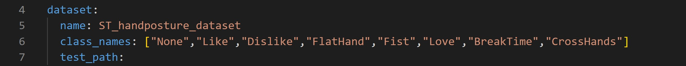
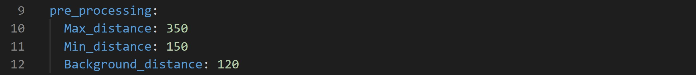
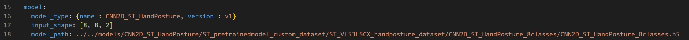
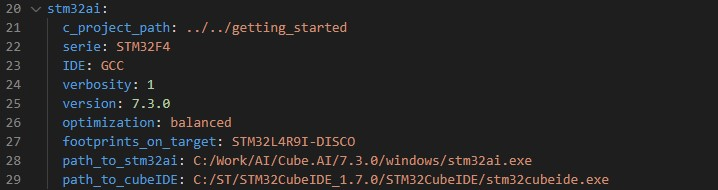
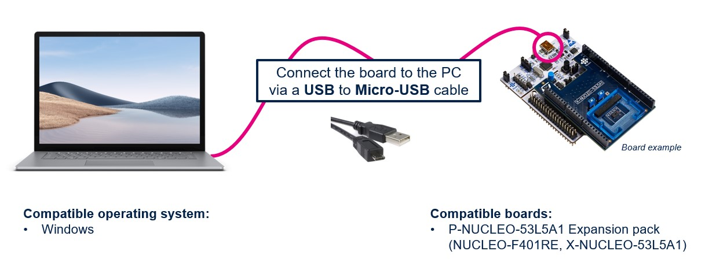

# ST multi-zone Time-of-Flight sensors hand posture recognition STM32 model zoo

This tutorial shows how to evaluate your pre-trained hand posture model on an *STM32 board* using *STM32Cube.AI*.


## Table of contents

* <a href='#prereqs'>Before you start</a><br>
* <a href='#deploy'>Deploy pretrained model on STM32 board</a><br>

## Before you start
<a id='prereqs'></a>


Please check out [STM32 model zoo](../../models/README.md) for hand posture recognition.

### **1. Hardware setup**

The [Getting Started](../../getting_started/README.md) is running on a NUCLEO STM32 microcontroller board connected to a ST multi-zone Time-of-Flight sensors daughter board. This version supports the following boards only:

- [NUCLEO-F401RE](https://www.https://www.st.com/en/evaluation-tools/nucleo-f401re)
- [P-NUCLEO-53L5A1](https://www.st.com/en/evaluation-tools/p-nucleo-53l5a1)

### **2. Software requirements**

You need to download and install the following software:

- [STM32CubeIDE](https://www.st.com/en/development-tools/stm32cubeide.html)
- If using [STM32Cube.AI](https://www.st.com/en/embedded-software/x-cube-ai.html) locally, open link and download the package, then `extract here` both `'.zip'` and `'.pack'` files.

### **3. Specifications**

- `serie` : STM32F4
- `IDE` : GCC


## Deploy pretrained model on STM32 board
<a id='deploy'></a>

### **1. Configure the yaml file**

You can run a demo using a pretrained model from [STM32 model zoo](../../models/README.md). Please refer to the YAML file provided alongside the TFlite model to fill the following sections in [user_config.yaml](user_config.yaml) (namely `Dataset Configuration` and `Load model`).

As an example, we will show how to deploy the model [ST_ToF_VL53L5CX_7_hand_postures.h5](../../models/CNN2D_ST_HandPosture/ST_pretrainedmodel_custom_dataset/ST_VL53L5CX_handposture_dataset/CNN2D_ST_HandPosture_8classes/CNN2D_ST_HandPosture_8classes.h5) pretrained on ST VL53L5CX dataset using the necessary parameters provided in [ST_ToF_VL53L5CX_7_hand_postures_config.yaml](../../models/CNN2D_ST_HandPosture/ST_pretrainedmodel_custom_dataset/ST_VL53L5CX_handposture_dataset/CNN2D_ST_HandPosture_8classes/CNN2D_ST_HandPosture_8classes_config.yaml).

**1.1. General settings:**

Configure the **general** section in **[user_config.yaml](user_config.yaml)** as the following:


where:

- `project_name` - *String*, name of the project.

**1.2. Dataset configuration:**

You need to specify some parameters related to the dataset and the preprocessing of the data in the **[user_config.yaml](user_config.yaml)** which will be parsed into a header file used to run the C application.

**1.2.1. Dataset info:**

Configure the **dataset** section in **[user_config.yaml](user_config.yaml)** as the following:



where:

- `name` - Dataset name
- `class_names` - A list containing the classes name.
- `test_path` - Path to the test set, needs to be provided to evaluate the model accuracy, else keep empty. To create your own test set, please follow [these steps](../training/README.md#create-your-st-tof-dataset).

**1.2.2. Preprocessing info:**

To run inference in the C application, we need to apply on the input data the same preprocessing used when training the model.

To do so, you need to specify the **preprocessing** configuration in **[user_config.yaml](user_config.yaml)** as the following:




- `Max_distance` - *Integer*, *in mm*, the maximum distance of the hand from the sensor allowed for this application. If the distance is higher, the frame is filtered/removed from the dataset
- `Min_distance` - *Integer*, *in mm*, the minimum distance of the hand from the sensor allowed for this application. If the distance is lower, the frame is filtered/removed from the dataset
- `Background_distance` - *Integer*, *in mm*, the gap behind the hand, all zones above this gap will be removed

**1.3. Load model:**

You can run a demo using a pretrained model provided in [STM32 model zoo](../../models/README.md) for hand posture recognition. These models were trained on specific datasets (e.g. ST_VL53L5CX_handposture_dataset).

Also, you can directly deploy your own pretrained model.

To do so, you need to configure the **model** section in **[user_config.yaml](user_config.yaml)** as the following:



where:

- `model_type` - A *dictionary* with keys relative to the model topology (see [more](../training/doc/models.json)). Example for CNN2D_ST_HandPosture *{name : CNN2D_ST_HandPosture, version : v1}*, else for a custom model use *{name : custom}*.
- `input_shape` -  A *list of int* *[H, W, C]* for the input resolution, e.g. *[8, 8, 2]*.
- `model_path` - *Path* to your model, the model can be in `.h5`, `SavedModel` format.


**1.4. C project configuration:**

To deploy the model in **STM32H747I-DISCO** board, we will use *STM32Cube.AI* to convert the model into optimized C code and *STM32CubeIDE* to build the C application and flash the board.

These steps will be done automatically by configuring the **stm32ai** section in **[user_config.yaml](user_config.yaml)** as the following:



where:
- `c_project_path` - *Path* to [Getting Started](../../getting_started/README.md) project.
- `serie` - **STM32F4**, only supported option for *Getting Started*.
- `IDE` -**GCC**, only supported option for *Getting Started*.
- `verbosity` - *0* or *1*. Mode 0 is silent, and mode 1 displays messages when building and flashing C application on STM32 target.
- `optimization` - *String*, define the optimization used to generate the C model, options: "*balanced*", "*time*", "*ram*".
- `footprints_on_target` - (Not used for this example). **'STM32H747I-DISCO'** to use **Developer Cloud Services** to benchmark model and generate C code, else keep **False** (i.e. only local download of **STM32Cube.AI** will be used to get model footprints and C code w/o inference time).
- `path_to_stm32ai` - *Path* to stm32ai executable file to use local download, else **False**.
- `path_to_cubeIDE` - *Path* to stm32cubeide executable file.


### **2. Run deployment:**

First you need to connect ST multi-zone Time-of-Flight daughter board [*P-NUCLEO-53L5A1*](https://www.st.com/en/evaluation-tools/p-nucleo-53l5a1) to the [*NUCLEO-F401RE*](https://www.https://www.st.com/en/evaluation-tools/nucleo-f401re) board, then connect the Nucleo board to your computer using an usb cable.

The picture below shows the complete setup :



Then, run the following command to build and flash the application on your board:


```bash
python deploy.py
```


### **3. Run the application:**

When the application is running on the *NUCLEO-F401RE* Nucleo board, it can be tested with the ST User Interface: STSW-IMG035_EVK (Gesture EVK).
This tool can be downloaded on [ST.com](https://www.st.com/en/embedded-software/stsw-img035.html).

The implementation and the dataset are done with the following sensor orientation:


Below are the different steps to open the dedicated Hand Posture widget to visualize the output of your application.


A dedicated User Manual is available in this software STSW-IMG035_EVK (Gesture EVK).
