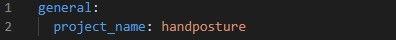
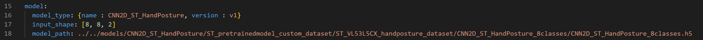
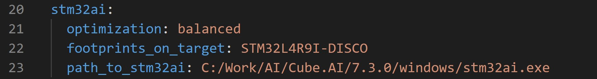
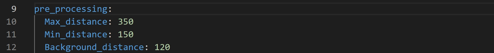
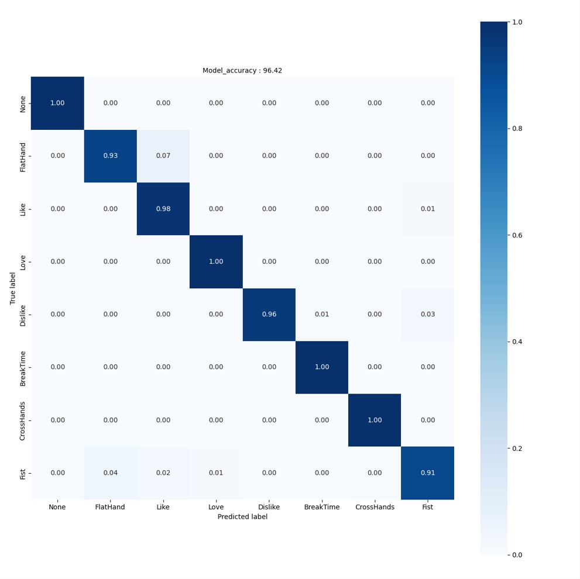

# ST multi-zone Time-of-Flight sensors hand posture recognition STM32 model zoo

This tutorial shows how to evaluate your pre-trained hand posture model using *STM32Cube.AI*.

## Table of contents

* <a href='#benchmark'>Benchmark your model using *STM32Cube.AI*</a><br>
* <a href='#Evaluate'>Evaluate the performance of your model</a><br>


## Benchmark your model using *STM32Cube.AI*
<a id='benchmark'></a>

### **1. Configure the yaml file**
**1.1. General settings:**

Configure the **general** section in **[user_config.yaml](user_config.yaml)** as the following:




where:

- `project_name` - *String*, name of the project.

**1.2. Load your model:**

Here you can define the model path to load and benchmark the model, also other parameters that will be useful for evaluating the model if wanted.

To do so we will need to configure the **model** section in **[user_config.yaml](user_config.yaml)** as the following:



where:

- `model_type` - A *dictionary* with keys relative to the model topology (see [more](../training/doc/models.json)). Example for CNN2D_ST_HandPosture *{name : CNN2D_ST_HandPosture, version : v1}*, else for a custom model use *{name : custom}*.
- `input_shape` -  A *list of int* *[H, W, C]* for the input resolution, e.g. *[8, 8, 2]*.
- `model_path` - *Path* to your model, the model can be in `.h5`, `SavedModel` format.

**1.4. Benchmark your model with STM32Cube.AI:**

STM32Cube.AI will allow you to benchmark your model and estimate its footprints for STM32 target devices.

Make sure to add the path to the stm32ai executable under **path_to_stm32ai**, else you will need to provide your credentials to use the **Developer Cloud Services**:



where:
- `optimization` - *String*, define the optimization used to generate the C model, options: "*balanced*", "*time*", "*ram*".
- `footprints_on_target` - Specify a board name to evaluate the model inference time on real stm32 target using the **Developer Cloud Services**, e.g. **'STM32L4R9I-DISCO'** (see [more](../training/doc/models.json)), else keep **False** (i.e. only local download on **STM32Cube.AI** will be used to evaluate footprints w/o inference time).
- `path_to_stm32ai` - *Path* to stm32ai executable file to use local download, else **False**.

### **2. Run benchmark**

Then, run the following command:


```bash
python evaluate.py
```

## Evaluate the performance of your model
<a id='Evaluate'></a>

### **1. Configure the yaml file**

**1.1. Getting the model parameters:**


First, you need to follow the previous steps in the [benchmark](#benchmark) section to configure your **[user_config.yaml](user_config.yaml)**.

**1.2. Preparing the dataset:**

You need to make sure to provide the path for a `test set` to be able to evaluate the accuracy of your model. To create your own test set, please follow [these steps](../training/README.md#create-your-st-tof-dataset)

**1.2.1. Loading the dataset:**

Configure the **dataset** section in **[user_config.yaml](user_config.yaml)** as the following:


where:

- `name` - Dataset name.
- `class_names` - A list containing the classes name.
- `test_path` - Path to the test_set, needs to be provided to evaluate the model accuracy.

**1.2.2. Apply preprocessing:**

Apply preprocessing by modifying the **preprocessing** parameters in **[user_config.yaml](user_config.yaml)** as the following:



- `Max_distance` - *Integer*, *in mm*, the maximum distance of the hand from the sensor allowed for this application. If the distance is higher, the frame is filtered/removed from the dataset
- `Min_distance` - *Integer*, *in mm*, the minimum distance of the hand from the sensor allowed for this application. If the distance is lower, the frame is filtered/removed from the dataset
- `Background_distance` - *Integer*, *in mm*, the gap behind the hand, all zones above this gap will be removed


### **2. Run evaluation**

Then, run the following command:

```bash
python evaluate.py
```

### **3. Visualize results**

**3.1. Saved results**

All evaluation artifacts are saved under the current output simulation directory **"outputs/{run_time}"**.

For example, you can retrieve the confusion matrix generated after evaluating the float model on the test set as follows:



**3.2. Run MLFlow**

MLflow is an API for logging parameters, code versions, metrics, and artifacts while running machine learning code and for visualizing results.
To view and examine the results of multiple trainings, you can simply access the MLFlow Webapp by running the following command:

```bash
mlflow ui
```
And open the given IP adress in your browser.