# ST multi-zone Time-of-Flight sensors hand posture recognition STM32 model zoo

This tutorial shows how to train from scratch or apply transfer learning on a hand posture model using a custom dataset.
As an example we will demonstrate the workflow on the **ST_VL53L5CX_handposture_dataset** classification dataset.

`Note:` If you are training a model in order to deploy it with the [getting started](../../getting_started/README.md), please check out first the application specifications [here](../deployment/README.md).

## Table of contents

* <a href='#Create'>Create your ST ToF dataset</a><br>
* <a href='#Data'>Prepare dataset</a><br>
* <a href='#training'>Train and evaluate model</a><br>
* <a href='#results'>Visualize training results</a><br>

## Create your ST ToF dataset
<a id='Create'></a>

### **1. Download the hand posture ST datalog tool**
ST datalog tool: STSW-IMG035_EVK (Gesture EVK).

This tool can be downloaded on [ST.com](https://www.st.com/en/embedded-software/stsw-img035.html)

### **2. Launch the hand posture ST datalog tool**
Launch the tool and connect your sensor to get the following windows:

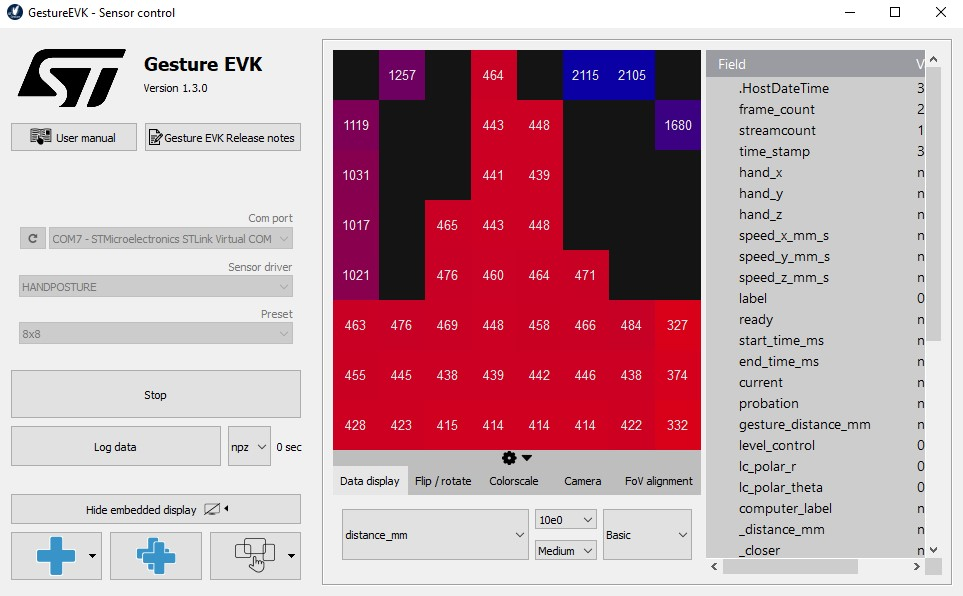

All the procedure to connect your hardware and to use the software is detailed in the documentation of the tool.  


The User Manual is available on [ST.com](https://www.st.com/en/embedded-software/stsw-img035.html#documentation)

Or directly on the User Interface of the tool: 


### **3. Record a Posture**

The implementation and the dataset are done with the following sensor orientation:
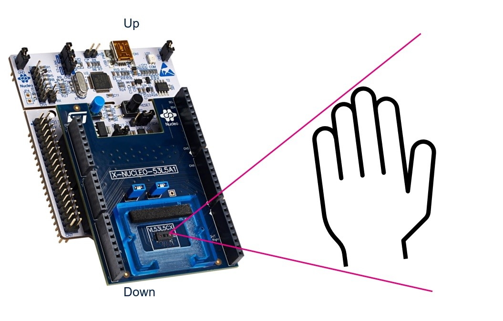

To access to the widgets:


Use the LabelSetter widget and fill the fields:
- `User Name`: The name or an identifier for the user who is recording the hand posture, used only in the datalog name (e.g. *"STuser*)
- `Comment`: If you want to add any comments in your datalog name (e.g. *"WithGloves"*)
- `Gesture`: Combobox to select your hand posture in a predefined list, it is possible to add your own posture by using "Custom"
- `Customer label#`: Used only if the "Custom" option is selected
- `Record Only Wrong Prediction`: is recording only the frames not well predicted by the tested model, useful when you will test your model and if you want to enrich your dataset


Then, put your hand in the field of view of the ToF sensor and start/stop logging:


A datalog has been saved in the GestureEVK folder:
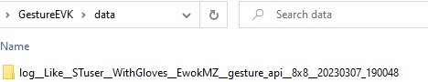


## Prepare dataset
<a id='Data'></a>

### **1. Download the dataset and extract it**

The dataset directory should look as the following:
```bash
ST_VL53L5CX_handposture_dataset/
  None/
  FlatHand/
  Like/
  Dislike/
  Fist/
  Love/
  BreakTime/
  CrossHands/
```
- In general your dataset should respect the following structure:
```bash
dataset_directory/
...class_a/
......log__class_a__xxx_1/ (***)
.........npz/
............data_class_a_xxx_1.npz
............data_class_a_xxx_2.npz
......log__class_a__xxx_2/
.........npz/
............data_class_a_xxy_1.npz
............data_class_a_xxy_2.npz
...class_a/
......log__class_a__xxx_1/
.........npz/
............data_class_a_xxx_1.npz
............data_class_a_xxx_2.npz
......log__class_a__xxx_2/
.........npz/
............data_class_a_xxy_1.npz
............data_class_a_xxy_2.npz
```

(***): The log directory is an architecture generated by the ST datalog tool: STSW-IMG035_EVK (Gesture EVK).
This tool can be downloaded on [ST.com](https://www.st.com/en/embedded-software/stsw-img035.html)
A dedicated documentation is available for this tool and to know how to create your own ST multi-zone Time-of-Flight dataset for hand posture recognition.

### **2. Configure the yaml file**
**2.1. General settings:**

Configure the **general** section in **[user_config.yaml](user_config.yaml)** as the following:


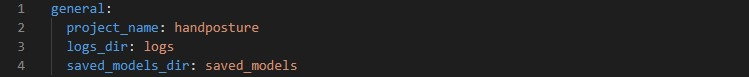

where:

- `project_name` - *String*, name of the project.
- `logs_dir` - Path to save tensorboard logs.
- `saved_models_dir` - Path to save the trained model.

**2.2. Loading the dataset:**

Configure the **dataset** section in **[user_config.yaml](user_config.yaml)** as the following:

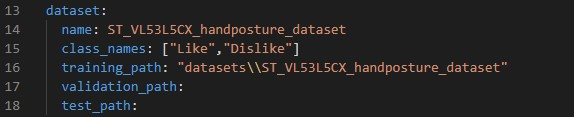

where:

- `name` - Dataset name.
- `class_names` - A list containing the class names.
- `training_path` - The directory where the training set is located, or the dataset path. 
- `validation_path` - Path to the validation set, if not provided 20% of the training set will be used for validation.
- `test_path` - Path to the test_set, if not provided the validation set will be used for evaluation.

**2.3. Apply preprocessing:**

Apply preprocessing by modifying the **preprocessing** parameters in **[user_config.yaml](user_config.yaml)** as the following:

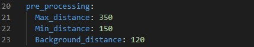

- `Max_distance` - *Integer*, *in mm*, the maximum distance of the hand from the sensor allowed for this application. If the distance is higher, the frame is filtered/removed from the dataset
- `Min_distance` - *Integer*, *in mm*, the minimum distance of the hand from the sensor allowed for this application. If the distance is lower, the frame is filtered/removed from the dataset
- `Background_distance` - *Integer*, *in mm*, the gap behind the hand, all zones above this gap will be removed

**2.4. Use data augmentation:**

It's a good practice to artificially introduce sample diversity by applying random, yet realistic, transformations to the training images. This helps exposing the model to different aspects of the training data and reduces the overfitting.
Also, for Hand Posture Use case, it's interesting to have each postures available for left-handed and right-handed. 

You can apply data augmentation by configuring the **data_augmentation** section in **[user_config.yaml](user_config.yaml)**:

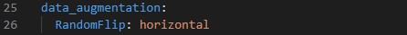

If you don't want to use a specific data augmentation technique set it to **False**, else provide an adequat value to be applied:

- `RandomFlip` - One of "*horizontal*", "*vertical*", or "*horizontal_and_vertical*". For most of postures, only "*horizontal*" is useful.

## Train and evaluate model
<a id='training'></a>

### **1. Configure training parameters**

**1.1. Choose a ST topology model not trained:**

ST is proposing a model topology to solve Hand Posture Recognition application thanks to ST multi-zone Time-of-Flight sensor data.
To do so we will need to configure the **model** section in **[user_config.yaml](user_config.yaml)** as the following:

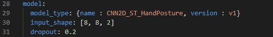

where:

- `model_type` - A *dictionary* with keys relative to the model topology (see [more](./doc/models.json)). Example for CNN2D_ST_HandPosture *{name : CNN2D_ST_HandPosture, version : v1}*, else for a custom model use *{name : custom}*.
- `input_shape` -  A *list of int* *[H, W, C]* for the input resolution, e.g. *[8, 8, 2]*.
- `dropout` - A *float* value between 0 and 1.

**1.2. Choose a custom model *(not yet implemented)*:**

If you want to define and train your custom model, you need to modify the **model** section in **[user_config.yaml](user_config.yaml)** as the following:

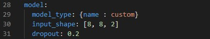

Under [utils](../utils/models/custom_model.py), we provide a template `custom_model.py` where you can define the feature extraction layers of your custom model in Keras/Tensorflow. Your topology should be described in the function `get_model(cfg)` as follows:

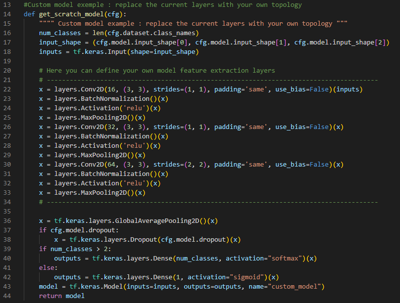

**1.3. Set training hyperparameters:**

To choose the right hyperparameters for training your model, simply modify the **train_parameters** section in **[user_config.yaml](user_config.yaml)** as the following:

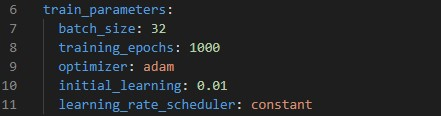

where:

- `batch_size` - *Integer*. Size of the batches of data, e.g. 32.
- `training_epochs` - *Integer*. Number of epochs to train the model. 
- `optimizer` - One of "Adam", "SGD" or "RMSprop".
- `initial_learning` - A *float* value, e.g. 0.001.
- `learning_rate_scheduler` - One of "Constant", "ReduceLROnPlateau", "Exponential" or "Cosine".


### **2. Configure evaluation parameters**

**2.1. Benchmark your model with STM32Cube.AI:**

STM32CubeAI will allow you to benchmark your model and estimate its footprints for STM32 target devices.

Make Sure to add the path to the stm32ai excutable under **path_to_stm32ai**, else you will need to provide your credentials to use the **Developer Cloud Services**:

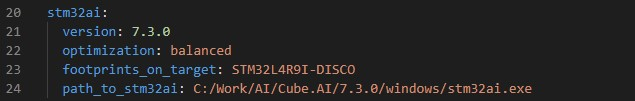

where:
- `optimization` - *String*, defines the optimization used to generate the C model, options: "*balanced*", "*time*", "*ram*".
- `footprints_on_target` - Specifies a board name to evaluate the model inference time on real stm32 target using the **Developer Cloud Services**, e.g. **'STM32H747I-DISCO'** (see [more](./doc/boards.json)), else keep **False** (i.e. only local download on **STM32Cube.AI** will be used to evaluate footprints w/o inference time).
- `path_to_stm32ai` - *Path* to stm32ai executable file to use local download, else **False**.


### **3. Train your model** 


Run the following command:


```bash
python train.py
```


## Visualize training results
<a id='results'></a>

### **1. Saved results**

All training and evaluation artifacts are saved under the current output simulation directory **"outputs/{run_time}"**.

For example, you can retrieve the plots of the accuracy/loss curves, as well as the confusion matrix generated after evaluating the model on the test set as follows:

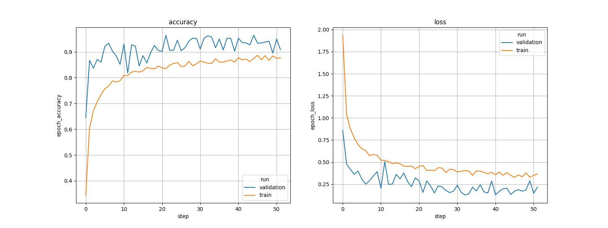


### **2. Run tensorboard**

To visualize the training curves logged by tensorboard, go to **"outputs/{run_time}"** and run the following command:

```bash
tensorboard --logdir logs
```

And open the URL `http://localhost:6006` in your browser.

### **3. Run MLFlow**

MLflow is an API for logging parameters, code versions, metrics, and artifacts while running machine learning code and for visualizing results.
To view and examine the results of multiple trainings, you can simply access the MLFlow Webapp by running the following command:
```bash
mlflow ui
```
And open the given IP adress in your browser.