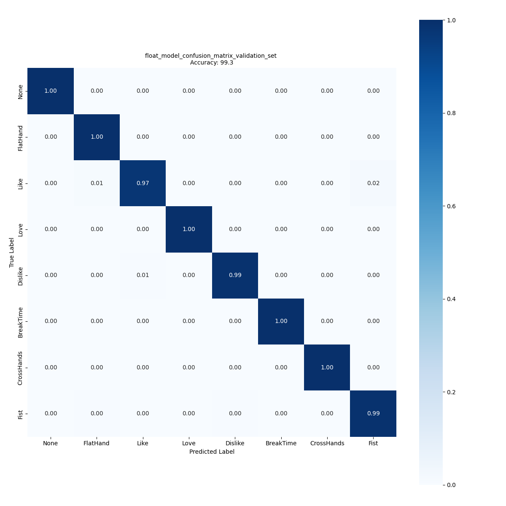

# Hand posture STM32 model zoo

## <a id="">Table of contents</a>

<details open><summary><a href="#1"><b>1. Hand Posture Model Zoo introduction</b></a></summary><a id="1"></a>

The hand posture model zoo provides a collection of independent services that can be used to perform various functions related to machine learning for Hand Posture Detection. The individual services include tasks such as training the model or evaluating the model.

To use the services in the hand posture model zoo, you can utilize the model zoo [stm32ai_main.py](stm32ai_main.py) along with [user_config.yaml](user_config.yaml) file as input. The yaml file specifies the service and a set of configuration parameters such as the model (either from the model zoo or your own custom model), the dataset, the number of epochs, and the preprocessing parameters, among others.

More information about the different services and their configuration options can be found in the <a href="#2">next section</a>.

The ToF Hand Posture datasets are expected to be structured in subdirectories for each class under the root directory of the dataset with the names of the subdirectories being the names of the classes. An example of this structure is shown below:


```bash
dataset_directory/
...class_a/
......log__class_a__xxx/ (***)
.........npz/
............data_class_a_xxx_1.npz
............data_class_a_xxx_2.npz
......log__class_a__xxy/
.........npz/
............data_class_a_xxy_1.npz
............data_class_a_xxy_2.npz
...class_b/
......log__class_b__xxx/
.........npz/
............data_class_b_xxx_1.npz
............data_class_b_xxx_2.npz
......log__class_b__xxy/
.........npz/
............data_class_b_xxy_1.npz
............data_class_b_xxy_2.npz
```

(***): The log directory is an architecture generated by the ST datalog tool: STSW-IMG035_EVK (Gesture EVK).
This tool can be downloaded on [ST.com](https://www.st.com/en/embedded-software/stsw-img035.html)
A dedicated documentation is available for this tool and to know how to create your own ST multi-zone Time-of-Flight dataset for hand posture recognition.

</details>
<details open><summary><a href="#2"><b>2. Hand Posture tutorial</b></a></summary><a id="2"></a>

This tutorial demonstrates how to use the `training` services to train the model. We chose to use the `CNN2D_ST_HandPosture` model and the [ST_VL53L8CX_handposture_dataset](../datasets) dataset as an example to demonstrate the workflow.

To get started, you will need to update the [user_config.yaml](user_config.yaml) file, which specifies the parameters and configuration options for the services that you want to use. Each section of the [user_config.yaml](user_config.yaml) file is explained in detail in the following sections.

<ul><details open><summary><a href="#2-1">2.1 Choose the operation mode</a></summary><a id="2-1"></a>

The `operation_mode` top-level attribute specifies the operations or the service you want to execute.

The different values of the `operation_mode` attribute and the corresponding operations are described in the table below.

| operation_mode attribute | Operations                                                             |
|:---------------------------|:-----------------------------------------------------------------------|
| `training`| Train a model from the model zoo or your own model                     |
| `evaluation` | Evaluate the accuracy of a float model on a test or validation dataset |
| `benchmarking` | Benchmark a float model on an STM32 board                              |
| `deployment`   | Deploy a model on an STM32 board                                       |

You can refer to readme links below that provide typical examples of operation modes, and tutorials on specific services:

   - [training](./training/README.md)
   - [evaluation](./evaluation/README.md)
   - [benchmarking](./benchmarking/README.md)
   - [deployment](../deployment/README.md)

In this tutorial the `operation_mode` used is the `training` like shown below to train a model it to be later deployed in the STM32 boards.

```yaml
operation_mode: training
```

</details></ul>
<ul><details open><summary><a href="#2-2">2.2 General settings</a></summary><a id="2-2"></a>

The `general` section and its attributes are shown below.

```yaml
general:
   project_name: handposture         # Project name. Optional, defaults to "<unnamed>".
   logs_dir: logs                    # Name of the directory where log files are saved. Optional, defaults to "logs".
   saved_models_dir: saved_models    # Name of the directory where model files are saved. Optional, defaults to "saved_models".
#  model_path: <file-path>           # Path to a model file.
   global_seed: 123                  # Seed used to seed random generators (an integer). Optional, defaults to 123.
   deterministic_ops: False          # Enable/disable deterministic operations (a boolean). Optional, defaults to False.
   display_figures: True             # Enable/disable the display of figures (training learning curves and confusion matrices).
                                     # Optional, defaults to True.
   gpu_memory_limit: 24              # Maximum amount of GPU memory in GBytes that TensorFlow may use (an integer).
```

The `global_seed` attribute specifies the value of the seed to use to seed the Python, numpy and Tensorflow random generators at the beginning of the main script. This is an optional attribute, the default value being 123. If you don't want random generators to be seeded, then set `global_seed` to 'None' (not recommended as this would make training results less reproducible).

Even when random generators are seeded, it is often difficult to exactly reproduce results when the same operation is run multiple times. This typically happens when the same training script is run on different hardware. The `deterministic_ops` operator can be used to enable the deterministic mode of Tensorflow. If enabled, an operation that uses the same inputs on the same hardware will have the exact same outputs every time it is run. However, determinism should be used carefully as it comes at the expense of longer run times. Refer to the Tensorflow documentation for more details.

The `gpu_memory_limit` attribute sets an upper limit in GBytes on the amount of GPU memory Tensorflow may use. This is an optional attribute with no default value. If it is not present, memory usage is unlimited. If you have several GPUs, be aware that the limit is only set on logical gpu[0]. 

The `model_path` attribute is utilized to indicate the path to the model file that you wish to use for the selected operation mode. The accepted formats for `model_path` are listed in the table below:

| Operation mode | `model_path` |
|:---------------|:-------------|
| 'evaluation'   | Keras file   |
| 'prediction'   | Keras file   |
| 'benchmarking' | Keras file   |
| 'deployment'   | Keras file   |

You can use the `model_path` attribute to train your own custom model instead of using a model from the Model Zoo. This is explained in detail in the [readme](./training/README.md) file for the train service. However, in this tutorial, the `model_path` attribute is not used since we are using a model from the Model Zoo.

</details></ul>
<ul><details open><summary><a href="#2-3">2.3 Dataset specification</a></summary><a id="2-3"></a>

The `dataset` section and its attributes are shown in the YAML code below.

```yaml
dataset:
   dataset_name: ST_handposture_dataset                                             # Dataset name. Optional, defaults to "<unnamed>".
   class_names: [None, Like, Dislike, FlatHand, Fist, Love, BreakTime, CrossHands]  # Names of the classes in the dataset, to be aligned with utils/handposture_dictionnary.py.
   training_path: ../datasets/ST_VL53L8CX_handposture_dataset                       # Path to the root directory of the training set.
   validation_path: <validation-set-root-directory>                                 # Path to the root directory of the validation set.
   validation_split: 0.2                                                            # Training/validation sets split ratio.
   test_path: <test-set-root-directory>                                             # Path to the root directory of the test set.
```

The `name` attribute is optional.

When a training is run, the training set is split in two to create a validation dataset if `validation_path` is not provided. When a model accuracy evaluation is run, the test set is used if there is one, otherwise the validation set is used (either provided or generated by splitting the training set).

The `validation_split` attribute specifies the training/validation set size ratio to use when splitting the training set to create a validation set. The default value is 0.2, meaning that 20% of the training set is used to create the validation set.

</details></ul>
<ul><details open><summary><a href="#2-4">2.4 Apply Hand Posture preprocessing</a></summary><a id="2-4"></a>

The 'preprocessing' section is required in all the operation modes except for the benchmarking.

The 'preprocessing' section for this tutorial is shown below.

```yaml
preprocessing: # Mandatory
  Max_distance: 400 # Mandatory
  Min_distance: 100 # Mandatory
  Background_distance:  120 # Mandatory
```

- `Max_distance` - *Integer*, *in mm*, the maximum distance of the hand from the sensor allowed for this application. If the distance is higher, the frame is filtered/removed from the dataset
- `Min_distance` - *Integer*, *in mm*, the minimum distance of the hand from the sensor allowed for this application. If the distance is lower, the frame is filtered/removed from the dataset
- `Background_distance` - *Integer*, *in mm*, the gap behind the hand, all zones above this gap will be removed

</details></ul>
<ul><details open><summary><a href="#2-5">2.5 Use data augmentation</a></summary><a id="2-5"></a>

The data augmentation functions to apply to the input frames during a training are specified in the optional `data_augmentation` section of the configuration file. They are only applied to the images during training.

For this tutorial data augmentation section is shown below.

```yaml
data_augmentation:
  random_flip:
    mode: horizontal # horizontal, vertical or horizontal_and_vertical
```

Please refer to [the data augmentation documentation](data_augmentation/README.md) for a list of functions that are available and the transforms they apply to the input frames.

</details></ul>
<ul><details open><summary><a href="#2-6">2.6 Set the training parameters</a></summary><a id="2-6"></a>

A 'training' section is required in all the operation modes that include a training.

```yaml
training:
  model:
    name: CNN2D_ST_HandPosture
    version: v1
    input_shape: (8, 8, 2)
  frozen_layers: #(0:-1)            # Optional, use if you want to freeze some layers (by default all layers are trainable)
  dropout: 0.2                     # set the dropout layers of your model to 0.2
  batch_size: 32
  epochs: 1000
  optimizer:
      # Use Keras Adam optimizer with initial LR set to 0.001
    Adam:
      learning_rate: 0.01
  callbacks:          # Optional section
      # Use Keras ReduceLROnPlateau learning rate scheduler
    ReduceLROnPlateau:
      monitor: val_loss
      factor: 0.1
      patience: 20
      min_lr: 1.0e-04
    EarlyStopping:
      monitor: val_accuracy
      restore_best_weights: true
      patience: 40
#  trained_model_path: trained.h5   # Optional, use it if you want to save the best model at the end of the training to a path of your choice
```

The `model` subsection is used to specify a model that is available with the Model Zoo:
- The `name` and `input_shape` attributes must always be present.

The `batch_size` and `epochs` attributes are mandatory.

The `dropout_rate` attribute is optional. By default, no dropout layer is inserted in the model.

All the Keras optimizers are supported. If you are not passing any argument to the optimizer, you may write it on one line. For example: "optimizer: Adam".

The optional `frozen_layers` attribute is used to make some layers of the model non-trainable. It is useful when a transfer learning approach is used to train the model. Transfer learning is covered in the "Transfer learning" section of the documentation.

The `callbacks` subsection is optional. All the Keras callbacks are supported. Note that several callbacks are built-in and cannot be redefined, including ModelCheckpoint, TensorBoard and CSVLoggerr. 

The best model obtained at the end of the training is saved in the 'experiments_outputs/\<date-and-time\>/saved_models' directory and is called 'best_model.h5' (see section <a href="#4">Saved results of image classification</a>). Make sure not to use the 'best_augmentation_model.h5' file as it includes the rescaling and data augmentation layers.
If you want to save the best model to another location, you can use `trained_model_path`.

</details></ul>
<ul><details open><summary><a href="#2-7">2.7 Benchmark the model</a></summary><a id="2-7"></a>

The [STM32Cube.AI Developer Cloud](https://stm32ai-cs.st.com/home) allows you to benchmark your model and estimate its footprints and inference time for different STM32 target devices. To use this feature, set the `on_cloud` attribute to True. Alternatively, you can use [STM32Cube.AI](https://www.st.com/en/embedded-software/x-cube-ai.html) to benchmark your model and estimate its footprints for STM32 target devices locally. To do this, make sure to add the path to the `stedgeai` executable under the `path_to_stedgeai` attribute and set the `on_cloud` attribute to False.

The `version` attribute to specify the **STM32Cube.AI** version used to benchmark the model, e.g. **9.1.0** and the `optimization` defines the optimization used to generate the C model, options: "balanced", "time", "ram".

The `board` attribute is used to provide the name of the STM32 board to benchmark the model on. The available boards are 'STM32H747I-DISCO', 'STM32H7B3I-DK', 'STM32F469I-DISCO', 'B-U585I-IOT02A', 'STM32L4R9I-DISCO', 'NUCLEO-H743ZI2', 'STM32H747I-DISCO', 'STM32H735G-DK', 'STM32F769I-DISCO', 'NUCLEO-G474RE', 'NUCLEO-F401RE' and 'STM32F746G-DISCO'.

```yaml
tools:
  stedgeai:
    version: 9.1.0
    optimization: balanced
    on_cloud: True
    path_to_stedgeai: C:/Users/<XXXXX>/STM32Cube/Repository/Packs/STMicroelectronics/X-CUBE-AI/<*.*.*>/Utilities/windows/stedgeai.exe
  path_to_cubeIDE: C:/ST/STM32CubeIDE_1.15.0/STM32CubeIDE/stm32cubeide.exe

benchmarking:
  board: NUCLEO-F401RE # Name of the STM32 board to benchmark the model on
```
The `path_to_cubeIDE` attribute is for the [deployment](../deployment/README.md) service.

</details></ul>
<ul><details open><summary><a href="#2-8">2.8 Deploy the model</a></summary><a id="2-8"></a>

If you want to deploy the model after running the chain, you can do so by referring to the [README](../deployment/README.md) and modifying the `deployment_config.yaml` file or by setting the `operation_mode` to `deploy` and modifying the `user_config.yaml` file as described below:

```yaml
general:
   model_path: <path-to-a-H5-model-file>     # Path to the model file to deploy

dataset:
   class_names: [None, Like, Dislike, FlatHand, Fist, Love, BreakTime, CrossHands] 

tools:
  stedgeai:
    version: 9.1.0
    optimization: balanced
    on_cloud: True
    path_to_stedgeai: C:/Users/<XXXXX>/STM32Cube/Repository/Packs/STMicroelectronics/X-CUBE-AI/<*.*.*>/Utilities/windows/stedgeai.exe
  path_to_cubeIDE: C:/ST/STM32CubeIDE_1.15.0/STM32CubeIDE/stm32cubeide.exe

deployment:
  c_project_path: ../../stm32ai_application_code/hand_posture/
  IDE: GCC
  verbosity: 1
  hardware_setup:
    serie: STM32F4
    board: NUCLEO-F401RE
```

In the `general` section, users must provide the path to the H5 model file that they want to deploy using the `model_path` attribute.

The `dataset` section requires users to provide the names of the classes using the `class_names` attribute.

The `tools` section includes information about the STM32AI toolchain, such as the version, optimization level, and path to the `stm32ai.exe` file.

Finally, in the `deployment` section, users must provide information about the hardware setup, such as the series and board of the STM32 device, as well as the input and output interfaces. Once all of these sections have been filled in, users can run the deployment service to deploy their model to the STM32 device.

</details></ul>
</details>
<details open><summary><a href="#3"><b>3. Run the Hand Posture training service</b></a></summary><a id="3"></a>

After updating the [user_config.yaml](user_config.yaml) file, please run the following command:

```bash
python stm32ai_main.py
```
* Note that you can provide YAML attributes as arguments in the command, as shown below:

```bash
python stm32ai_main.py operation_mode='training'
```
</details>
<details open><summary><a href="#4"><b>4. Visualize the services results</b></a></summary><a id="4"></a>

Every time you run the Model Zoo, an experiment directory is created that contains all the directories and files created during the run. The names of experiment directories are all unique as they are based on the date and time of the run.

Experiment directories are managed using the Hydra Python package. Refer to [Hydra Home](https://hydra.cc/) for more information about this package.

By default, all the experiment directories are under the <MODEL-ZOO-ROOT>/image_classification/src/experiments_outputs directory and their names follow the "%Y_%m_%d_%H_%M_%S" pattern.

This is illustrated in the figure below.

```
                                  experiments_outputs
                                          |
                                          |
      +--------------+-----------------------+-----------------------+
      |              |                       |                       |
      |              |                       |                       |
    mlruns    <date-and-time>         <date-and-time>         <date-and-time> 
      |                                      |              
    MLflow                                   +--- stm32ai_main.log
    files                                    +--- training_curves.png
                                             +--- float_model_confusion_matrix_validation_set.png
                                             |
      +--------------------------------------+-----------------+
      |                                      |                 |
      |                                      |                 |
 saved_models                               logs             .hydra
      |                                      |                 |
      +--- best_augmented_model.h5      TensorBoard          Hydra
      +--- best_model.h5                   files             files
```

The file named 'stm32ai_main.log' under each experiment directory is the log file saved during the execution of the 'stm32ai_main.py' script. The contents of the other files saved under an experiment directory are described in the table below.

|  File             |  Directory | Contents               |
|:-------------------|:-------------------------|:-----------------------|
| best_augmented_model.h5 | saved_models | Best model saved during training, rescaling and data augmentation layers included (Keras) |
| best_model.h5           | saved_models | Best model obtained at the end of a training (Keras) |
| training_curves.png     | metrics | Training learning curves (losses and accuracies) |
| float_model_confusion_matrix_test_set.png | metrics | Float model confusion matrix | 

All the directory names, including the naming pattern of experiment directories, can be changed using the configuration file. The names of the files cannot be changed.
s
The models in the 'best_augmented_model.h5' Keras files contain data augmentation layers. These model files are not intended to be used outside of the Model Zoo context.

<ul><details open><summary><a href="#4-1">4.1 Saved results</a></summary><a id="4-1"></a>

All of the training and evaluation artifacts are saved in the current output simulation directory, which is located at **experiments_outputs/\<date-and-time\>**.

For example, you can retrieve the plots of the accuracy/loss curves, as well as the confusion matrix generated after evaluating the float/quantized model on the test set by navigating to the appropriate directory within **experiments_outputs/\<date-and-time\>**.




</details></ul>
<ul><details open><summary><a href="#4-2">4.2 Run tensorboard</a></summary><a id="4-2"></a>
 
To visualize the training curves that were logged by TensorBoard, navigate to the **experiments_outputs/\<date-and-time\>** directory and run the following command:

```bash
tensorboard --logdir logs
```
This will start a server and its address will be displayed. Use this address in a web browser to connect to the server. Then, using the web browser, you will able to explore the learning curves and other training metrics.

</details></ul>
<ul><details open><summary><a href="#4-3">4.3 Run Run MLFlow</a></summary><a id="4-3"></a>

MLflow is an API that allows you to log parameters, code versions, metrics, and artifacts while running machine learning code, and provides a way to visualize the results. 

To view and examine the results of multiple trainings, you can navigate to the **experiments_outputs** directory and access the MLflow Webapp by running the following command:

```bash
mlflow ui
```
This will start a server and its address will be displayed. Use this address in a web browser to connect to the server. Then, using the web browser, you will be able to navigate the different experiment directories and look at the metrics they were collected. Refer to [MLflow Home](https://mlflow.org/) for more information about MLflow.

</details></ul>
</details>
<details open><summary><a href="#A"><b>Appendix A: YAML syntax</b></a></summary><a id="A"></a>

**Example and terminology:**

An example of YAML code is shown below.

```yaml
training:
  model:
    name: CNN2D_ST_HandPosture
    version: v1
    input_shape: (8, 8, 2)
```

The code consists of a number of nested "key-value" pairs. The column character is used as a separator between the key and the value.

Indentation is how YAML denotes nesting. The specification forbids tabs because tools treat them differently. A common practice is to use 2 or 3 spaces but you can use any number of them. 

We use "attribute-value" instead of "key-value" as in the YAML terminology, the term "attribute" being more relevant to our application. We may use the term "attribute" or "section" for nested attribute-value pairs constructs. In the example above, we may indifferently refer to "training" as an attribute (whose value is a list of nested constructs) or as a section.

**Comments:**

Comments begin with a pound sign. They can appear after an attribute value or take up an entire line.

```yaml
training:
  model:
    name: CNN2D_ST_HandPosture # This is a comment.
    version: v1
    # This is a comment.
    input_shape: (8, 8, 2)
```

**Attributes with no value:**

The YAML language supports attributes with no value. The code below shows the alternative syntaxes you can use for such attributes.

```yaml
attribute_1:
attribute_2: ~
attribute_3: null
attribute_4: None     # Model Zoo extension
```
The value *None* is a Model Zoo extension that was made because it is intuitive to Python users.

Attributes with no value can be useful to list in the configuration file all the attributes that are available in a given section and explicitly show which ones were not used.

**Strings:**

You can enclose strings in single or double quotes. However, unless the string contains special YAML characters, you don't need to use quotes.

This syntax:

```yaml
training:
  model:
    name: CNN2D_ST_HandPosture
```

is equivalent to this one:

```yaml
training:
  model:
    name: "CNN2D_ST_HandPosture"
```

**Strings with special characters:**

If a string value includes YAML special characters, you need to enclose it in single or double quotes. In the example below, the string includes the ',' character, so quotes are required.

```yaml
name: "Pepper,_bell___Bacterial_spot"
```

**Booleans:**

The syntaxes you can use for boolean values are shown below. Supported values have been extended to *True* and *False* in the Model Zoo as they are intuitive to Python users.

```yaml
# YAML native syntax
attribute_1: true
attribute_2: false

# Model Zoo extensions
attribute_3: True
attribute_4: False
```

**Numbers and numerical expressions:**

Attribute values can be integer numbers, floating-point numbers or numerical expressions as shown in the YAML code below.

```yaml
ReduceLROnPlateau:
   patience: 10    # Integer value
   factor: 0.1     # Floating-point value
   min_lr: 1e-6    # Floating-point value, exponential notation
```

**Lists:**

You can specify lists on a single line or on multiple lines as shown below.

This syntax:

```yaml
class_names: [None, Like, Dislike]
```
is equivalent to this one:

```yaml
class_names: 
- None
- Like
- Dislike
```

</details>
