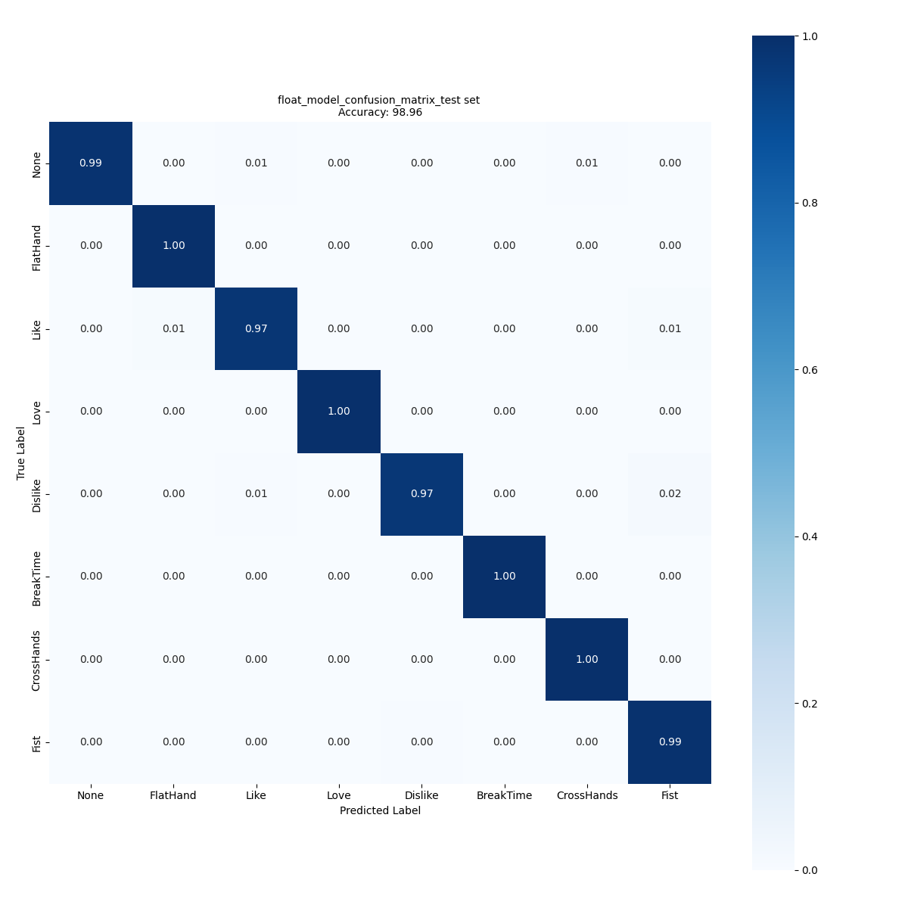

# Evaluation of hand posture model

Our evaluation service is a comprehensive tool that enables users to assess the accuracy of their Keras (.h5) Hand Posture model. By uploading their model and a test dataset, users can quickly and easily evaluate the performance of their model and generate various metrics, such as accuracy.

The evaluation service is designed to be fast, efficient, and accurate, making it an essential tool for anyone looking to evaluate the performance of their model.

## <a id="">Table of contents</a>

<details open><summary><a href="#1"><b>1. Configure the yaml file</b></a></summary><a id="1"></a>

To use this service and achieve your goals, you can use the [user_config.yaml](../user_config.yaml) or directly update the [evaluation_config.yaml](../config_file_examples/evaluation_config.yaml) file and use it. This file provides an example of how to configure the evaluation service to meet your specific needs.

Alternatively, you can follow the tutorial below, which shows how to evaluate your pre-trained image classification model using our evaluation service.

<ul><details open><summary><a href="#1-1">1.1 Setting the model and the operation mode</a></summary><a id="1-1"></a>

As mentioned previously, all the sections of the YAML file must be set in accordance with this **[README.md](../config_file_examples/evaluation_config.yaml)**.
In particular, `operation_mode` should be set to evaluation and the `evaluation` section should be filled as in the following example: 

```yaml
general:
     model_path: ../pretrained_models/CNN2D_ST_HandPosture/ST_pretrainedmodel_custom_dataset/ST_VL53L8CX_handposture_dataset/CNN2D_ST_HandPosture_8classes/CNN2D_ST_HandPosture_8classes.h5     # Path to the model file to deploy

operation_mode: evaluation
```
In this example, the path to the CNN2D_ST_HandPosture_8classes model (for VL53L8CX sensor) is provided in the `model_path` parameter.

</details></ul>
<ul><details open><summary><a href="#1-2">1.2 Prepare the dataset</a></summary><a id="1-2"></a>

Information about the dataset you want use for evaluation is provided in the `dataset` section of the configuration file, as shown in the YAML code below.

```yaml
dataset:
  name: ST_handposture_dataset
  class_names: [None, Like, Dislike, FlatHand, Fist, Love, BreakTime, CrossHands]
  test_path: ../datasets/ST_VL53L8CX_handposture_dataset
```

In this example, the path to the test dataset is provided in the `test_path` parameter.

In cases where there is no validation set path or test set provided to evaluate the model trained using the training service, the available data under the `training_path` directory is split into two to create a training set and a validation set. By default, 80% of the data is used for training and the remaining 20% is used for the validation set in the evaluation service. 

If you want to use a different split ratio, you need to specify the percentage to be used for the validation set in the `validation_split` parameter (to ensure consistency in the [training](../training/README.md) and evaluation process, you must specify the same validation_split parameter value in both the training and evaluation services), as shown in the YAML example below:

```yaml
dataset:
   name: ST_handposture_dataset
   class_names: [None, Like, Dislike, FlatHand, Fist, Love, BreakTime, CrossHands]
   training_path: ../datasets/ST_VL53L8CX_handposture_dataset
```

</details></ul>
<ul><details open><summary><a href="#1-3">1.3 Apply preprocessing</a></summary><a id="1-3"></a>

The frames from the dataset need to be preprocessed before they are presented to the network for evaluation.

This is illustrated in the YAML code below:

```yaml
preprocessing: # Mandatory
  Max_distance: 400 # Mandatory
  Min_distance: 100 # Mandatory
  Background_distance:  120 # Mandatory
```

- `Max_distance` - *Integer*, *in mm*, the maximum distance of the hand from the sensor allowed for this application. If the distance is higher, the frame is filtered/removed from the dataset
- `Min_distance` - *Integer*, *in mm*, the minimum distance of the hand from the sensor allowed for this application. If the distance is lower, the frame is filtered/removed from the dataset
- `Background_distance` - *Integer*, *in mm*, the gap behind the hand, all zones above this gap will be removed

</details></ul>
</details>
<details open><summary><a href="#2"><b>2. Evaluate your model</b></a></summary><a id="2"></a>

If you chose to modify the [user_config.yaml](../user_config.yaml) you can evaluate the model by running the following command from the **src/** folder:

```bash
python stm32ai_main.py 
```
If you chose to update the [evaluation_config.yaml](../config_file_examples/evaluation_config.yaml) and use it then run the following command from the **src/** folder: 

```bash
python stm32ai_main.py --config-path ./config_file_examples/ --config-name evaluation_config.yaml
```

</details>
<details open><summary><a href="#3"><b>3. Visualize the evaluation results</b></a></summary><a id="3"></a>

You can retrieve the confusion matrix generated after evaluating the model on the test dataset by navigating to the appropriate directory within **experiments_outputs/\<date-and-time\>**.



You can also find the evaluation results saved in the log file **stm32ai_main.log** under **experiments_outputs/\<date-and-time\>**.

</details>
