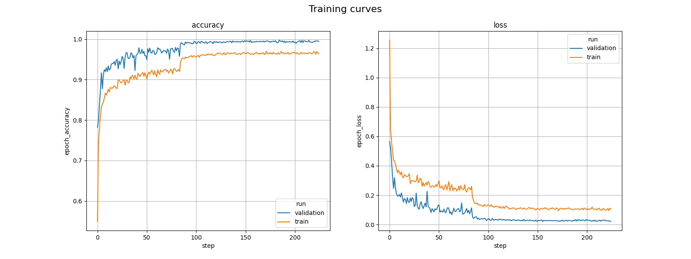

# <a id="">Hand Posture STM32 model training</a>

This readme shows how to train from scratch or apply transfer learning on a Hand Posture model using a custom dataset.
As an example we will demonstrate the workflow on the [ST_VL53L8CX_handposture_dataset](../../datasets) classification dataset.

## <a id="">Table of contents</a>

<details open><summary><a href="#1"><b>1. Prepare the dataset</b></a></summary><a id="1"></a>

The ToF Hand Posture datasets are expected to be structured in subdirectories for each class under the root directory of the dataset with the names of the subdirectories being the names of the classes. An example of this structure is shown below:

```bash
dataset_directory/
...class_a/
......log__class_a__xxx/ (***)
.........npz/
............data_class_a_xxx_1.npz
............data_class_a_xxx_2.npz
......log__class_a__xxy/
.........npz/
............data_class_a_xxy_1.npz
............data_class_a_xxy_2.npz
...class_b/
......log__class_b__xxx/
.........npz/
............data_class_b_xxx_1.npz
............data_class_b_xxx_2.npz
......log__class_b__xxy/
.........npz/
............data_class_b_xxy_1.npz
............data_class_b_xxy_2.npz
```
(***): The log directory is an architecture generated by the ST datalog tool: STSW-IMG035_EVK (Gesture EVK).
This tool can be downloaded on [ST.com](https://www.st.com/en/embedded-software/stsw-img035.html)
A dedicated documentation is available for this tool and to know how to create your own ST multi-zone Time-of-Flight dataset for hand posture recognition.

The ST dataset for VL53L8CX ToF sensor is available in ModelZOO: [ST_VL53L8CX_handposture_dataset.zip](../../datasets)

After downloading and unzipping the dataset, the directory tree should look as below:


```bash
ST_VL53L8CX_handposture_dataset/
...None/
......log__None__User1__1__VL53L8__handposture_api__8x8__20230503_164753/ (***)
.........npz/
............data_None__User1__1__VL53L8__handposture_api__8x8__20230503_164753_ends164758.785.npz
............data_None__User1__1__VL53L8__handposture_api__8x8__20230503_164753_ends164810.608.npz
......log__None__User1__2__VL53L8__handposture_api__8x8__20230505_112618/
.........npz/
............
............
...Like/
......log__Like__User1__1__VL53L8__handposture_api__8x8__20230503_165000/
.........npz/
............data_Like....npz
............data_Like....npz
......log__Like..../
.........npz/
............
```
The names of the subdirectories under the dataset root directory are the names of the classes. They have to be aligned with the class names defined in [handposture_dictionnary.py](../utils/handposture_dictionnary.py)

If you want to increase your dataset or create new classes, the dalalogging tool can be downloaded on [ST.com](https://www.st.com/en/embedded-software/stsw-img035.html)

A dedicated documentation is available for this tool and to know how to create your own ST multi-zone Time-of-Flight dataset for hand posture recognition.

Other dataset formats are not supported.

</details>
<details open><summary><a href="#2"><b>2. Create your training configuration file</b></a></summary><a id="2"></a>
<ul><details open><summary><a href="#2-1">2.1 Overview</a></summary><a id="2-1"></a>

All the proposed services like the training of the model are driven by a configuration file written in the YAML language.

For training, the configuration file should include at least the following sections:

- `general`, describes your project, including project name, directory where to save models, etc.
- `operation_mode`, describes the service or chained services to be used
- `dataset`, describes the dataset you are using, including directory paths, class names, etc.
- `preprocessing`, specifies the methods you want to use for rescaling and resizing the images. 
- `training`, specifies your training setup, including batch size, number of epochs, optimizer, callbacks, etc.
- `mlflow`, specifies the folder to save MLFlow logs.
- `hydra`, specifies the folder to save Hydra logs.

This tutorial only describes the settings needed to train a model. In the first part, we describe basic settings.
At the end of this readme, you can also find more advanced settings and callbacks supported.

</details></ul>
<ul><details open><summary><a href="#2-2">2.2 General settings</a></summary><a id="2-2"></a>

The first section of the configuration file is the `general` section that provides information about your project.

```yaml
general:
  project_name: my_project
  logs_dir: logs
  saved_models_dir: saved_models
  deterministic_ops: True
```
If you want your experiments to be fully reproducible, you need to activate the `deterministic_ops` attribute and set it to True.
Enabling the `deterministic_ops` attribute will restrict TensorFlow to use only deterministic operations on the device, but it may lead to a drop in training performance. It should be noted that not all operations in the used version of TensorFlow can be computed deterministically. 
If your case involves any such operation, a warning message will be displayed and the attribute will be ignored.
The `logs_dir` attribute is the name of the directory where the MLFlow and TensorBoard files are saved. The `saved_models_dir` attribute is the name of the directory where models are saved, which includes the trained model. This directory is located under the top level <hydra> directory.

</details></ul>
<ul><details open><summary><a href="#2-3">2.3 Dataset specification</a></summary><a id="2-3"></a>

Information about the dataset you want use is provided in the `dataset` section of the configuration file, as shown in the YAML code below.

```yaml
dataset:
  name: ST_handposture_dataset
  class_names: [None, Like, Dislike, FlatHand, Fist, Love, BreakTime, CrossHands]
  training_path: ../datasets/ST_VL53L8CX_handposture_dataset
  validation_path:
  validation_split: 0.2
  test_path:
```

In this example, no validation set path is provided, so the available data under the *training_path* directory is split in two to create a training set and a validation set. 
By default, 80% of the data is used for the training set and the remaining 20% is used for the validation set.
If you want to use a different split ratio, you need to specify in `validation_split` the percentage to be used for the validation set.

No test set path is provided in this example to evaluate the model accuracy after training. Therefore, the validation set is used as the test set.

</details></ul>
<ul><details open><summary><a href="#2-4">2.4 Dataset preprocessing</a></summary><a id="2-4"></a>

The frames from the dataset need to be preprocessed before they are presented to the network.

This includes "distance filtering" and "background removal", as illustrated in the YAML code below.

```yaml
preprocessing:
  Max_distance: 400
  Min_distance: 100
  Background_distance:  120
```
- `Max_distance` - *Integer*, *in mm*, the maximum distance of the hand from the sensor allowed for this application. If the distance is higher, the frame is filtered/removed from the dataset
- `Min_distance` - *Integer*, *in mm*, the minimum distance of the hand from the sensor allowed for this application. If the distance is lower, the frame is filtered/removed from the dataset
- `Background_distance` - *Integer*, *in mm*, the gap behind the hand, all zones above this gap will be removed

</details></ul>
<ul><details open><summary><a href="#2-5">2.5 Data augmentation</a></summary><a id="2-5"></a>

Data augmentation is an effective technique to reduce the overfit of a model when the dataset is too small or the classification problem to solve is too easy for the model.

For the Hand Posture use case, it's also very useful to balance right-hand postures and left-hand postures by using a mirroring (vertical flip).

The data augmentation functions to apply to the input frames are specified in the `data_augmentation` section of the configuration file as illustrated in the YAML code below.

```yaml
data_augmentation:
  random_flip:
    mode: vertical
```

The data augmentation functions with their parameter settings are applied to the input images in their order of appearance in the configuration file. 
Refer to the data augmentation documentation **[README.md](../data_augmentation/README.md)** for more information about the available functions and their arguments.

</details></ul>
<ul><details open><summary><a href="#2-6">2.6 Loading a model</a></summary><a id="2-6"></a>

Information about the model you want to train is provided in the `training` section of the configuration file.

The YAML code below shows how you can use the ST Hand Posture CNN2D model from the Model Zoo.

```yaml
training:
  model:
    name: CNN2D_ST_HandPosture
    version: v1
    input_shape: (8, 8, 2)
```

</details></ul>
<ul><details open><summary><a href="#2-7">2.7 Training setup</a></summary><a id="2-7"></a>

The training setup is described in the `training` section of the configuration file, as illustrated in the example below.

```yaml
training:
  dropout: 0.2
  batch_size: 32
  epochs: 1000
  optimizer:
    Adam:
      learning_rate: 0.01
  callbacks:
    ReduceLROnPlateau:
      monitor: val_loss
      factor: 0.1
      patience: 20
      min_lr: 1.0e-04
    EarlyStopping:
      monitor: val_accuracy
      restore_best_weights: true
      patience: 40
```

The `batch_size`, `epochs` and `optimizer` attributes are mandatory. All the others are optional.

The `dropout` attribute only makes sense if your model includes a dropout layer. 

All the Tensorflow optimizers can be used in the `optimizer` subsection. All the Tensorflow callbacks can be used in the `callbacks` subsection, except the ModelCheckpoint and TensorBoard callbacks that are built-in and can't be redefined.

A variety of learning rate schedulers are provided with the Model Zoo. If you want to use one of them, just include it in the `callbacks` subsection. Refer to [the learning rate schedulers README](../../../common/training/lr_schedulers_README.md) for a description of the available callbacks and learning rate plotting utility.

</details></ul>
</details>
<details open><summary><a href="#3"><b>3. Train your model</b></a></summary><a id="3"></a>

To launch your model training using a real dataset, run the following command from **src/** folder:

```bash
python stm32ai_main.py --config-path ./config_file_examples/ --config-name training_config.yaml
```
Trained h5 model can be found in [pretrained_models/](../../pretrained_models) or ../experiments_outputs folders.

</details>
<details open><summary><a href="#4"><b>4. Visualise your results</b></a></summary><a id="4"></a>
<ul><details open><summary><a href="#4-1">4.1 Saved results</a></summary><a id="4-1"></a>

All training and evaluation artifacts are saved under the current output simulation directory **"experiments_outputs/{run_time}"**.

For example, you can retrieve the plots of the accuracy/loss curves as below:



</details></ul>
<ul><details open><summary><a href="#4-2">4.2 Run tensorboard</a></summary><a id="4-2"></a>

To visualize the training curves logged by tensorboard, go to **"outputs/{run_time}"** and run the following command:

```bash
tensorboard --logdir logs
```

And open the URL `http://localhost:6006` in your browser.

</details></ul>
<ul><details open><summary><a href="#4-3">4.3 Run MLFlow</a></summary><a id="4-3"></a>

MLflow is an API for logging parameters, code versions, metrics, and artifacts while running machine learning code and for visualizing results.
To view and examine the results of multiple trainings, you can simply access the MLFlow Webapp by running the following command:
```bash
mlflow ui
```
And open the given IP adress in your browser.

</details></ul>
</details>
<details open><summary><a href="#5"><b>5. Advanced settings</b></a></summary><a id="5"></a>
<ul><details open><summary><a href="#5-1">5.1 Continue Training your own model and Transfer Learning</a></summary><a id="5-1"></a>

You may want to continue training your own model on a new dataset rather than training your model from scratch.

This can be done using the `model_path` attribute of the `general:` section to provide the path to the model file to use as illustrated in the example below.

```yaml
general:
   model_path: <path-to-a-Keras-model-file>    # Path to the model file to use for training

operation_mode: training

dataset:
   training_path: <training-set-root-directory>    # Path to the root directory of the training set.
   validation_split: 0.2                           # Use 20% of the training set to create the validation set.
   test_path: <test-set-root-directory>            # Path to the root directory of the test set.

training:
   batch_size: 32
   epochs: 150
   dropout: 0.3
   frozen_layers:
   optimizer:
      Adam:                               
         learning_rate: 0.001
   callbacks:                    
      ReduceLROnPlateau:
         monitor: val_loss
         factor: 0.1
         patience: 10
```

The model file must be a Keras model file with a '.h5' filename extension.

The `model:` subsection of the `training:` section is not present as we are not training a model from the Model Zoo. An error will be thrown if it is present when `model_path` is set.

About the model loaded from the file:
- if some layers are frozen in the model, they will be reset to trainable before training. You can use the `frozen_layers` attribute if you want to freeze these layers (or different ones).
- If you set the `dropout` attribute but the model does not include a dropout layer, an error will be thrown. Reciprocally, an error will also occur if the model includes a dropout layer but the `dropout` attribute is not set.
- If the model was trained before, the state of the optimizer won't be preserved as the model is compiled before training.

</details></ul>
<ul><details open><summary><a href="#5-2">5.2 Freezing layers</a></summary><a id="5-2"></a>

Once the model has been loaded, some layers are often frozen, that is made non-trainable, before training the model. A commonly used approach is to freeze all the layers but the last one, which is the classifier.

By default, all the layers are trainable. If you want to freeze some layers, then you need to add the optional `frozen_layers` attribute to the `training:` section of your configuration file. The indices of the layers to freeze are specified using the Python syntax for indexing into lists and arrays. Below are some examples.


```yaml
training:
   frozen_layers: (0:-1)    # Freeze all the layers but the last one
   
training:
   frozen_layers: (10:120)   # Freeze layers with indices from 10 to 119

training:
   frozen_layers: (150:)     # Freeze layers from index 150 to the last layer

training:
   frozen_layers: (8, 110:121, -1)  # Freeze layers with index 8, 110 to 120, and the last layer
```

Note that if you want to make it explicit that all the layers are trainable, you may add the `frozen_layers` attribute and left it unset or set to *None*.

</details></ul>
<ul><details open><summary><a href="#5-3">5.3 Creating your own custom model</a></summary><a id="5-3"></a>

You can create your own custom model and get it handled as any built-in Model Zoo model. If you want to do that, you need to modify a number of Python source code files that are all located under the *\<MODEL-ZOO-ROOT>\/image_classification/src* directory root.

An example of custom model is given in the **models/custom_model.py** located in the *\<MODEL-ZOO-ROOT\>/hand_posture/src/models/*. The model is constructed in the body of the *get_custom_model()* function that returns the model. Modify this function to implement your own model.

In the provided example, the *get_custom_model()* function takes in arguments:
- `num_classes`, the number of classes.
- `input_shape`, the input shape of the model.
- `dropout`, the dropout rate if a dropout layer must be included in the model.

As you modify the *get_custom_model()* function, you can add your own arguments. Assume for example that you want to have an argument `alpha` that is a float. Then, just add it to the interface of the function.

Then, your custom model can be used as any other ModelZOO model using the configuration file as shown in the YAML code below:
```yaml
training:
   model:
      name: custom
      input_shape: (128, 128, 3)
   dropout: 0.2
```

</details></ul>
</details>
