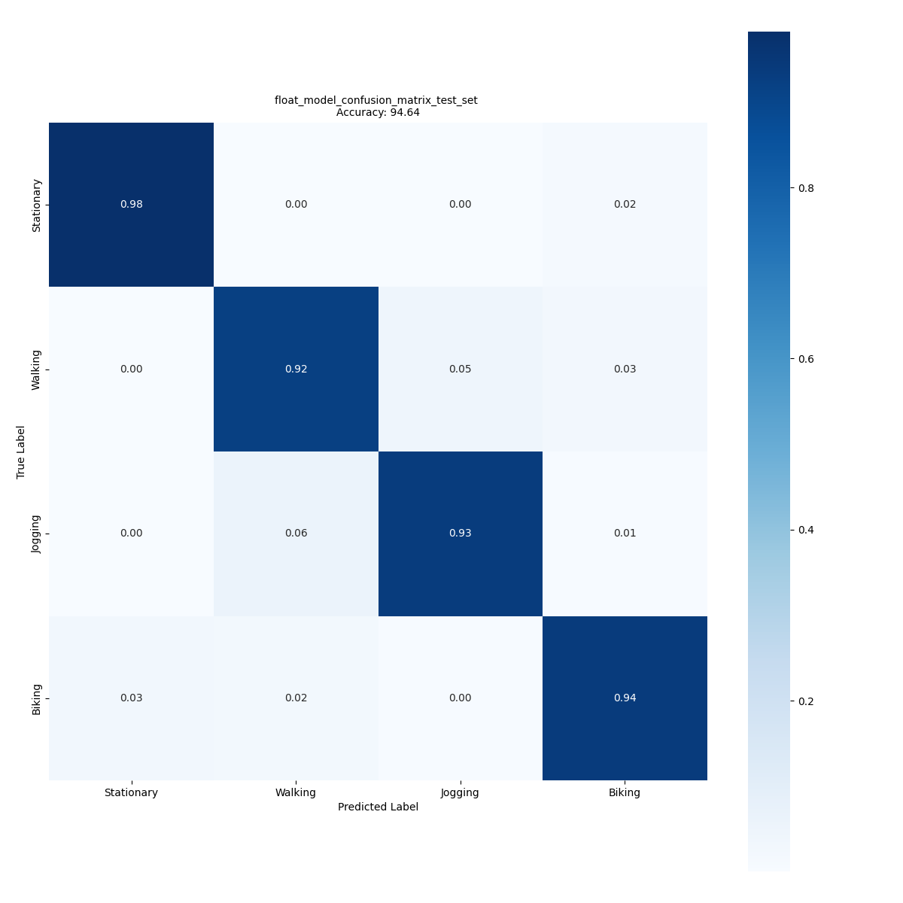

# IGN HAR model

## **Use case** : `Human activity recognition`

# Model description

IGN is acronym of Ignatov, and is a convolutional neural network (CNN) based model for performing the human activity recognition (HAR) task based on the 3D accelerometer data. In this work we use a modified version of the IGN model presented in the [paper[2]](#2). It uses the 3D raw data with gravity rotation and supression filter as preprocessing. This is a light model with very small foot prints in terms of FLASH and RAM as well as computational requirements.

This network supports any input size greater than (20 x 3 x 1) but we recommend to use at least (24 x 3 x 1), i.e. a window length of 24 samples. In this folder we provide IGN models trained with two different window lenghts [24 and 48].

The only input required to the model is the input shape, dropout ratio, and the number of output classes.

In this folder you will find multiple copies of the IGN model pretrained on a public dataset ([WISDM](https://www.cis.fordham.edu/wisdm/dataset.php)) and a custom dataset collected by ST (mobility_v1). 

## Network information

| Network Information     |  Value          |
|:-----------------------:|:---------------:|
|  Framework              | TensorFlow      |
|  Params                 | 3,064           |

## Network inputs / outputs

For an input resolution of wl x 3 x 1 and P classes

| Input Shape | Description |
| :----:| :-----------: |
| (1, wl, 3, 1) | Single ( wl x 3 x 1 ) matrix of accelerometer values, `wl` is window lenght, for 3 axes and 1 is channel in FLOAT32.|

| Output Shape | Description |
| :----:| :-----------: |
| (1, P) | Per-class confidence for P classes in FLOAT32|

## Recommended platforms

| Platform | Supported | Recommended |
|:----------:|:-----------:|:-----------:|
| STM32L4  |    [x]    |    []    |
| STM32U5  |    [x]    |    [x]     |

# Performances

## Metrics

Measures are done with [STM32Cube.AI Dev Cloud version](https://stm32ai-cs.st.com/home) 10.0.0 with enabled input/output allocated options and balanced optimization. The inference time is reported is calculated using **STM32Cube.AI version 10.0.0**, on STM32 board **B-U585I-IOT02A** running at Frequency of **160 MHz**.

Reference memory footprint and inference times for IGN models are given in the table below. The accuracies are provided in the sections after for two datasets.

| Model                                                                        |   Format  | Input Shape | Series  | Activation RAM (KiB) | Runtime RAM (KiB) | Weights Flash (KiB) | Code Flash (KiB) | Total RAM (KiB)| Total Flash (KiB) | Inference Time (msec) | STM32Cube.AI version  |
|:-----------------------------------------------------------------------------:|:---------:|:-----------:|:-------:|:--------------------:|:-----------------:|:-------------------:|:----------------:|:--------------:|:-----------------:|:---------------------:|:---------------------:|
| [IGN wl 24](./ST_pretrainedmodel_public_dataset/WISDM/ign_wl_24/ign_wl_24.h5) | FLOAT32   | 24 x 3 x 1  | STM32U5 | 2.03                 | 1.91              | 11.97               | 13.61            |  3.94          | 25.58          |   2.25    | 10.0.0            |
| [IGN wl 48](./ST_pretrainedmodel_public_dataset/WISDM/ign_wl_48/ign_wl_48.h5) | FLOAT32   | 48 x 3 x 1  | STM32U5 | 4.56                 | 1.91              | 38.97               | 13.61            |  6.47          | 52.58          |   8.17    | 10.0.0            |

### Accuracy with mobility_v1 dataset

Dataset details: A custom dataset and not publically available, Number of classes: 5 [Stationary, Walking, Jogging, Biking, Vehicle]. **(We kept only 4, [Stationary, Walking, Jogging, Biking]) and removed Driving**, Number of input frames:  81,151 (for wl = 24), and 40,575 for (wl = 48).

| Model                                                                                        | Format | Resolution | Accuracy (%)|
|:--------------------------------------------------------------------------------------------:|:------:|:----------:|:-----------:|
| [IGN wl 24](./ST_pretrainedmodel_custom_dataset/mobility_v1/ign_wl_24/ign_wl_24.h5)          | FLOAT32| 24 x 3 x 1 | 94.64       |
| [IGN wl 48](./ST_pretrainedmodel_custom_dataset/mobility_v1/ign_wl_48/ign_wl_48.h5)          | FLOAT32| 48 x 3 x 1 | 95.01       |

Confusion matrix for IGN wl 24 with Float32 weights for mobility_v1 dataset is given below.

### Accuracy with WISDM dataset

Dataset details: [link](([WISDM]("https://www.cis.fordham.edu/wisdm/dataset.php"))) , License [CC BY 2.0](https://creativecommons.org/licenses/by/2.0/) , Quotation[[1]](#1) , Number of classes: 4 (we are combining [Upstairs and Downstairs into Stairs] and [Standing and Sitting into Stationary]), Number of samples: 45,579 (at wl = 24), and 22,880 (at wl = 48).

| Model                                                                                 | Format  | Resolution |  Accuracy (%) |
|:-------------------------------------------------------------------------------------:|:-------:|:----------:|:-------------:|
| [IGN wl 24](ST_pretrainedmodel_public_dataset/WISDM/ign_wl_24/ign_wl_24.h5)           | FLOAT32 | 24 x 3 x 1 | 91.7         |
| [IGN wl 48](ST_pretrainedmodel_public_dataset/WISDM/ign_wl_48/ign_wl_48.h5)           | FLOAT32 | 48 x 3 x 1 | 93.67          |

## Retraining and Integration in a simple example:

Please refer to the stm32ai-modelzoo-services GitHub [here](https://github.com/STMicroelectronics/stm32ai-modelzoo-services)

# References

<a id="1">[1]</a>
“WISDM : Human activity recognition datasets". [Online]. Available: "https://www.cis.fordham.edu/wisdm/dataset.php".

<a id="2">[2]</a>
“Real-time human activity recognition from accelerometer data using Convolutional Neural Networks, Andrey Ignatove". [Online]. Available: "https://www.sciencedirect.com/science/article/abs/pii/S1568494617305665?via%3Dihub".
