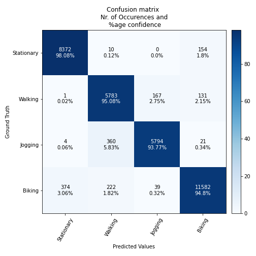

# IGN HAR model

## **Use case** : [Human activity recognition](../../../human_activity_recognition/)

# Model description

IGN is acronym of Ignatov, and is a convolutional neural network based model for performing the human activity recognition (HAR) task based on the accelerometer data. In this work we use a modified version of the IGN model presented in the [paper[2]](#2). It uses the 3D raw data with gravity rotation and supression filter as preprocessing. This is a very light model with very small foot prints in terms of FLASH and RAM as well as computational requirements.

This network supports any input size greater than (20 x 3 x 1) but we recommend to use at least (24 x 3 x 1), i.e. a window length of 24 samples.

The only input required to the model is the input shape, dropout ratio, and the number of outputs.

In this folder you will find multiple copies of the IGN model pretrained on a public dataset ([WISDM](https://www.cis.fordham.edu/wisdm/dataset.php)) and a custom dataset collected by ST (mobility_v1). The pretrained model is also quantized in INT8 using tensorflow lite converter with FLOAT32 inputs and outputs.

## Network information

| Network Information     |  Value          |
|:-----------------------:|:---------------:|
|  Framework              | TensorFlow      |
|  Params                 | 3,064           |
|  Quantization           | int8            |

The models are quantized using post training quantization with tensorflow lite converter.

## Network inputs / outputs

For an input resolution of wl x 3 x 1 and P classes

| Input Shape | Description |
| :----:| :-----------: |
| (1, wl, 3, 1) | Single ( wl x 3 x 1 ) matrix of accelerometer values, `wl` is window lenght, for 3 axes and 1 is channel in FLOAT32.|

| Output Shape | Description |
| :----:| :-----------: |
| (1, P) | Per-class confidence for P classes in FLOAT32|

## Recommended platforms

| Platform | Supported | Recommended |
|:----------:|:-----------:|:-----------:|
| STM32L4  |    [x]    |    []    |
| STM32U5  |    [x]    |    [x]     |

# Performances
## Training

To train a IGN model, you need to configure the [user_config.yaml](../../scripts/training/user_config.yaml) file following the [tutorial](../../scripts/training/README.md) under the training section.

As an example, [ign_wl_24_config.yaml](../ign/ST_pretrainedmodel_public_dataset/WISDM/ign_wl_24/ign_wl_24_config.yaml) file is used to train this model on WISDM dataset, you can copy its content in the [user_config.yaml](../../scripts/training/user_config.yaml) file provided under the training section to reproduce the results presented below. 

## Deployment

To deploy your trained model, you need to configure the [user_config.yaml](../../scripts/deployment/user_config.yaml) file following the [tutorial](../../scripts/deployment/README.md) under the deployment section.

## Metrics

Measures are done with default STM32Cube.AI configuration with enabled input / output allocated option.

### Reference memory footprint based on WISDM dataset (see Accuracy for details on dataset)

| Model                                                                                |   Format  | Input Shape | Series  | Activation RAM (KiB) | Runtime RAM (KiB) | Weights Flash (KiB) | Code Flash (KiB) | Total RAM (KiB)| Total Flash (KiB) | STM32Cube.AI version  |
|:------------------------------------------------------------------------------------:|:---------:|:-----------:|:-------:|:--------------------:|:-----------------:|:-------------------:|:----------------:|:--------------:|:-----------------:|:---------------------:|
| [IGN wl 24](ST_pretrainedmodel_public_dataset/WISDM/ign_wl_24/ign_wl_24.h5)          | FLOAT32   | 24 x 3 x 1  | STM32U5 | 2.81                 | 2.21              | 11.97               | 15.46            |  5.03          | 27.43             | 8.1.0                 |
| [IGN wl 24](ST_pretrainedmodel_public_dataset/WISDM/ign_wl_24/ign_wl_24_int8.tflite) | INT8      | 24 x 3 x 1  | STM32U5 | 1.63                 | 2.75              | 3.11                | 33.42            |  4.38          | 36.53             | 8.1.0                 |
| [IGN wl 48](ST_pretrainedmodel_public_dataset/WISDM/ign_wl_48/ign_wl_48.h5)          | FLOAT32   | 48 x 3 x 1  | STM32U5 | 9.84                 | 2.21              | 38.97               | 15.46            |  12.06         | 54.43             | 8.1.0                 |
| [IGN wl 48](ST_pretrainedmodel_public_dataset/WISDM/ign_wl_48/ign_wl_48_int8.tflite) | INT8      | 48 x 3 x 1  | STM32U5 | 2.33                 | 2.75              | 9.86                | 33.45            |  5.08          | 43.30             | 8.1.0                 |

### Reference inference time based on WISDM dataset (see Accuracy for details on dataset)
The inference time is reported is calculated using **STM32Cube.AI version 8.1.0**, on STM32 board **B-U585I-IOT02A** running at Frequency of **160 MHz**.

| Model                                                                                     | Format  | Resolution | Inference time (ms) |
|:-----------------------------------------------------------------------------------------:|:-------:|:----------:|:-------------------:|
| [IGN wl 24](ST_pretrainedmodel_public_dataset/WISDM/ign_wl_24/ign_wl_24.h5)               | FLOAT32 | 24 x 3 x 1 |    2.224            |
| [IGN wl 24](ST_pretrainedmodel_public_dataset/WISDM/ign_wl_24/ign_wl_24_int8.tflite)      | INT8    | 24 x 3 x 1 |    0.804            |
| [IGN wl 48](ST_pretrainedmodel_public_dataset/WISDM/ign_wl_48/ign_wl_48.h5)               | FLOAT32 | 48 x 3 x 1 |    8.085            |
| [IGN wl 48](ST_pretrainedmodel_public_dataset/WISDM/ign_wl_48/ign_wl_48_int8.tflite)      | INT8    | 48 x 3 x 1 |    2.802            |

### Accuracy with mobility_v1 dataset

Dataset details: A custom dataset and not publically available, Number of classes: 5 [Stationary, Walking, Jogging, Biking, Vehicle]. **(We kept only 4, [Stationary, Walking, Jogging, Biking]) and removed Driving**, Number of input frames:  81,151 (for wl = 24), and 40,575 for (wl = 48).

| Model                                                                                        | Format | Resolution | Accuracy (%)|
|:--------------------------------------------------------------------------------------------:|:------:|:----------:|:-----------:|
| [IGN wl 24](./ST_pretrainedmodel_custom_dataset/mobility_v1/ign_wl_24/ign_wl_24.h5)          | FLOAT32| 24 x 3 x 1 | 95.51       |
| [IGN wl 24](./ST_pretrainedmodel_custom_dataset/mobility_v1/ign_wl_24/ign_wl_24_int8.tflite) | INT8   | 24 x 3 x 1 | 95.19       |
| [IGN wl 48](./ST_pretrainedmodel_custom_dataset/mobility_v1/ign_wl_48/ign_wl_48.h5)          | FLOAT32| 48 x 3 x 1 | 96.06       |
| [IGN wl 48](./ST_pretrainedmodel_custom_dataset/mobility_v1/ign_wl_48/ign_wl_48_int8.tflite) | INT8   | 48 x 3 x 1 | 96.07       |

Confusion matrix for IGN wl 24 with Float32 weights for mobility_v1 dataset is given below.

### Accuracy with WISDM dataset

Dataset details: [link](([WISDM]("https://www.cis.fordham.edu/wisdm/dataset.php"))) , License [CC BY 2.0](https://creativecommons.org/licenses/by/2.0/) , Quotation[[1]](#1) , Number of classes: 4 (we are combining [Upstairs and Downstairs into Stairs] and [Standing and Sitting into Stationary]), Number of samples: 45,579 (at wl = 24), and 22,880 (at wl = 48).

| Model                                                                                 | Format  | Resolution |  Accuracy (%) |
|:-------------------------------------------------------------------------------------:|:-------:|:----------:|:-------------:|
| [IGN wl 24](ST_pretrainedmodel_public_dataset/WISDM/ign_wl_24/ign_wl_24.h5)           | FLOAT32 | 24 x 3 x 1 | 86.38         |
| [IGN wl 24](ST_pretrainedmodel_public_dataset/WISDM/ign_wl_24/ign_wl_24_int8.tflite)  | INT8    | 24 x 3 x 1 | 85.62         |
| [IGN wl 48](ST_pretrainedmodel_public_dataset/WISDM/ign_wl_48/ign_wl_48.h5)           | FLOAT32 | 48 x 3 x 1 | 85.4          |
| [IGN wl 48](ST_pretrainedmodel_public_dataset/WISDM/ign_wl_48/ign_wl_48_int8.tflite)  | INT8    | 48 x 3 x 1 | 85.01         |

## Training and code generation

- Link to training script: [here](../../scripts/training/README.md)
- Link to STM32Cube.AI generation script: [here](../../scripts/deployment/README.md)

## Demos
### Integration in a simple example

Please refer to the generic guideline [here](../../scripts/deployment/README.md).

# References

<a id="1">[1]</a>
“WISDM : Human activity recognition datasets". [Online]. Available: "https://www.cis.fordham.edu/wisdm/dataset.php".

<a id="2">[2]</a>
“Real-time human activity recognition from accelerometer data using Convolutional Neural Networks, Andrey Ignatove". [Online]. Available: "https://www.sciencedirect.com/science/article/abs/pii/S1568494617305665?via%3Dihub".
