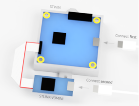
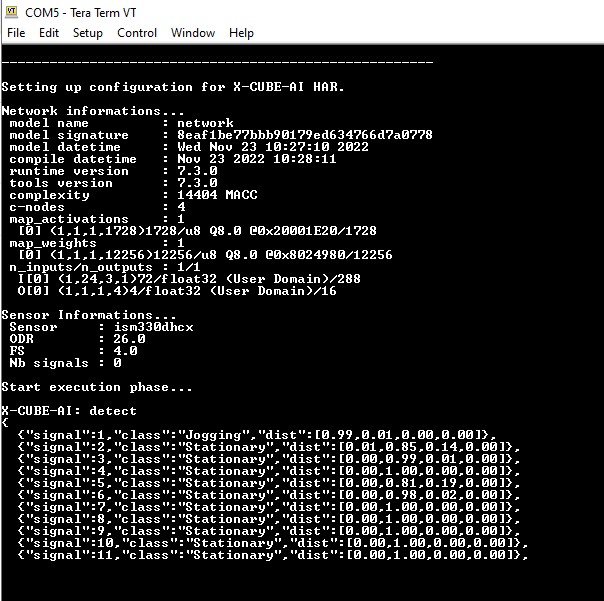

# Human activity recognition (HAR) STM32 model deployment

This tutorial shows how to deploy your pre-trained keras, tflite or sklearn (onnx) models on an STM32 board using **STM32Cube.AI**. It will also cover the quantization of the pretrained keras models, to have an even more effecient deployment. 

This document demonstrate the steps using a pretrained model from **[ST public model zoo](../../models/README.md)**. However, readers can deploy any external or custom model also as long as it has the same restrictions and preprocessing applied. The STM32 project provided supports on only [B-U585I-IOT02A](https://www.st.com/en/evaluation-tools/b-u585i-iot02a.html) board.

## Table of contents
 - <a href='#prereqs'>Before you start</a><br>

 - <a href='#deploy'>Deploy a keras model on STM32 board</a><br>

 - <a href='#quantize'>Quantize your model before deployment</a><br>
 - [Deploy a model from ST public model zoo](#Tflite)

<!-- [Validating the performance of the C application](#validation) -->

## Before you start
<a id='prereqs'></a>


Please check out [STM32 model zoo](../../models/README.md) for pretrained models for human activity recognition (HAR).

### **1. Hardware setup**

The [getting started](../../getting_started/README.md) is running on an STMicroelectronics evaluation board called [B-U585I-IOT02A](https://www.st.com/en/evaluation-tools/b-u585i-iot02a.html). Although this board has many sensors in this demo version we will be running an accelerometer only.


### **2. Software requirements**

You need to download and install the following software:

- [STM32CubeIDE](https://www.st.com/en/development-tools/stm32cubeide.html) : an all-in-one multi-OS development tool, which is part of the STM32Cube software ecosystem.
- (optional) [STM32Cube.AI](https://www.st.com/en/embedded-software/x-cube-ai.html) : if using STM32Cube.AI locally, open link and download the package, then `extract here` both `'.zip'` and `'.pack'` files.

### **3. Specifications**

- `serie` : STM32U5
- `IDE` : GCC
- `quantization_input_type` : float
- `quantization_output_type` : float

<a name="deploy"></a>
# Deploy a keras, tflite or .onnx model

### **1. Configure the yaml file**

You can run this demo using any of the pretrained models from [STM32 model zoo](../../models/README.md) directory. Please refer to the `.yaml` files provided alongside the models to fill the following parameters in [user_config.yaml](user_config.yaml).

As an example, we will show how to deploy the model [ign_wl_24.h5](../../models/ign/ST_pretrainedmodel_public_dataset/WISDM/ign_wl_24/ign_wl_24.h5) pretrained on WISDM dataset using the necessary parameters provided in [ign_wl_24_config.yaml](../../models/ign/ST_pretrainedmodel_public_dataset/WISDM/ign_wl_24/ign_wl_24_config.yaml).

**1.1. General settings:**

Configure the **general** section in **[user_config.yaml](user_config.yaml)** as the following:


```python
general:
 project_name: HAR

```

where:

- `project_name` - *String*, name of the project. `HAR` or anyother name of your choice.

**1.2. Dataset configuration:**

You need to specify some parameters related to the dataset and the preprocessing of the data in the **[user_config.yaml](user_config.yaml)** which will be parsed into a header file used to run the C application.

**1.2.1. Dataset info:**

Configure the **dataset** section in **[user_config.yaml](user_config.yaml)** as the following:
```python
 dataset:
  name: wisdm
  class_names: [Jogging,Stationary,Stairs,Walking]
```

where:

- `name` - Dataset name used to train the model. `wisdm` is used here, for models trained on ST propritery dataset mobility_v1, specify `mobility_v1`.
- `class_names` - A list containing the classes name. This will be used to show the inference result on the serial terminal, hence providing the right order which was used at the time of training is very important. For `wisdm` the available classes are `[Jogging,Stationary,Stairs,Walking]` for the models trained on the `mobility_v1` dataset the available classes are `[Stationary,Walking,Jogging,Biking].`

**1.2.2. Preprocessing info:**

To run inference in the C application, we need to apply on the input data the same preprocessing used when training the model.

To do so, you need to specify the **preprocessing** configuration in **[user_config.yaml](user_config.yaml)** as the following:


```python
pre_processing:
  segment_len: 24
  segment_step: 24
  preprocessing: True
```

- `segment_len` - An *integer* value to define how long a segment of acceleration values should be, for each inference.
- `segment_step` - An *integer* value to control the overlap. **In this version this value should be exactly same as the `segment_len` as we do not support the overlapping frames**.
- `preprocessing` - A *boolean* value, *True* means gravity rotation and suppression filter is applied, *False* means this filter is diabled.

**1.3. Load model:**

In this demo we will run a using a pretrained model provided in [ST HAR model zoo](../../models/README.md) for human activity recognition. These models were trained and quantized on specific datasets (e.g. a public dataset WISDM, or a custom ST dataset mobility_v1).

Also, you can directly deploy your own pretrained model if quantized using *TFlite Converter* and respecting the specified [intput/output types](#3-specifications), else you can quantize your model before deploying it by following these [steps](#quantize).

The next step in deployment of the model is to configure the **model** section in **[user_config.yaml](user_config.yaml)** as the following:

```python
model:
  model_type: {name : ign}
  input_shape: [24,3,1]
  model_path: ../../models/svc/ST_pretrainedmodel_public_dataset/WISDM/ign_wl_24/ign_wl_24.h5
```

where:

- `model_type` - A *dictionary* with keys relative to the model topology (Example for `ign` family *{name : ign}*, else for a custom model use *{name : custom}*.
- `input_shape` -  A *list of int* *[wl, 3, 1]* for the input resolution, e.g. *[24, 3, 1]*.
- `model_path` - *Path* to pretained model. Please check out some pretrained models from STM32 model zoo [here](../../models/README.md).


**1.4. C project configuration:**

To deploy the model on a **B-U585I-IOT02A** board, we will use *STM32Cube.AI* to convert the model into optimized C code and *STM32CubeIDE* to build the C application provided in [getting_started](../../getting_started/README.md) folder, and flash the board with the built binary.

These steps will be done automatically by configuring the **stm32ai** section in **[user_config.yaml](user_config.yaml)** as the following:

```python
stm32ai:
  c_project_path: ../../getting_started
  serie: STM32U5
  IDE: GCC
  verbosity: 1
  version: 8.1.0
  optimization: balanced
  footprints_on_target: B-U585I-IOT02A
  path_to_stm32ai: C:/stmicroelectronics/STM32Cube/Repository/Packs/STMicroelectronics/X-CUBE-AI/8.1.0/Utilities/windows/stm32ai.exe
  path_to_cubeIDE: C:/ST/STM32CubeIDE_1.10.0/STM32CubeIDE/stm32cubeidec.exe
```
where:
- `c_project_path` - *Path* to [Getting Started](../../getting_started/README.md) project.
- `serie` - **STM32U5**, only supported option for *Getting Started*.
- `IDE` -**GCC**, only supported option for *Getting Started*.
- `verbosity` - *0* or *1*. Mode 0 is silent, and mode 1 displays messages when building and flashing the C applicaiton.
- `version` - Specify the **STM32Cube.AI** version used to benchmark the model, e.g. **8.1.0**.
- `optimization` - *String*, define the optimization used to generate the C model, options: "*balanced*", "*time*", "*ram*".
- `footprints_on_target` - **'B-U585I-IOT02A'** to use **Developer Cloud Services** to benchmark model and generate C code, else keep **False** (in this case the local installation of **STM32Cube.AI** will be used to get model footprints (w/o inference time) and C code generation).
- `path_to_stm32ai` - *Path* to stm32ai executable file.
- `path_to_cubeIDE` - *Path* to stm32cubeide executable file.


### **2. Run deployment:**

 **2.1 Attach the board:**

 To run build the project and flash the target board, connect an [B-U585I-IOT02A](https://www.st.com/en/evaluation-tools/b-u585i-iot02a.html?rt=db&id=DB4410) to your computer. Make sure that you connect the **STLINK \[CN8\]**.



 **2.2 Run deploy.py**

Then, run the following command:


```bash
python deploy.py
```

This will generate the C code, show the foot-prints (and inference time), copy the model files in the Getting Started project, build the C project, and flash the board.

### **3. Quantize your model before deployment:**
<a id='quantize'></a>

 ### **3.1. Configure the yaml file**

 In addition to the [previous steps](#1-configure-the-yaml-file), you can configure the following sections to quantize your `ign` or `gmp` model provided as `h5` models. Also, you can evaluate its accuracy after quantization if a path to the `dataset.training_path` is provided and `quantize.evaluate` is set to *True*. If the dataset is not provided one can still quantize using fake quantization based on random data generated, however evaluation needs real dataset.

 **3.1.1. Loading the dataset:**

 Configure the **dataset** section in **[user_config.yaml](user_config.yaml)** as the following:

 ```python
 dataset:
   name: wisdm
   class_names: [Jogging,Stationary,Stairs,Walking]
   training_path: C:/stmicroelectronics2022/external_model_zoo/WISDM_ar_v1.1/WISDM_ar_v1.1_raw.txt
 ```

 where:

 - `name` - Dataset name. In this version only `wisdm` is the supported option.
 - `class_names` - A list containing the classes name.
 - `training_path` - The path to the text file containing the wisdm dataset.

 **3.1.2. Model quantization:**

 Configure the **quantization** section in **[user_config.yaml](user_config.yaml)** as the following:

 ```python
 quantization:
   quantize: True
   evaluate: True
   quantizer: TFlite_converter
   quantization_type: PTQ
   quantization_input_type: float
   quantization_output_type: float
   export_dir: quantized_models
 ```

 where:

 - `quantize` - *Boolean*, if True model will be quantized, else False.
 - `evaluate` - *Boolean*, if True evaluate float and quantized model on the test sets if path to `dataset.traing_path` are provided, else False.
 - `quantizer` - *String*, only option is "TFlite_converter" which will convert model trained weights from float to integer values. The quantized model will be saved in TensorFlow Lite format.
 - `quantization_type` - *String*, only option is "PTQ",i.e. "post-training quantization".
 - `quantization_input_type` - **float**, only supported options for *getting started*.
 - `quantization_output_type` - **float**, only supported option for *getting started*.
 - `export_dir` - *String*, referres to directory name to save the quantized model.


### **4. See the output on the board:**
Once, programmed the board can be connected through a serial terminal and the output of the inference can be seen in the serial terminal. 
To connect the serial port please follow the steps shown in the figure below:


After successful connection perform a reset using [RESET] button on the board. This will reset the board and start running the inference of the AI model on the board using real-time data from the accelerometer. Following figure shows a screenshot of [getting_started](../../getting_started/README.md) project running the inference running on the board:



Each of the line in the Tera Term terminal shows the output of one inference from the live data.
In messages below:
```bash
<"signal":1, "class":"Jogging", "dist":[0.99,0.00,0.01,0.00]>
``` 
The labels `"signal"` shows the signal index or number, the `"class"` has the label of the class detected and `"dist"` shows the probability distribution of the confidence of the signal to belong to any given class with classes in order as `[Jogging, Stationary, Stairs, Walking]`. Note that the activities are different for the model trained on the `mobility_v1` dataset and are `[Stationary,Walking,Jogging,Biking].`,

# restrictions
- In this version getting started for deployment is only supported on the [B-U585I-IOT02A](https://www.st.com/en/evaluation-tools/b-u585i-iot02a.html).
- Only the *float* type input is supported for the quantization operation.
- Only the WISDM dataset can be used for the real quantization otherwise a fake quantization is performed using the randomly generated data.