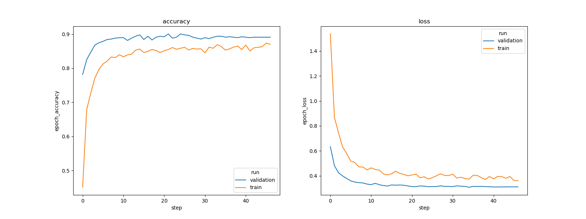

# Human activity recognition STM32 model training

This tutorial shows how to train from scratch a human activity recognition model using WISDM dataset.
As an example we will demonstrating the workflow on the [WISDM](https://www.cis.fordham.edu/wisdm/dataset.php) dataset.

# Table of contents

* <a href='#Data'>Prepare dataset</a><br>
* <a href='#training'>Train and evaluate model</a><br>
* <a href='#results'>Visualize training results</a><br>

# Prepare dataset
<a id='Data'></a>

### **1. DOWNLOAD THE DATASET AND EXTRACT IT**

The dataset can be found at the link [WISDM](https://www.cis.fordham.edu/wisdm/dataset.php). Once the dataset is downloaded and extracted the dataset directory should look as the following:
```bash
WISDM_ar_v1.1/
  readme.txt
  WISDM_ar_v1.1_raw.txt
  WISDM_ar_v1.1_raw_about.txt
  WISDM_ar_v1.1_transformed.arff
  WISDM_ar_v1.1_trans_about.txt
```
- We will only need WISDM_ar_v1.1_raw.txt file. The content of this file will look like this:
```bash
33,Jogging,49105962326000,-0.6946377,12.680544,0.50395286;
33,Jogging,49106062271000,5.012288,11.264028,0.95342433;
33,Jogging,49106112167000,4.903325,10.882658,-0.08172209;
33,Jogging,49106222305000,-0.61291564,18.496431,3.0237172;
33,Jogging,49106332290000,-1.1849703,12.108489,7.205164;
33,Jogging,49106442306000,1.3756552,-2.4925237,-6.510526;
33,Jogging,49106542312000,-0.61291564,10.56939,5.706926;
```
where each of the columns contains (from left-to-right) user_id, activity_label, time-stamp, acceleration values in x-axis, acceleration values in y-axis, and acceleration values in z-axis.
### **2. CONFIGURE THE YAMLS FILE**
**2.1. General settings:**

Configure the **general** section in **[user_config.yaml](user_config.yaml)** as the following:


```python
general:
  project_name: HAR
  logs_dir: logs
  saved_models_dir: saved_models
```

where:

- `project_name` - *String*, name of the project.
- `logs_dir` - Path to save tensorboard logs.
- `saved_models_dir` - Path to save the trained models.

**2.2. Loading the dataset:**

Configure the **dataset** section in **[user_config.yaml](user_config.yaml)** as the following:

```python
dataset:
  name: wisdm
  class_names: [Jogging,Stationary,Stairs,Walking]
  training_path: C:/stmicroelectronics2022/external_model_zoo/WISDM_ar_v1.1/WISDM_ar_v1.1_raw.txt
  validation_path:
  test_path:
```

where:

- `name` - Dataset name.
- `class_names` - A list containing the target classes names. **Note that although there are six classes originally, we merged [`Upstairs` and `Downstairs`] classes into `Stairs` and [`Sitting` and `Standing`] classes into `Stationary`.** The reason to do so is to decrease the unbalance in the dataset.
- `training_path` - The path to the training dataset (in this case it must point to `WISDM_ar_v1.1_raw.txt` file).
- `validation_path` - Path to the validation set, if not provided 20% of the training set will be used for validation (should be empty).
- `test_path` - Path to the test_set, if not provided the validation set will be used for evaluation (should be empty).

**2.3. Apply preprocessing:**

Apply preprocessing by modifiying the **preprocessing** parameters in **[user_config.yaml](user_config.yaml)** as the following:

```python
pre_processing:
  segment_len: 24
  segment_step: 24
  preprocessing: True
```

- `segment_len` - *Integer*, Frame length to be used for creating the data frames out of time series, 24 means each frame will be 24 samples long.
- `segment_step` - *Integer*, The difference between the start of first sample of the second frame from first. If same value is used for `segment_length` and `segment_step` no overlap is present in the two consecutive frames, if `segment_step < segment_length` the frame is overlapped for the `delta` samples where `delta =  segment_length - segment_step`.
- `preprocessing` - *Boolean*, if *True* gravity rotation and supression is applied to first rotate the data in a way that the gravity is always pointing through z-axis and then this gravity is removed.

# Train and evaluate model
<a id='training'></a>

### **1. CONFIGURE TRAINING PARAMETERS**

**1.1. Choose one of the available model configurations:**

In the current version we support four different models. These include `svc` a support vector classifier from **sklearn** or one of the three CNN architectures, namely, `ign`, `gmp`, or a `custom`.
As an example we present below a use case of an *svc*. To do this we will need to configure the model section in the **[user_config.yaml](user_config.yaml)** as the following:

```python
model:
  model_type: {name : svc}
  input_shape: [24,3,1]
  dropout: 0.5
```

where:

- `model_type` - A *dictonary* with keys relative to the model topology. Currently supported values are `ign` for [IGN](../utils/models/ign.py) topology Neural Network, `gmp` for [GMP](../utils/models/gmp.py) topology of neural netork, `svc` for a support vector machine based classifier.
- `input_shape` -  A *list of int* *[H, W, C]* for the input resolution, e.g. *[24, 3, 1]*. Here `H` should be same value as the `segment_len` in `pre-processing`.


**1.2. Choose a custom model:**

Fruthermore, we let the user also develop his own custom topology for his neural network. A sample custom model topology is provided in the [custom_model.py](../utils/models/custom_model.py). User can modify the topology and to choose this as the topology to train, `custom` is to be selected as the `name` of the `model_type`. In this case the model part in `user_config.yaml` file looks like this.
```python
model:
  model_type: {name : custom}
  input_shape: [24,3,1]
  dropout: 0.5
```

**1.3. Set training hyperparameters:**

To choose the right hyperparameters for training your model, simply modify the **tf_train_parameters** section in **[user_config.yaml](user_config.yaml)** as the following:

```python
tf_train_parameters:
  batch_size: 64
  dropout: 0.5
  training_epochs: 1000
  optimizer: adam
  initial_learning: 0.001
  learning_rate_scheduler: ReduceLROnPlateau
```

where:

- `batch_size` - *Integer*. Size of the batches of data, e.g. 64, 128, etc.
- `dropout` - A *float* value between 0 and 1.
- `training_epochs` - *Integer*. Number of epochs to train the model, e.g. 20, 50, 100, or 1000 etc. We are providing an early stopping criteria in the training so choosing a high number is more preferable to avoid under fitting of the neural network.
- `optimizer` - One of the three optimizers can be used. Options are : "adam", "sgd" or "rmsprop".
- `initial_learning` - A *float* value, e.g. 0.001.
- `learning_rate_scheduler` - One of available options which are : "Constant", "ReduceLROnPlateau", "Exponential" or "Cosine".


### **2. CONFIGURE EVALUATION PARAMETERS**

**2.1. Model quantization:**

Post training quantization is a good way to optimize your neural network models before deploying. This enables the deployment process more efficient on your embedded devices by reducing the required memory usage (Flash/RAM) and reducing the inference time by accelerating the computations, and all this with little-to-no degradation in the model accuracy.

Configure the **quantization** section in **[user_config.yaml](user_config.yaml)** as the following:

```python
quantization:
  quantize: True
  evaluate: True
  quantizer: TFlite_converter
  quantization_type: PTQ
  quantization_input_type: float
  quantization_output_type: float
  export_dir: quantized_models
  ```

where:

- `quantize` - *Boolean*, if *True* then model will be quantized. *False* will only generate the *float32* model.
- `evaluate` - *Boolean*, if True evaluate the performance of the quantizd model on the test accuracy.
- `quantizer` - *String*, only supported option is "TFlite_converter" which will convert model trained weights from float to integer values. The quantized model will be saved in TensorFlow Lite (*.tflite) format.
- `quantization_type` - *String*, only option is "PTQ",i.e. "Post-Training Quantization".
- `quantization_input_type` - *String*, can be "int8", "uint8" or "float", represents the quantization type for the model input.
- `quantization_output_type` - *String*, can be "int8", "uint8" or "float", represents the quantization type for the model output.
- `export_dir` - *String*, referres to directory name to save the quantized model.

**2.2. Benchmark your model with STM32Cube.AI:**

STM32Cube.AI will allow you to benchmark your model and estimate its footprints for STM32 target devices.

Make Sure to add the path to your stm32ai excutable under **path_to_stm32ai**:
```python
stm32ai:
  version: 8.1.0
  optimization: default
  footprints_on_target: B-U585I-IOT02A
  path_to_stm32ai: C:/stmicroelectronics2022/STM32Cube/Repository/Packs/STMicroelectronics/X-CUBE-AI/7.2.0/Utilities/windows/stm32ai.exe
```
where:
- `version` - Specify the **STM32Cube.AI** version used to benchmark the model, e.g. **7.3.0**.
- `optimization` - *String*, define the optimization used to generate the C model, options: "*balanced*", "*time*", or "*ram*".
- `footprints_on_target` - Specify board name to evaluate the model inference time on real stm32 target, e.g. **'B-U585I-IOT02A'**. The other supported boards are NUCLEO-H745ZI-Q, STM32H747I-DISCO, STM32F469I-DISCO, STM32H7B3I-DK, NUCLEO-G474RE, STM32F769I-DISCO, STM32F746G-DISCO, STM32H735G-DK, else set it to **False** if do not want to find the inference time on the target board. In this case only the footprints (RAM/FLAS) and computation requirements are provided in terms of (MAACs). Details on the supported boards and their specs can be found [here](./doc/boards.json).
- `path_to_stm32ai` - *Path* to stm32ai executable file.


### **3. TRAIN YOUR MODEL**


Run the following command:


```bash
python train.py
```


# Visualize training results
<a id='results'></a>

### **1. SAVED RESULTS**

All training and evaluation artificats are saved under the current output simulation directory **"outputs/{run_time}"**.

For example, you can retrieve the plots of the accuracy/loss curves, as well as the confusion matrix generated after evaluating the float/quantized model on the test set as follows:




<!--  -->


<!--  -->

### **2. RUN TENSORBOARD**

When one of the tensorflow model is used ('ign', 'gmp' or 'custom'), the training curves can be visualized using tensorboard, go to **"outputs/{run_time}"** and run the following command:

```bash
tensorboard --logdir logs
```

And open the URL `http://localhost:6006` in your browser.

### **3. RUN MLFLOW**

MLflow is an API for logging parameters, code versions, metrics, and artifacts while running machine learning code and for visualizing results.
To view and examine the results of multiple trainings, you can simply access the MLFlow Webapp by running the following command:
```bash
mlflow ui
```
And open the given IP adress or link presented in terminal console in your browser to view the results of all the experiment runs.