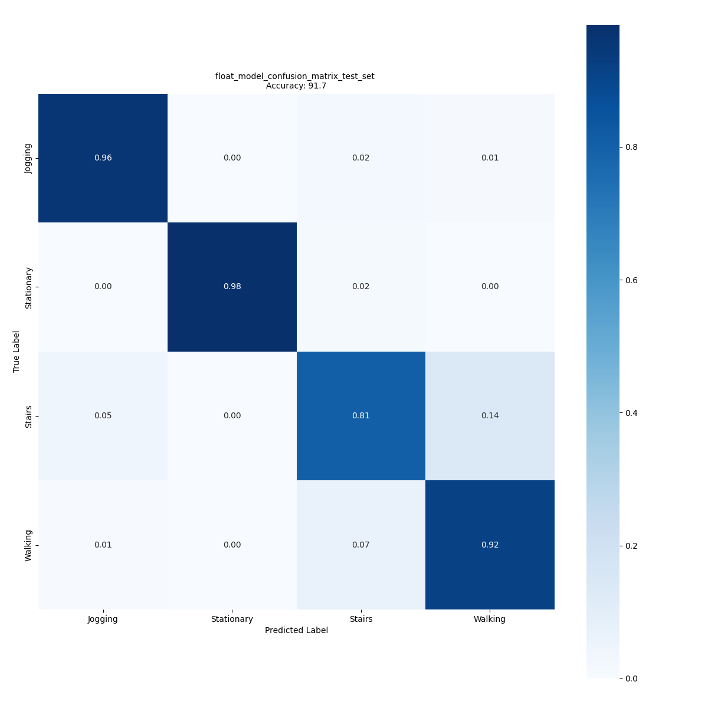

# Evaluation of Human Activity Recognition (HAR) model

This document provides details on how a pretrained HAR model can be evaluated. The evaluation service is a comprehensive tool that enables users to assess the accuracy of their Keras (.h5) HAR model. The inputs are the pretrained model and the the dataset, providing that the users can quickly and easily evaluate the performance of their model and generate various metrics, such as accuracy and confusion matrix.

The details on how to use this service are provided in the article below.

## <a id="">Table of contents</a>

### <a href="#1">1. Configure the yaml file</a>
#### <a href="#1-1">1.1 Setting the model and the operation mode</a>
#### <a href="#1-2">1.2 Apply preprocessing</a>
#### <a href="#1-3">1.3 Prepare the dataset</a>
### <a href="#2">2. Evaluate your model</a>
### <a href="#3">3. Visualize evaluation results</a>


__________________________________________

## <a id="1">1. Configure the yaml file</a>

To evaluate a pretrained HAR model using evaluation service, the users can edit the parameters provided in the main [user_config.yaml](../user_config.yaml) file, or alternatively directly update the few parameters in the minimalistic configuration file provided for the evaluation service [evaluation_config.yaml](../config_file_examples/evaluation_config.yaml).

To edit the main [user_config.yaml](../user_config.yaml) file, follow the steps below, which shows how to evaluate your pre-trained HAR model trained on mobility_v1 or WISDM datasets.

### <a id="1-1">1.1 Setting the model and the operation mode</a>

The first thing to set is the path to the pretrained model in the `general.model_path` parameter and the `operation_mode` to use the evaluate service.

```yaml
general:
  project_name: human_activity_recognition # optional, if not provided default name is used for the experiment
  model_path: model_path: ../pretrained_models/ign/ST_pretrainedmodel_public_dataset/WISDM/ign_wl_24/ign_wl_24.h5 # mandatory
                        # Path to the model file to be evaluated
operation_mode: evaluation # mandatory
```
In this example, the path to the IGN model trained on the WISDM dataset is used for evaluation.

### <a id="1-2">1.2 Prepare the dataset</a>

Next the users need to provide the information about the dataset to be used for the evaluation. All the information regarding this is provided in the `dataset` section of the yaml file.

```yaml
dataset:
  name: wisdm  # mandatory
  class_names: [Jogging,Stationary,Stairs,Walking] 
              # (optional: if not provided are generated based on the dataset name) 
  training_path: ../datasets/WISDM_ar_v1.1/WISDM_ar_v1.1_raw.txt # mandatory
  validation_split: 0.2
  test_path:
  test_split: 0.25
```
When evaluating the pretrained model on the WISDM dataset, the dataset path is provided in the `dataset.training_path` parameter and the `dataset.validation_split` and `dataset.test_split` are used to create the test and validation splits. By default the values for the `validation_split` and `test_split` are set to 0.2 and 0.25. First, the dataset is split into test and train, and then the train set is further split into the train and validation splits.

In case of `mobility_v1` dataset the `test.pkl` portion is used for the evaluation. 

### <a id="1-3">1.3 Apply preprocessing</a>

The frames from the dataset need to be preprocessed before they are presented to the network for evaluation.

This is illustrated in the YAML code below:

```yaml
preprocessing: # mandatory
  gravity_rot_sup: true # mandatory
  normalization: false # mandatory
training:
  model:
    name: ign # optional
    input_shape: (24, 3, 1) # mandatory
```

- `gravity_rot_sup` - *boolean*, the flag to control the application of the gravity rotation and then supression by applying a high pass filter.
- `normalization` - *boolean*, the flag to enable the standard normalization of the frame (x_i - mu)/std 
- `training.model.input_shape` - *(INT, INT, INT)*, *Tupple*, the shape of the input. In this case (24,3,1), shows a frame of length 24, 3-axis data.

## <a id="2">2. Evaluate your model</a>

If you chose to modify the [user_config.yaml](../user_config.yaml) you can evaluate the model by running the following command from the **src/** folder:

```bash
python stm32ai_main.py 
```
If you chose to update the [evaluation_config.yaml](../config_file_examples/evaluation_config.yaml) and use it then run the following command from the **src/** folder: 

```bash
python stm32ai_main.py --config-path ./config_file_examples/ --config-name evaluation_config.yaml
```

## <a id="3">3. Visualize the evaluation results</a>

Once the dataset is prepared and the model is evaluated, the accuracies are printed in the terminal and the confusion matrix is displayed. However, after you have closed the terminal and the confusion matrix image, you can still retrieve the confusion matrix generated after evaluating the model on the test dataset by navigating to the appropriate directory within **experiments_outputs/\<date-and-time\>**.



You can also find the evaluation results saved in the log file **stm32ai_main.log** under **experiments_outputs/\<date-and-time\>**.

You can also visualize the results also by using the mlflow by issuing the command `mlflow ui`. That will open the mlflow in the browser.
