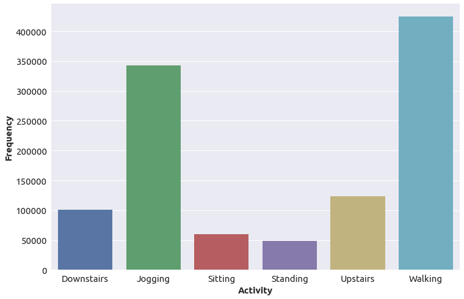

# <a id="">Human Activity Recognition (HAR) STM32 model training</a>

This readme shows how to train an HAR model from scratch or use transfer learning on for training a model using a public (WISDM) or custom (mobility_v1) dataset. The scripts has two different choices for the model architecture based on convolutional neural networ (CNN) namely:
- [Ignatov (IGN)](../../pretrained_models/ign/README.md) 
- [Global Max Pooling (GMP)](../../pretrained_models/gmp/README.md)

In this article details for training the IGN model using [WISDM](https://www.cis.fordham.edu/wisdm/dataset.php) (a public dataset) are provided.

## <a id="">Table of contents</a>

<details open><summary><a href="#1"><b>1. Prepare the dataset</b></a></summary><a id="1"></a>

The WISDM dataset was released by the [Wireless Sensor Data Mining (WISDM) Lab](http://www.cis.fordham.edu/wisdm/).

The data collected correspond to the data used in the research [Activity Recognition using Cell Phone Accelerometers](http://www.cis.fordham.edu/wisdm/public_files/sensorKDD-2010.pdf), Proceedings of the Fourth International Workshop on Knowledge, Discovery from Sensor Data (at KDD-10), Washington DC. 

The dataset is collected in controlled labortary conditions using a mobile phone accelerometer. The dataset can be downloaded as a zip file using this link [WISDM_ar_latest.tar.gz](https://www.cis.fordham.edu/wisdm/includes/datasets/latest/WISDM_ar_latest.tar.gz). For this tutorial the users are requested to download and extract the contents of the file. After expanding the contents of the file the user must have these contents in it:
- readme.txt
- WISDM_ar_v1.1_raw.txt
- WISDM_ar_v1.1_raw_about.txt
- WISDM_ar_v1.1_transformed.arff
- WISDM_ar_v1.1_trans_about.txt

For the purpose of this tutorial we only need the `WISDM_ar_v1.1_raw.txt` file. Thi path to this file is to be provided to the variable, `dataset.training_path` in the [user_config.yaml](../user_config.yaml) configuration file (the details will be provided in section 2). The file `WISDM_ar_v1.1_raw.txt` contains data like below:
```bash
33,Jogging,49105962326000,-0.6946377,12.680544,0.50395286;
33,Jogging,49106062271000,5.012288,11.264028,0.95342433;
33,Jogging,49106112167000,4.903325,10.882658,-0.08172209;
33,Jogging,49106222305000,-0.61291564,18.496431,3.0237172;
33,Jogging,49106332290000,-1.1849703,12.108489,7.205164;
33,Jogging,49106442306000,1.3756552,-2.4925237,-6.510526;
33,Jogging,49106542312000,-0.61291564,10.56939,5.706926;
33,Jogging,49106652389000,-0.50395286,13.947236,7.0553403;
33,Jogging,49106762313000,-8.430995,11.413852,5.134871;
33,Jogging,49106872299000,0.95342433,1.3756552,1.6480621;
33,Jogging,49106982315000,-8.19945,19.57244,2.7240696;
33,Jogging,49107092330000,1.4165162,5.7886477,2.982856;
33,Jogging,49107202316000,-1.879608,-2.982856,-0.29964766;
```
The data columns of the dataset contains data for: `['user_id', 'Activity_Label', 'time_stamp', 'acc_x', 'acc_y', 'acc_z']`. 
The 3-D accelerometer data is captured at a rate of 20 Hz or samples/sec. 

In WISDM dataset there are six different activities performed namely: [`Donwstairs`,`Jogging`,`Sitting`, `Standing`, `Upstairs`, `Walking`]. The sample distribution for these activities performed is presented in the figure below.


As it is apparent the activities performed are heavily unbalanced in the dataset, that is why we created two super-classes in attempt to balance the dataset and simplify the problem.
```tex
- Stairs = Upstairs + Downstairs
- Stationary = Sitting + Standing
```
Finally, the four activites are [`Jogging`, `Stationary`, `Stairs`, `Walking`].

We will use only the columns of `['user_id', 'Activity_Label', 'acc_x', 'acc_y', 'acc_z']`.  The data is then framed to create frames of `(wl, 3, 1)` shape. Here, `wl` represents the windows length. We provide pretrained models for two different choices of wl, [24, 48].

After the frames or segments of `(wl, 3, 1)` shape are created, the `test_split` and `validation_split` values are used to first split the frames into `Train|Test` distribution and then `Train` is furthermore splitted into `Train|Validation`. 

NOTE: **In case of WISDM dataset only way to provide the dataset path is to provide it in the `dataset.training_path` variable, in all the operation modes.**


In case of custom dataset `mobility_v1` from STMicroelectronics, the data is already splitted into train and test distributions. A small subset of the data is provided in [human_activity_recognition/datasets/mobility_v1](../../datasets/mobility_v1/). The data is in the form of the `.pkl` files containing the list of the 3D accelerometer recordings for five different activities. 

> [!NOTE]  
> `mobility_v1` dataset is a proprietry dataset, and the subset provided here is just for the demonstration sake. The trained model with this small dataset might show bad results on the test dataset as it is only for testing sake that the scripts work.

**For `mobility_v1` dataset the paths to the train and test pkl files are to be provided in `dataset.training_path`, `dataset.test_path`. The script handles the windowing of the accelerometer data and splitting training data into train and validation.**

> [!WARNING]  
> **Currently, no other dataset formats are supported.**

</details>
<details open><summary><a href="#2"><b>2. Create your training configuration file</b></a></summary><a id="2"></a>
<ul><details open><summary><a href="#2-1">2.1 Overview</a></summary><a id="2-1"></a>

All the proposed services like the `training`, ``evaluation` etc. of the model are driven by a [user_config.yaml](../user_config.yaml) configuration file written in the YAML language. 

For training, the configuration file should include at least the following sections:

- `general`, describes your project, including project name, directory where to save models, etc.
- `operation_mode`, describes the service or chained services to be used
- `dataset`, describes the dataset you are using, including directory paths, class names, etc.
- `preprocessing`, specifies the methods you want to use for preprocessing. 
- `training`, specifies your training setup, including batch size, number of epochs, optimizer, callbacks, etc.
- `mlflow`, specifies the folder to save MLFlow logs.
- `hydra`, specifies the folder to save Hydra logs.

This tutorial only describes the basic settings needed to train a model. In the first part, we describe basic settings.
At the end of this readme, you can also find more advanced settings and callbacks supported.

</details></ul>
<ul><details open><summary><a href="#2-2">2.2 General settings</a></summary><a id="2-2"></a>

The first section of the configuration file is the `general` section that provides information about your project.

```yaml
general:
  project_name: human_activity_recognition # optional <default: human_activity_recognition>
  logs_dir: logs 
  saved_models_dir: saved_models
  display_figures: True
  global_seed: 123
  gpu_memory_limit: 24
  deterministic_ops: True 
```
- `project_name`: is used for storing the experiments in the `mlflow` a tool to track the results of different experiments.
- `log_dir`: is the directory of the run that will hold all the logs created during the experiment.
- `saved_models_dir`: holds the trained model
- `display_figures`: a bolean flag to chose if at the end of the experiment the figures generated are opened or not. This will include the figures of the training_history, confusion_matrix etc.
- `global_seed`: to control the determinism of the random number generation and seeding different functions.
- `gpu_memory_limit`: integer value to allocate maximum amount of gpu memory (in GigaBytes).
- `deterministic_ops`: a boolean, set to True, if you want your experiments to be fully reproducible.

Enabling the `deterministic_ops` attribute will restrict TensorFlow to use only deterministic operations on the device, but it may lead to a drop in training performance. It should be noted that not all operations in the used version of TensorFlow can be computed deterministically. 

If your case involves any such operation, a warning message will be displayed and the attribute will be ignored.

The `logs_dir` attribute is the name of the directory where the MLFlow and TensorBoard files are saved. The `saved_models_dir` attribute is the name of the directory where models are saved, which includes the trained model. This directory is located under the top level <.hydra> directory.

</details></ul>
<ul><details open><summary><a href="#2-3">2.3 Dataset specification</a></summary><a id="2-3"></a>

Information about the dataset that you want to use, (path to it, the classes available, the train_test_split etc.) is provided in the `dataset` section of the [user_config.yaml](../user_config.yaml) file, as shown in the YAML code below.

```yaml
dataset:
  name: wisdm
  class_names: [Jogging, Stationary, Stairs, Walking]
  training_path: ../datasets/WISDM_ar_v1.1/WISDM_ar_v1.1_raw.txt
  validation_split: 0.2
  test_split: 0.25
  seed: 123
```
- `name`: name of the dataset,  `wisdm`
- `class_names`: labels of the classes [Jogging, Stationary, Stairs, Walking] in case of `wisdm`
- `training_path`: path to `WISDM_ar_v1.1_raw.txt` file for `wisdm` and to train.pkl for `mobility_v1`
- validation_split: (float between 0-1), portion of training data to be used for the validation
- test_split: (float between 0-1) portion of the total data to be used for the test
- seed: (integer) a seed to be used for random function and to produce reproudicible results.

In this example, we are using `WISDM` dataset so only the `training_path` has to be provided, as it is a single text file. The values of the validation_split and test_split  no validation set path is provided, so the available data under the *training_path* directory is split in two to create a training set and a validation set. 
By default, 25% of the data is used for the test set and 75% data is further split in to train_validation (80-20%).
If you want to use a different split ratio, you need to specify in `test_split`, and `validation_split` the portion to be used for the train, test and validation set.

</details></ul>
<ul><details open><summary><a href="#2-4">2.4 Dataset preprocessing</a></summary><a id="2-4"></a>

The acceleration data is divided into frames by using a given window length value. This is retrived from `training.model.input_shape[0]`. The frames from the dataset are then need to be preprocessed before they are presented to the network. We provide two possible preprocessing algorithms to preprocess the frames.

These include "gravity rotation and supression" and "normalization", as illustrated in the YAML code below.

```yaml
preprocessing:
  gravity_rot_sup: True
  normalization: False
```
- `gravity_sup_rot` - *boolean*, to choose if gravity is to be rotated in z-axis and then supressed using a high-pass filter.
- `normalization` - *boolean*, the flag to choose if standard normalization is to be applied to the frame. $(x-\mu/\sigma)$

The mentioned settings abover are used for all the pretrained models in the model zoo of Human activity recognition in the [pretrained_models](../../pretrained_models/README.md).

</details></ul>
<ul><details open><summary><a href="#2-5">2.5 Training parameters</a></summary><a id="2-5"></a>

The training section contains various training configurations as well as the details on the model shape and architecture.

<ul><details open><summary><a href="#2-5-1">2.5.1 Model parameters</a></summary><a id="2-5-1"></a>

Information about the model you want to train is provided in the `training.model` section of the configuration file.

The YAML code below shows how you can use the ST Hand Posture CNN2D model from the Model Zoo.

```yaml
training:
  model:
    name: ign # available choices are [ign, gmp]
    input_shape: (24, 3, 1)
```
</details></ul>
<ul><details open><summary><a href="#2-5-2">2.5.2 Training setup</a></summary><a id="2-5-2"></a>

The rest of the training setup is also provided in the `training` section of the configuration file, which include callbacks, optimizers etc. as illustrated below:

```yaml
training:
  dropout: 0.2
  batch_size: 32
  epochs: 1000
  optimizer:
    Adam:
      learning_rate: 0.01
  callbacks:
    ReduceLROnPlateau:
      monitor: val_loss
      factor: 0.1
      patience: 20
      min_lr: 1.0e-04
    EarlyStopping:
      monitor: val_accuracy
      restore_best_weights: true
      patience: 40
```

The `batch_size`, `epochs` and `optimizer` attributes are mandatory. All the others are optional.

The `dropout` attribute only makes sense if your model includes a dropout layer. 

All the Tensorflow optimizers can be used in the `optimizer` subsection. All the Tensorflow callbacks can be used in the `callbacks` subsection, except the ModelCheckpoint and TensorBoard callbacks that are built-in and can't be redefined.

A variety of learning rate schedulers are provided with the Model Zoo. If you want to use one of them, just include it in the `callbacks` subsection. Refer to [the learning rate schedulers README](../../../common/training/lr_schedulers_README.md) for a description of the available callbacks and learning rate plotting utility.

</details></ul>
</details></ul>
<ul><details open><summary><a href="#2-6">2.6 Hydra and MLflow settings</a></summary><a id="2-6"></a>

The `mlflow` and `hydra` sections must always be present in the YAML configuration file. The `hydra` section can be used to specify the name of the directory where experiment directories are saved and/or the pattern used to name experiment directories. With the YAML code below, every time you run the Model Zoo, an experiment directory is created that contains all the directories and files created during the run. The names of experiment directories are all unique as they are based on the date and time of the run.

```yaml
hydra:
   run:
      dir: ./experiments_outputs/${now:%Y_%m_%d_%H_%M_%S}
```

The `mlflow` section is used to specify the location and name of the directory where MLflow files are saved, as shown below:

```yaml
mlflow:
   uri: ./experiments_outputs/mlruns
```

</details></ul>
</details>
<details open><summary><a href="#3"><b>3. Train your model</b></a></summary><a id="3"></a>

To launch your model training using a real dataset, run the following command from **src/** folder:

```bash
python stm32ai_main.py --config-path ./config_file_examples/ --config-name training_config.yaml
```
Trained h5 model can be found in [pretrained_models/](../../pretrained_models) or ../experiments_outputs folders.

</details>
<details open><summary><a href="#4"><b>4. Visualise your results</b></a></summary><a id="4"></a>
<ul><details open><summary><a href="#4-1">4.1 Saved results</a></summary><a id="4-1"></a>

All training and evaluation artifacts are saved under the current output simulation directory **"experiments_outputs/{run_time}"**.

For example, you can retrieve the plots of the accuracy/loss curves as below:


</details></ul>
<ul><details open><summary><a href="#4-2">4.2 Run tensorboard</a></summary><a id="4-2"></a>

To visualize the training curves logged by tensorboard, go to **"outputs/{run_time}"** and run the following command:

```bash
tensorboard --logdir logs
```

And open the URL `http://localhost:6006` in your browser.

</details></ul>
<ul><details open><summary><a href="#4-3">4.3 Run MLFlow</a></summary><a id="4-3"></a>

MLflow is an API for logging parameters, code versions, metrics, and artifacts while running machine learning code and for visualizing results.
To view and examine the results of multiple trainings, you can simply access the MLFlow Webapp by running the following command:
```bash
mlflow ui
```
And open the given IP adress in your browser.

</details></ul>
</details>
<details open><summary><a href="#5"><b>5. Advanced settings</b></a></summary><a id="5"></a>
<ul><details open><summary><a href="#5-1">5.1 Continue Training your own model and Transfer Learning</a></summary><a id="5-1"></a>

You may want to continue training your own model on a new dataset rather than training your model from scratch.

This can be done using the `model_path` attribute of the `general:` section to provide the path to the model file to use as illustrated in the example below.

```yaml
general:
   model_path: <path-to-a-Keras-model-file>    # Path to the model file to use for training

operation_mode: training

training:
   batch_size: 32
   epochs: 150
   dropout: 0.5
   frozen_layers:
   optimizer:
      Adam:                               
         learning_rate: 0.001
   callbacks:                    
      ReduceLROnPlateau:
         monitor: val_loss
         factor: 0.1
         patience: 10
```

The model file must be a Keras model file with a '.h5' filename extension.

The `model:` subsection of the `training:` section is not present as we are not training a model from the Model Zoo. An error will be thrown if it is present when `model_path` is set.

About the model loaded from the file:
- if some layers are frozen in the model, they will be reset to trainable before training. You can use the `frozen_layers` attribute if you want to freeze these layers (or different ones).
- If you set the `dropout` attribute but the model does not include a dropout layer, an error will be thrown. Reciprocally, an error will also occur if the model includes a dropout layer but the `dropout` attribute is not set.
- If the model was trained before, the state of the optimizer won't be preserved as the model is compiled before training.

</details></ul>
<ul><details open><summary><a href="#5-2">5.2 Freezing layers</a></summary><a id="5-2"></a>

Once the model has been loaded, some layers are often frozen, that is made non-trainable, before training the model. A commonly used approach is to freeze all the layers but the last one, which is the classifier.

By default, all the layers are trainable. If you want to freeze some layers, then you need to add the optional `frozen_layers` attribute to the `training:` section of your configuration file. The indices of the layers to freeze are specified using the Python syntax for indexing into lists and arrays. Below are some examples.


```yaml
training:
   frozen_layers: (0:-1)    # Freeze all the layers but the last one
   
training:
   frozen_layers: (0:2)   # Freeze layers with indices from 0 to 2

```

Note that if you want to make it explicit that all the layers are trainable, you may add the `frozen_layers` attribute and left it unset or set to *None*.

</details></ul>
<ul><details open><summary><a href="#5-3">5.3 Creating your own custom model</a></summary><a id="5-3"></a>

You can create your own custom model and get it handled as any built-in Model Zoo model. If you want to do that, you need to modify a number of Python source code files that are all located under the [custom_model.py](../models/custom_model.py) file. Then provide `training.model.name=custom` in the configuration YAML file.

An example of custom model is given in the [custom_model.py](../models/custom_model.py). The users are free to modify it as they want.

In the provided example, the *get_custom_model()* function takes in arguments:
- `num_classes`, the number of classes.
- `input_shape`, the input shape of the model.
- `dropout`, the dropout rate if a dropout layer must be included in the model.

Then, your custom model can be used as any other ModelZOO model using the configuration file as shown in the YAML code below:
```yaml
training:
   model:
      name: custom
      input_shape: (128, 128, 3)
   dropout: 0.2
```

</details></ul>
<ul><details open><summary><a href="#5-4">5.4 Using chain_tb as operation mode (training and benchmarking)</a></summary><a id="5-4"></a>

You can also use a special operation mode called `chain_tb` which will run a chain of opperations, first training the model and then benchmark the model either locally using STM32Cube.AI cli application (will provide memory footprints both RAM and FLASH) or using the STM32Cube.AI dev cloud (RAM, FLASH, Inference Time[ms]). To do this users have to provide additional parameters as illustrated below:
```yaml
tools:
  stedgeai:
    version: 9.1.0
    optimization: balanced
    on_cloud: True # True for using cloud or set to False for using local installation
    path_to_stedgeai: C:/Users/<XXXXX>/STM32Cube/Repository/Packs/STMicroelectronics/X-CUBE-AI/<*.*.*>/Utilities/windows/stedgeai.exe
  path_to_cubeIDE: C:/ST/STM32CubeIDE_1.15.0/STM32CubeIDE/stm32cubeide.exe

benchmarking:
  board: B-U585I-IOT02A
```

</details></ul>
</details>
