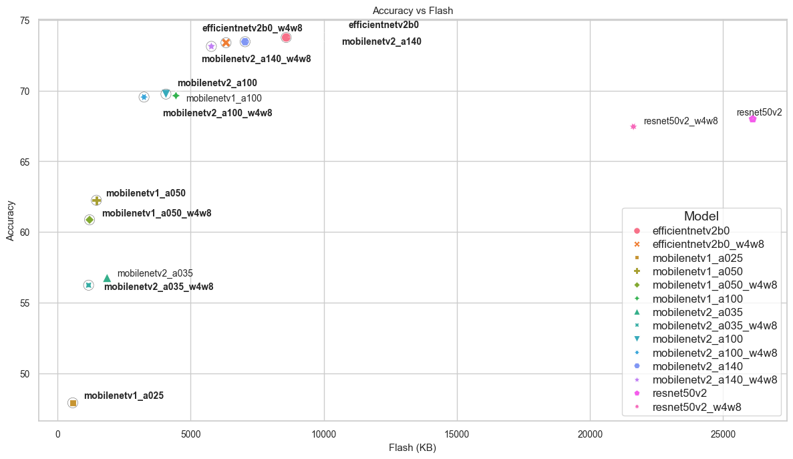
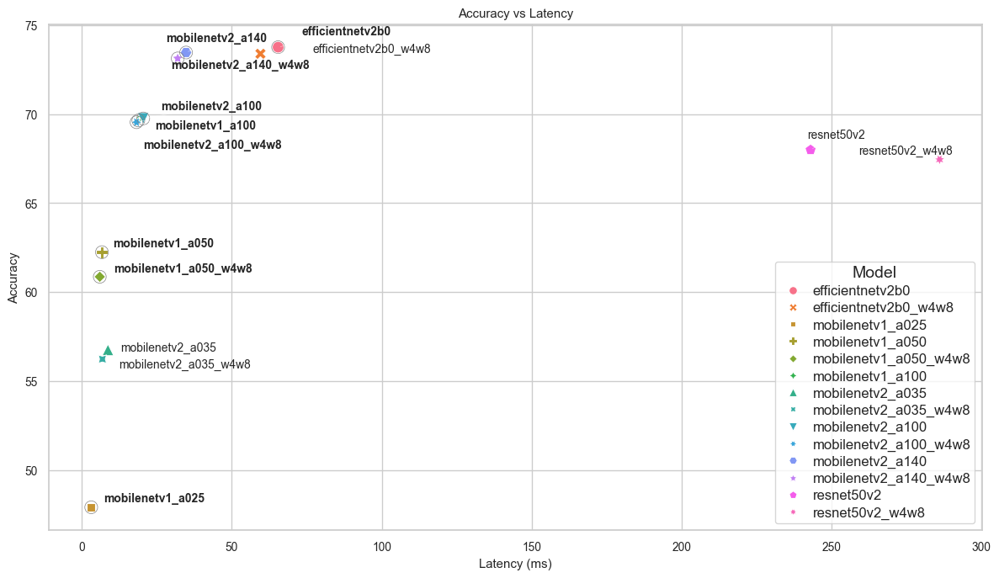
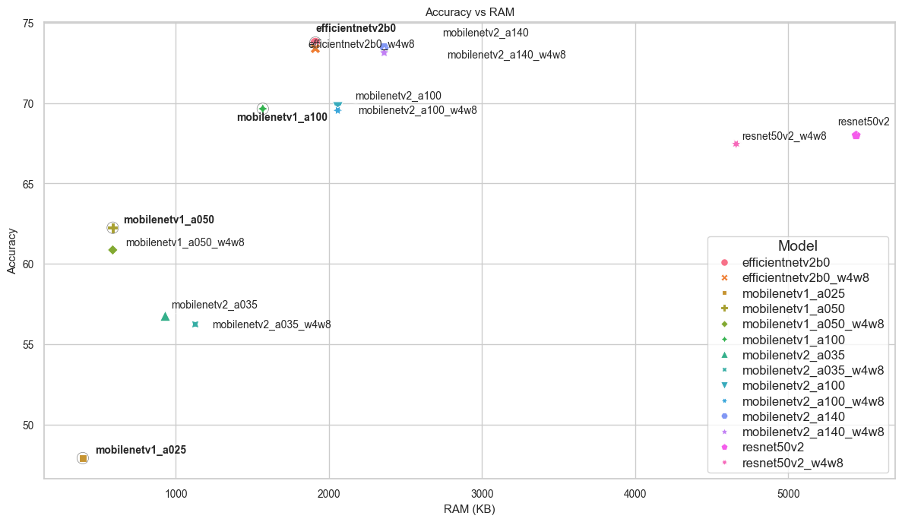

# Tensorflow Models Benchmarking and Analysis 

## **Use case** : `Image classification`

## Model Selection Guide 

### Front runners 
- **Top accuracy model** - `efficientnetv2b0` (73.75%)
- **Ultra-low latency** - `mobilenetv1_a025` – 3.1 ms
- **Lowest Flash** - `mobilenetv1_a025` – 571 KB

 **Verdict**
- All MobileNet variants fit comfortably under 2.5 MB RAM
- ResNet50 exceeds 5 MB RAM → Problematic for MCUs
---

### Pareto-Optimal Trends (Accuracy ↑, Cost ↓)

All the Tensorflow classification models are plotted for Accuracy vs Flash, Accuracy vs RAM and Accuracy vs Latency and Pareto is drawn in circles on these plots followed by Pareto model analysis. 

**Accuracy Vs Flash** 

**Accuracy Vs Latency** 

**Accuracy Vs RAM**
 

**Strong Pareto candidates**
| Model | Accuracy | Latency | Notes |
|-------|---------|--------|------|
| `mobilenetv1_a050` | 62% | ~6 ms | Very small footprint, ultra-fast |
| `mobilenetv1_a100` | ~70% | <20 ms | Good flash/RAM balance |
| `mobilenetv2_a100_w4w8` | 69.5% | Reduced vs FP model | Excellent balanced choice |
| `mobilenetv2_a140_w4w8` | 73.1% | ~32 ms | Best option when accuracy is priority |

---

### Model Recommendations 

**Ultra-low-power / MCU users**
- **Goal:** Minimal flash + RAM + latency  
- **Recommended:** `mobilenetv1_a025`, `mobilenetv1_a050`  
- Best for sensors, always-on vision, battery-powered devices  
- Accuracy tradeoff

**Real-time edge inference (Cameras, robotics)**
- **Goal:** <20 ms latency, good accuracy  
- **Recommended:** `mobilenetv1_a100`, `mobilenetv2_a100_w4w8`  
- Excellent balance  
- Fits most embedded SoCs  
- Quantized versions preferred

**Accuracy-focused edge deployment**
- **Goal:** Maximum accuracy within edge constraints  
- **Recommended:** `mobilenetv2_a140_w4w8`, `efficientnetv2b0_w4w8`  
- Higher latency and flash  
- Still deployable on most of the devices 

---

### Summary Table 

| Scenario | Best Choice |
|----------|------------|
| Smallest model | `mobilenetv1_a025` |
| Fastest inference | `mobilenetv1_a025` |
| Best balanced edge model | `mobilenetv2_a100_w4w8` |
| Best accuracy on edge | `mobilenetv2_a140_w4w8` |
| Avoid for edge | `resnet50v2` |
