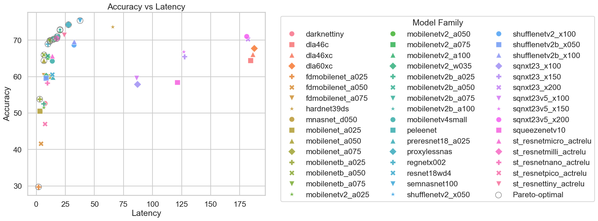
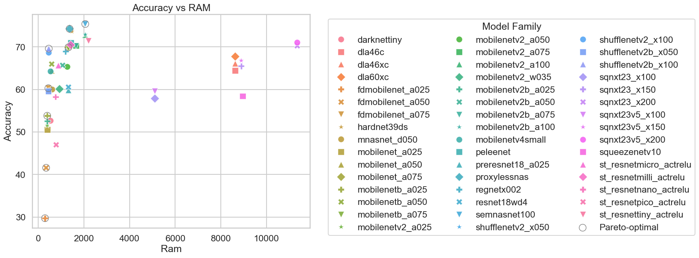
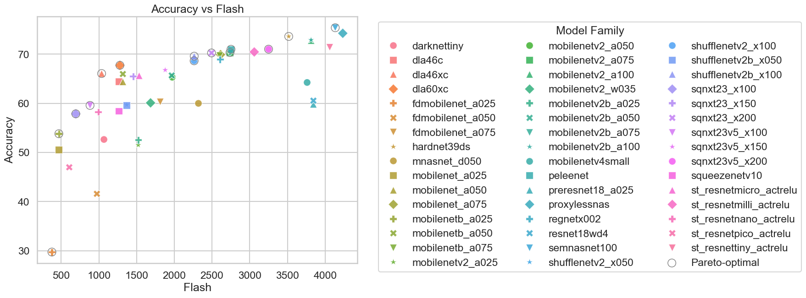

# PyTorch Models Benchmarking and Analysis 

## **Use case** : `Image classification`

The Pytorch models span various architectures designed for efficient edge deployment, including:
- **MobileNet family** - Efficient depthwise separable convolutions
- **MobileNetV2 family** - Inverted residual blocks with linear bottlenecks
- **MobileNetV4** - Latest MobileNet iteration with enhanced performance
- **ResNet variants** - Residual learning frameworks
- **ShuffleNet** - Channel shuffle operations for efficient group convolutions
- **SqueezeNet** - Fire modules with squeeze and expand layers
- **EfficientNet-inspired architectures** - Compound scaling methods
- **FDMobileNet** - Fast downsampling MobileNet variants
- **DLA (Deep Layer Aggregation)** - Hierarchical and iterative aggregation
- **RegNet** - Designing network design spaces
- **MnasNet** - Mobile neural architecture search
- **ProxylessNAS** - Direct neural architecture search on target hardware
- **PeleeNet** - Efficient DenseNet variant
- **HardNet** - Harmonic DenseNet
- **SqueezeNext** - More efficient SqueezeNet
- **DarkNet** - Feature extraction backbone
- **ST_ResNet** - ST extreme compressed and decomposed ResNet style backbone 
- **Semnasnet** – Squeeze-and-Excitation MnasNet

## Model Selection Guide 

### Front runners 
- **Top accuracy model** - `semnasnet100_pt_224` (75.38%)
- **Ultra-low latency** - `fdmobilenet_a025_pt_224` – 1.88 ms
- **Lowest Flash** - `fdmobilenet_a025_pt_224` – 377 KB
- **Best ST in-house model** - `st_resnettiny_actrelu_pt_224` (71.4%) – Well-balanced performance

 **Verdict**
- MobileNet and MobileNetV2 variants fit comfortably under 4 MB Flash
- ST_ResNet family offers excellent accuracy-latency tradeoffs with in-house optimizations
- DLA and SqueezeNext models require significant RAM (>8 MB) → Problematic for MCUs
---

### Pareto-Optimal Trends (Accuracy ↑, Cost ↓)

All the Pytorch classification models are plotted for Accuracy vs Flash, Accuracy vs RAM and Accuracy vs Latency and Pareto is drawn in circles on these plots followed by Pareto model analysis. 

**Accuracy Vs Latency** 

**ALL Latency/Accuracy Pareto Models**
`fdmobilenet_a025`, `mobilenetb_a025`, `mobilenet_a050`, `mobilenetb_a050`, `regnetx002`, `mobilenetb_a075`, `mobilenet_a075`, `mobilenetv2b_a075`, `mobilenetv2_a075`, `st_resnetmilli_actrelu`, `peleenet`, `mobilenetv2_a100`, `mobilenetv2b_a100`, `proxylessnas`, `semnasnet100`
    
**Accuracy Vs RAM** 

**ALL RAM/Accuracy Pareto Models**
`fdmobilenet_a025`, `fdmobilenet_a050`, `mobilenetb_a025`, `fdmobilenet_a075`, `shufflenetv2b_x100`, `mobilenet_a075`, `proxylessnas`, `semnasnet100`

**Accuracy Vs Flash**
 

**ALL Flash/Accuracy Pareto Models**
 `fdmobilenet_a025`, `mobilenetb_a025`, `sqnxt23_x100`, `sqnxt23v5_x100`, `dla46xc`, `dla60xc`, `shufflenetv2_x100`, `shufflenetv2b_x100`, `sqnxt

**Strong Pareto candidates**
| Model | Accuracy | Latency | Notes |
|-------|---------|--------|------|
| `mobilenet_a025_pt_224` | 50.6% | ~3 ms | Very small footprint, ultra-fast |
| `st_resnetnano_actrelu_pt_224` | 58.3% | ~9.5 ms | ST in-house, ultra-efficient |
| `mobilenetv2_a050_pt_224` | 65.3% | ~10 ms | Good flash/RAM balance |
| `st_resnetmilli_actrelu_pt_224` | 70.5% | ~17.6 ms | ST in-house, excellent balance |
| `peleenet_pt_224` | 71.0% | ~18 ms | Excellent balanced choice |
| `semnasnet100_pt_224` | 75.4% | ~38 ms | Best option when accuracy is priority |

---

### Model Recommendations 

**Ultra-low-power / MCU users**
- **Goal:** Minimal flash + RAM + latency  
- **Recommended:** `mobilenet_a025_pt_224`, `st_resnetpico_actrelu_pt_224`  
- Best for sensors, always-on vision, battery-powered devices  
- ST_ResNet pico offers 47% accuracy at just 607 KB flash

**Real-time edge inference (Cameras, robotics)**
- **Goal:** <20 ms latency, good accuracy  
- **Recommended:** `st_resnetmilli_actrelu_pt_224`, `peleenet_pt_224`  
- ST_ResNet milli: 70.5% accuracy in 17.6 ms (ST in-house optimized)
- Fits most embedded SoCs  
- Quantized versions preferred

**Accuracy-focused edge deployment**
- **Goal:** Maximum accuracy within edge constraints  
- **Recommended:** `semnasnet100_pt_224`, `proxylessnas_pt_224`  
- Higher latency and flash  
- Still deployable on most of the devices 

---

### Summary Table 

| Scenario | Best Choice |
|----------|------------|
| Smallest model | `fdmobilenet_a025_pt_224` |
| Fastest inference | `fdmobilenet_a025_pt_224` |
| Best balanced edge model | `st_resnetmilli_actrelu_pt_224` |
| Best ST in-house model | `st_resnettiny_actrelu_pt_224` |
| Best accuracy on edge | `semnasnet100_pt_224` |
| Avoid for edge | DLA models (high RAM) |

