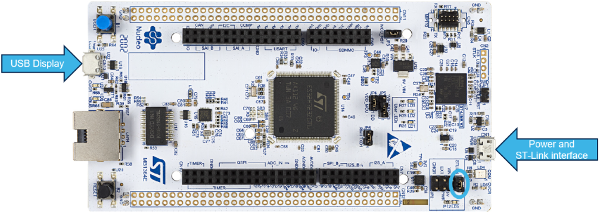
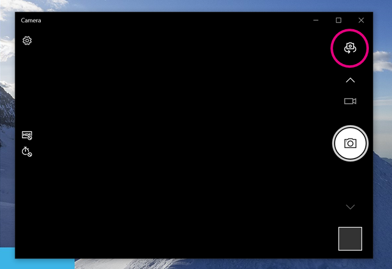
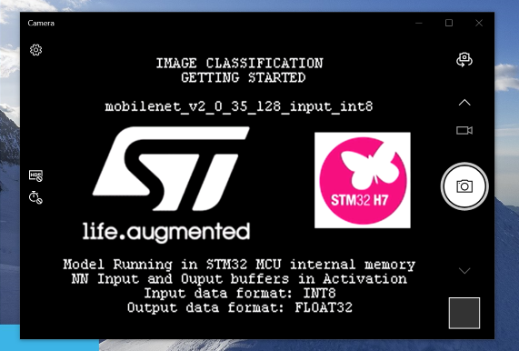
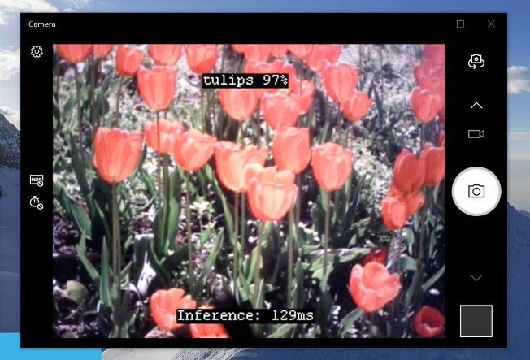
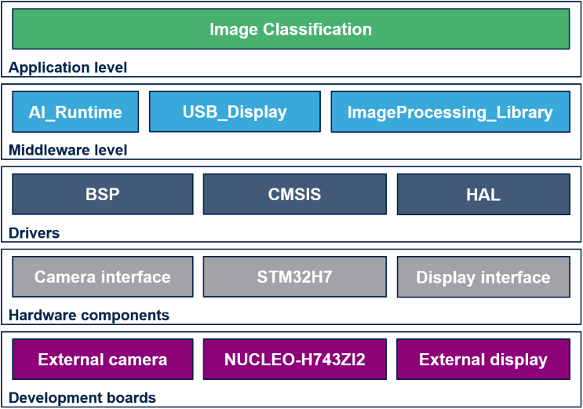
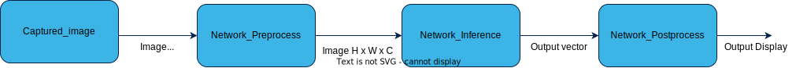
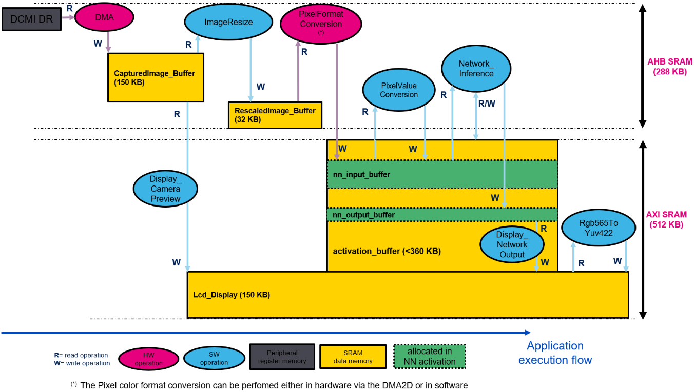

# __Image classification getting started - NUCLEO-H743ZI2__

The purpose of this package is to enable image classification application on a STM32 board.

This project provides an STM32 microcontroller embedded real time environnement to execute [X-CUBE-AI](https://www.st.com/en/embedded-software/x-cube-ai.html) generated model targeting image classification application.


### __Directory contents__

This repository is structured as follows:

| Directory                                                                | Content                                                         |
|:----------------------------------------------------------------------   |:---------------------------------------------------------       |
| Application\\<STM32_Board_Name>\STM32CubeIDE                             | cubeIDE project files; only IDE files related                   |
| Application\\<STM32_Board_Name>\Inc                                      | Application include files                                       |
| Application\\<STM32_Board_Name>\Src                                      | Application source files                                        |
| Application\Network\\*                                                   | *Place holder* for AI C-model; files generated by STM32Cube.AI  |
| Drivers\CMSIS                                                            | CMSIS Drivers                                                   |
| Drivers\BSP                                                              | Board Support Package and Drivers                               |
| Drivers\STM32XXxx_HAL_Driver                                             | Hardware Abstraction Layer for STM32XXxx family products        |
| Middlewares\ST\STM32_AI_Runtime                                          | *Place holder* for AI runtime library                           |
| Middlewares\ST\STM32_ImageProcessing_Library                             | Usual image processing functions                                |
| Middlewares\ST\STM32_USB_Display                                         | USB display library                                             |
| Middlewares\ST\STM32_USB_Device                                          | USB device library                                              |
| Middlewares\Utilities\Fonts                                              | API to manage the fonts                                         |
| Middlewares\Utilities\lcd                                                | API to manage the lcd screen                                    |

## __Before you start__

### __Hardware and Software environment__

In order to run this image classification application examples you need to have the following hardware:

- [NUCLEO-H743ZI2](https://www.st.com/en/product/nucleo-h743zi) Nucleo board
- [B-CAMS-OMV](https://www.st.com/en/product/b-cams-omv) camera bundle
- any USB host able to display a camera/webcam output (most of the PCs can handle it)

Only this hardware is supported for now

### __Tools installations__

This getting started needs [STM32CubeIDE](https://www.st.com/content/st_com/en/products/development-tools/software-development-tools/stm32-software-development-tools/stm32-ides/stm32cubeide.html) as well as [X-CUBE-AI](https://www.st.com/en/embedded-software/x-cube-ai.html) from `v7.3.0` to latest version. 


You can find the info to install the tools in the parents [README](../../../scripts/deployment/README.md) of the deployment part and the general [README](../../../../README.md) of the model zoo. 


## __Hardware layout__

The pinout of the NUCLEO-H743ZI2 board for the OV5640 sensor is described in the following table:

| Nucleo-H743ZI2 pin               | OV5640 I/O                                               |
|:---------------------------------|:---------------------------------------------------------|
| PB8                              | I2C SCL                                                  |
| PB9                              | I2C SDA                                                  |
| PC6                              | DCMI D0                                                  |
| PC7                              | DCMI D1                                                  |
| PC8                              | DCMI D2                                                  |
| PC9                              | DCMI D3                                                  |
| PC11                             | DCMI D4                                                  |
| PD3                              | DCMI D5                                                  |
| PE5                              | DCMI D6                                                  |
| PE6                              | DCMI D7                                                  |
| PA6                              | DCMI PXCLK                                               |
| PA4                              | DCMI HSYNC                                               |
| PB7                              | DCMI VSYNC                                               |
| PF2                              | Sensor RST                                               |
| PF3                              | Sensor PWDN                                              |

Here is a scheme of the connections between the NUCLEO-H743ZI2 board and the B-CAMS-OMV camera module:


As the B-CAMS-OMV module is already providing XCLK to the OV5640 sensor thanks to the oscillator X1, the XCLK pin of the module needs to stay unplugged. 

## __Deployment__

### __Generate C code from tflite file__

This repo does not provide the AI C-model generated by X-CUBE-AI.

The user needs to generate the AI C-model.

It is generated by the [deployment script](../../../scripts/deployment/README.md) of the model zoo.

### __Build and deploy__

You should use the deploy.py script to automatically build and deploy the program on the target (if the hardware is connected).

After the deployment script has been launched once, you can launch the `Application\NUCLEO-H743ZI2\STM32CubeIDE\.project` with STM32CubeIDE. With the IDE you can modify, build and deploy on the target.

### __USB Display__

To display the output of the STM32, you need to connect the micro-USB port of the Nucleo-H743ZI2 to the host. The USB port outputting the video data is the following one: 



Launch the camera application on the host. On Windows, you can find it by typing "camera" in the search bar. 



If needed click on the camera switch button to switch to the STM32 Usb FS Display. Then reset the board. The Welcome screen of the application should appear: 



After few seconds, the output of the neural network should be printed with the camera input displayed:




## __Getting started deep dive__

The purpose of this package is to enable image classification application on a STM32 board. 

This package also provides a feature-rich image processing library ([STM32_ImageProcessing_Library](../../Middlewares/ST/STM32_ImageProcessing_Library/) software component).




### __Processing workflow__

The software executes an image classification on each image captured by the camera. The framerate depends on each step of the processing workflow. For the USB Display, the framerate is limited by the USB bandwidth (12Mbit/s for USB FS) as the program is waiting for the image to be sent to the host before capturing a new one. 



Captured_image: image from the camera

Network_Preprocess - 3 steps:
   -  ImageResize: rescale the image to fit the resolution needed by the network
   -  PixelFormatConversion: convert image format (usually RGB565) to fit the network color channels (RGB888 or Grayscale)
   -  PixelValueConversion: convert to pixel type used by the network (uint8 or int8)

HxWxC: Height, Width and Number of color channels, format defined by the neural network

Network_Inference: call AI C-model network

Network_Postprocess: call Output_Dequantize to convert the output type (only float32 for now)

### __Memory layout__

The application software uses different buffers. The following diagram describes how they are used and which functions interact with it. 




Unlike the STM32H747I-DISCO, the NUCLEO-H743ZI2 embedded no external SDRAM, the memory is limited to the internal RAM. The biggest RAM block is an AXI SRAM of 512KB. It needs to be shared between the Lcd_Display buffer and the activation_buffer. For this reason, the activation_buffer is limited to 360KB. The models used in this example need to be small enough to fit in this buffer.


### __Model configuration__

The `'<getting-start-install-dir>/Application/NUCLEO-H743ZI2/Inc/CM7/ai_model_config.h'` file contains configuration information.

This file is generated by the deploy.py script.

The number of output class for the model:

```C
#define NB_CLASSES          (5)
```

The dimension of the model input tensor:

```C
#define INPUT_HEIGHT        (128)
#define INPUT_WIDTH         (128)
#define INPUT_CHANNELS      (3)
```

A table containing the list of the labels for the output classes:

```C
#define CLASSES_TABLE const char* classes_table[NB_CLASSES] = {\
   "daisy" ,   "dandelion" ,   "roses" ,   "sunflowers" ,   "tulips"}\
```

The type of resizing algorithm that should be used by the preprocessing stage:

```C
#define NO_RESIZE                   (0)
#define INTERPOLATION_NEAREST       (1)

#define PP_RESIZING_ALGO       INTERPOLATION_NEAREST
```
 In the version V1.0 of the package, only the nearest neighbor algorithm is supported.

The pixels values offset and scale for the input frame to fit the training data of the neural network: 
```C
#define PP_OFFSET       (-1.0f)
#define PP_SCALE       (127.5f)
```

Input frame aspect ratio algorithms:
```C
#define KEEP_ASPECT_DISABLE            (0)
#define KEEP_ASPECT_RATIO_CROP         (1)
#define KEEP_ASPECT_RATIO_WITH_BORDERS (2)

#define ASPECT_RATIO_MODE KEEP_ASPECT_DISABLE
```

The pixel color format that is expected by the neural network model: 

```C
#define RGB_FORMAT        (1)
#define BGR_FORMAT        (2)
#define GRAYSCALE_FORMAT  (3)
#define PP_COLOR_MODE    RGB_FORMAT
```

Data format supported for the input and/or the output of the neural network model: 
```C
#define UINT8_FORMAT     (1)
#define INT8_FORMAT      (2)
#define FLOAT32_FORMAT   (3)
```

Data format that is expected by the input layer of the quantized neural network model (only UINT8 and INT8 formats are supported in V1.0):
```C
#define QUANT_INPUT_TYPE    INT8_FORMAT
```

Data format that is provided by the output layer of the quantized neural network model (only FLOAT32 format is supported in V1.0):
```C
#define QUANT_OUTPUT_TYPE    FLOAT32_FORMAT
```

Display interfaces supported for the application: 
```C
#define DISPLAY_INTERFACE_USB (1)
```
Display interface selection: 
```C
#define DISPLAY_INTERFACE DISPLAY_INTERFACE_USB
```

Camera interfaces supported for the application: 
```C
#define CAMERA_INTERFACE_DCMI (1)
```
Camera interface selection: 
```C
#define CAMERA_INTERFACE CAMERA_INTERFACE_DCMI
```

Camera DCMI sensors supported for the application: 
```C
#define CAMERA_SENSOR_OV5640 (1)
```
Camera DCMI sensor selection:
```C
#define CAMERA_SENSOR CAMERA_SENSOR_OV5640
```


The rest of the model details will be embedded in the `.c` and `.h` files generated by the tool [X-CUBE-AI](https://www.st.com/en/embedded-software/x-cube-ai.html). 

### __Image processing__

The frame captured by the camera is in a standard video format. As the neural network needs to receive a square-shaped image as input, three solutions are provided to reshape the captured frame before running the inference
- KEEP_ASPECT_RATIO_DISABLE: the frame is compacted to fit into a square with a side equal to the height of the captured frame. The aspect ratio is modified. 


- KEEP_ASPECT_RATIO_CROP: the frame is cropped to fit into a square with a side equal to the height of the captured frame. The aspect ratio remains but some data is lost on each side of the image. 


## __Limitations__

- Supports only Cube-AI from v7.3.0 to latest version.
- Supports only the NUCLEO-H743ZI2 board with B-CAMS-OMV camera module and USB display host.
- Supports only neural network model whom size fits in SoC internal memory
- Supports only 8-bits quantized model
- Supports only models with less than 360KB of activation buffer
- Input layer of the quantized model supports only data in UINT8 or INT8 format
- Output layer of the quantized model provides data in only FLOAT32 format
- Only the crop option is available to keep the aspect ratio
- Limited to STM32CubeIDE / arm gcc toolchain; IAR and Keil are coming.
- Manageable through STM32CubeIDE (open, modification, debug)
