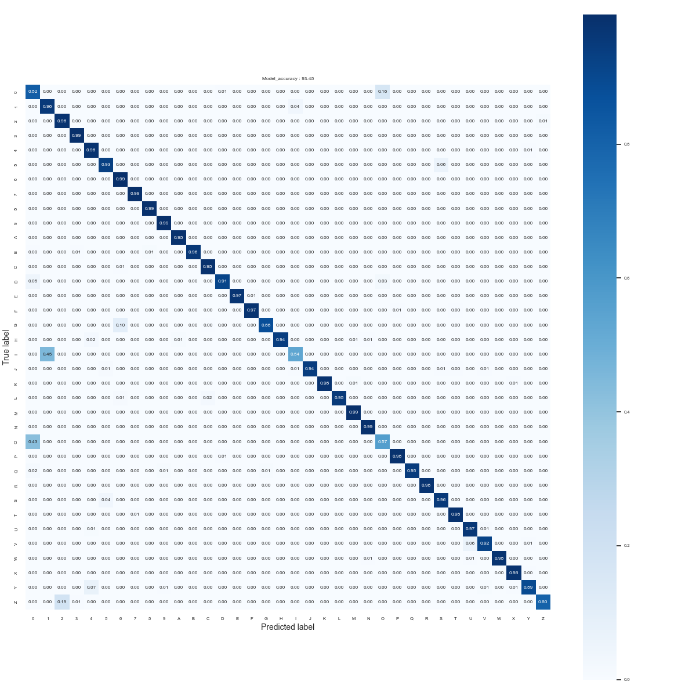

# ST MNIST v1 

## **Use case** : [Image classification](../README.md)

# Model description

This folder contains a custom model ST-MNIST for MNIST type datasets. ST-MNIST model is a depthwise separable convolutional based model architecture and can be used for different MNIST use-cases, e.g. alphabet recognition, digit recognition, or fashion MNIST etc.

ST-MNIST model accepts an input shape of 28 x 28, which is standard for MNIST type datasets.  The pretrained model is also quantized in int8 using tensorflow lite converter.

## Network information

| Network Information     |  Value          |
|-------------------------|-----------------|
|  Framework              | TensorFlow Lite |
|  Quantization           | int8            |

## Network inputs / outputs

For an image resolution of 28x28 and 36 classes : 10 integers (from 0-9) and 26 alphabets (upper-case A-Z) 

| Input Shape | Description |
| ----- | ----------- |
| (1, 28, 28, 1) | Single 28x28 grey-scale image with UINT8 values between 0 and 255 |

| Output Shape | Description |
| ----- | ----------- |
| (1, 36) | Per-class confidence for 36 classes in FLOAT32|

## Recommended Platforms

| Platform | Supported | Recommended |
|----------|-----------|-----------|
| STM32L0  |[]|[]|
| STM32L4  |[x]|[x]|
| STM32U5  |[x]|[x]|
| STM32H7  |[x]|[x]|
| STM32MP1 |[x]|[]|

# Performances
## Training

This model is trained on a subset version of [EMNIST](https://www.nist.gov/itl/products-and-services/emnist-dataset) dataset. In these experiment we kept only the ten digits classes [0,9] and capital alphabets [A-Z] from the matlab version of the EMNIST byclass dataset. The dataset can be downloaded from the [link](http://www.itl.nist.gov/iaui/vip/cs_links/EMNIST/matlab.zip). We used all the samples for these classes and we have 533,993 images in train dataset, and 89,264 images for the for the test dataset.

The training configurations for the training model are provided in, [stmnist_v1_tfs_config.yaml](./ST_pretrainedmodel_public_dataset/emnist_byclass/st_mnist_v1_28_tfs/st_mnist_v1_28_tfs_config.yaml) file. 

## Deployment

To deploy your trained model, you need to configure the [user_config.yaml](../../src/user_config.yaml) file following the [tutorial](../../deployment/README.md) under the deployment section and deploy the [.tflite model](./ST_pretrainedmodel_public_dataset/emnist_byclass/st_mnist_v1_28_tfs/st_mnist_v1_28_tfs_int8.tflite). 

## Metrics

Measures are done with default STM32Cube.AI configuration with enabled input / output allocated option.

### Reference MCU memory footprint based on EMNIST-Byclass dataset (see Accuracy for details on dataset)

| Model             | Format | Resolution | Series  | Activation RAM | Runtime RAM | Weights Flash | Code Flash | Total RAM   | Total Flash | STM32Cube.AI version  |
|-------------------|--------|------------|---------|----------------|-------------|---------------|------------|-------------|-------------|-----------------------|
| [ST MNIST Byclass v1 tfs](./ST_pretrainedmodel_public_dataset/emnist_byclass/st_mnist_v1_28_tfs/st_mnist_v1_28_tfs_int8.tflite) | Int8   | 28x28x1    | STM32H7 | 14.12 KiB     | 4.49 KiB       | 10.08 KiB    | 51.38 KiB    | 18.61 KiB   | 61.46 KiB  | 8.1.0                 |

### Reference inference time based on EMNIST-Byclass dataset (see Accuracy for details on dataset)

| Model             | Format | Resolution | Board            |   Frequency   | Inference time (ms) | STM32Cube.AI version  |
|-------------------|--------|------------|------------------|---------------|---------------------|-----------------------|
| [ST MNIST Byclass v1 tfs](./ST_pretrainedmodel_public_dataset/emnist_byclass/st_mnist_v1_28_tfs/st_mnist_v1_28_tfs_int8.tflite) | Int8   | 28x28x1    | STM32H747I-DISCO | 400 MHz       |      4.15 ms       | 8.1.0                 |

### Accuracy with EMNIST-Byclass dataset

Dataset details: [link](https://www.nist.gov/itl/products-and-services/emnist-dataset) , by_class, digits from [0-9] and capital letters [A-Z]. Number of classes: 36, Number of train images: 533,993, Number of test images: 89,264.

| Model | Format | Resolution | Top 1 Accuracy |
|-------|--------|------------|----------------|
| [ST MNIST Byclass v1 tfs](./ST_pretrainedmodel_public_dataset/emnist_byclass/st_mnist_v1_28_tfs/st_mnist_v1_28_tfs.h5) | Float | 28x28x1     | 91.89 % |
| [ST MNIST Byclass v1 tfs](./ST_pretrainedmodel_public_dataset/emnist_byclass/st_mnist_v1_28_tfs/st_mnist_v1_28_tfs_int8.tflite) | Int8 | 28x28x1    | 91.47 % |

Following we provide the confusion matrix for the model with Float32 weights.

Following we provide the confusion matrix for the quantized model with INT8 weights.

## Retraining and code generation

Please refer to the yaml explanations: [here](../../src/README.md)

## Demos
### Integration in a simple example

Please refer to the generic guideline [here](../../deployment/README.md)

# References

<a id="1">[1]</a>
"EMNIST : NIST Special Dataset," [Online]. Available: https://www.nist.gov/itl/products-and-services/emnist-dataset.

<a id="2">[2]</a>
"EMNIST: an extension of MNIST to handwritten letters". https://arxiv.org/abs/1702.05373
