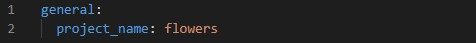
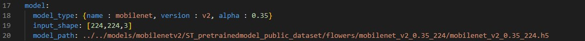
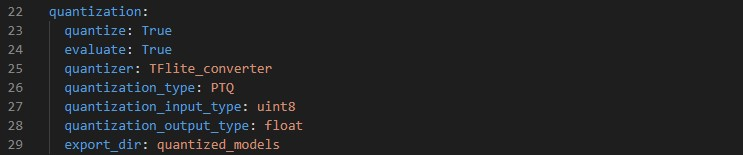
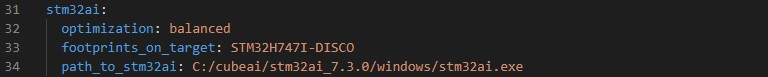
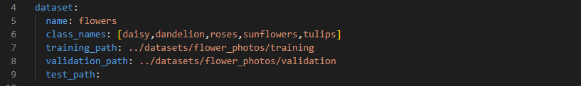
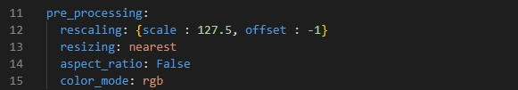
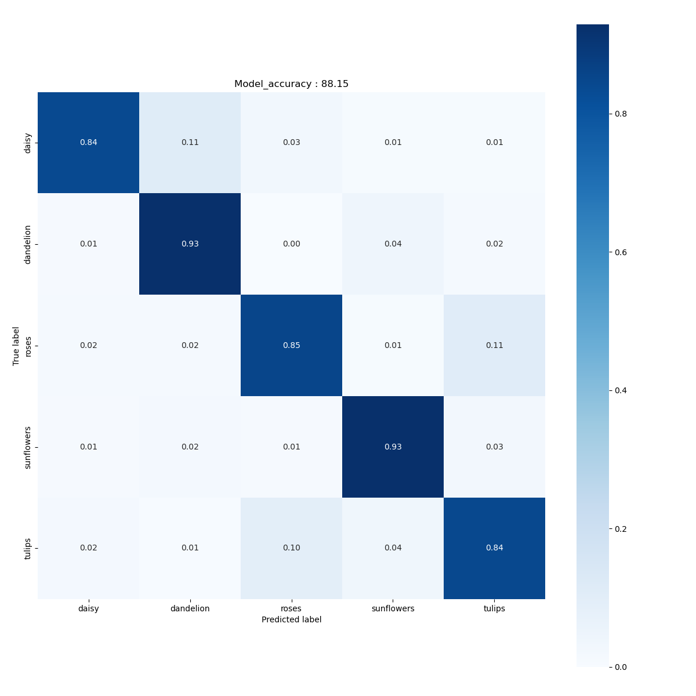

# Image classification STM32 model evaluate

This tutorial shows how to quantize and evaluate your pre-trained image classification model using *STM32Cube.AI*.

## Table of contents

* <a href='#benchmark'>Benchmark your model using *STM32Cube.AI* </a><br>
* <a href='#Evaluate'>Quantize and evaluate the performance of your model</a><br>


## Benchmark your model using *STM32Cube.AI*
<a id='benchmark'></a>

### **1. Configure the yaml file**
**1.1. General settings:**

Configure the **general** section in **[user_config.yaml](user_config.yaml)** as the following:




where:

- `project_name` - *String*, name of the project.

**1.2. Load your model:**

Here you can define the model path to load and benchmark the model, also other parameters that will be useful for quantizing and evaluating the model if wanted.

To do so we will need to configure the **model** section in **[user_config.yaml](user_config.yaml)** as the following:



where:

- `model_type` - A *dictionary* with keys relative to the model topology (see [more](../training/doc/models.json)). Example for mobilenet family *{name : mobilenet, version : v2, alpha : 0.35}*, else for a custom model use *{name : custom}*.
- `input_shape` -  A *list of int* *[H, W, C]* for the input resolution, e.g. *[224, 224, 3]*.
- `model_path` - *Path* to your model, the model can be in `.h5`, `SavedModel` or `.tflite` format.

**1.4. Model quantization:**

Quantization optimizes your model to be deployed more efficiently on your embedded device by reducing its memory usage(Flash/RAM) and accelerating its inference time, with little degradation in model accuracy.

In this step you don't need to provide a dataset, your model will be quantized with fake data to be able to evaluate the optimized model footprints. However this method will not preserve the accuracy of your model, so to properly quantize your model or evaluate the quantized model accuracy, please refer to the section [below](#quantize-and-evaluate-the-performance-of-your-model).

If your model is already quantized into TensorFlow `.tflite` format, **please skip this step**.

Configure the **quantization** section in **[user_config.yaml](user_config.yaml)** as the following:  



where:

- `quantize` - *Boolean*, if True model will be quantized, else False.
- `evaluate` - *Boolean*, if True evaluate quantized model if validation or test sets are provided, else False.
- `quantizer` - *String*, only option is "TFlite_converter" which will convert model trained weights from float to integer values. The quantized model will be saved in TensorFlow Lite format.
- `quantization_type` - *String*, only option is "PTQ",i.e. "Post-Training Quantization". 
- `quantization_input_type` - *String*, can be "int8", "uint8" or "float", represents the quantization type for the model input.
- `quantization_output_type` - *String*, can be "int8", "uint8" or "float", represents the quantization type for the model output.
- `export_dir` - *String*, referres to directory name to save the quantized model.


**1.5. Benchmark your model with STM32Cube.AI:**

STM32Cube.AI will allow you to benchmark your model and estimate its footprints for STM32 target devices.

Make sure to add the path to the stm32ai executable under **path_to_stm32ai**, else you will need to provide your credentials to use the **Developer Cloud Services**:



where:
- `optimization` - *String*, define the optimization used to generate the C model, options: "*balanced*", "*time*", "*ram*".
- `footprints_on_target` - Specify a board name to evaluate the model inference time on real stm32 target using the **Developer Cloud Services**, e.g. **'STM32H747I-DISCO'** (see [more](../training/doc/models.json)), else keep **False** (i.e. only local download on **STM32Cube.AI** will be used to evaluate footprints w/o inference time).
- `path_to_stm32ai` - *Path* to stm32ai executable file to use local download, else **False**.

### **2. Run benchmark**

Then, run the following command:


```bash
python evaluate.py
```

## Quantize and evaluate the performance of your model
<a id='Evaluate'></a>

### **1. Configure the yaml file**

**1.1. Getting the model and quantization parameters:**


First, you need to follow the previous steps in the [benchmark](#benchmark) section to configure your **[user_config.yaml](user_config.yaml)**.

As mentioned before, you can skip most of the quantization parameters if your model is already quantized using Tflite Converter, however make sure to set `evaluate` to True.

**1.2. Preparing the dataset:**

If you are providing a float model, we suggest using `Post-Training Quantization` to optimize the model footprints. To do so, you need to provide the data used during training. Also, you need to make sure to provide the path for a `validation set` or a `test set` to be able to evaluate the accuracy of your model when quantized.

**1.2.1. Loading the dataset:**

Configure the **dataset** section in **[user_config.yaml](user_config.yaml)** as the following:



where:

- `name` - Dataset name. Exception for *Cifar  datasets*, the name should be "*cifar10*" or "*cifar100*".
- `class_names` - A list containing the classes name.
- `training_path` - The directory where the training set is located, or the dataset path. 
- `validation_path` - Path to the validation set, needs to be provided to evaluate the model accuracy.
- `test_path` - Path to the test_set, if not provided the validation set will be used for evaluation.

**1.2.2. Apply preprocessing:**

Apply preprocessing by modifiying the **preprocessing** parameters in **[user_config.yaml](user_config.yaml)** as the following:



- `rescaling` - A *dictonary* with keys *(scale, offset)* to rescale input values to a new range. To scale input image **[0:255]** in the range **[-1:1]** you should pass **{scale = 127.5, offset = -1}**, else in the range **[0:1]** you should pass **{scale = 255, offset = 0}**.
- `resizing` - *String*, the interpolation method used when resizing images, e.g. *bilinear*, *nearest*, *bicubic*, *area*, *gaussian*.
- `aspect_ratio` - *Boolean*, if *True* resize the images without aspect ratio distortion, else aspect ratio may not be preserved.
- `color_mode` - One of "*grayscale*", "*rgb*" or "*bgr*".


### **2. Run evaluation**

Then, run the following command:

```bash
python evaluate.py
```

### **3. Visualize results**

**3.1. Saved results**

All evaluation artifats are saved under the current output simulation directory **"outputs/{run_time}"**.

For example, you can retrieve the confusion matrix generated after evaluating the float/quantized model on the validation/test set as follows:




**3.2. Run MLFlow**

MLflow is an API for logging parameters, code versions, metrics, and artifacts while running machine learning code and for visualizing results.
To view and examine the results of multiple trainings, you can simply access the MLFlow Webapp by running the following command:

```bash
mlflow ui
```
And open the given IP adress in your browser.