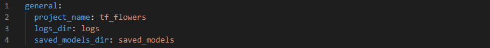
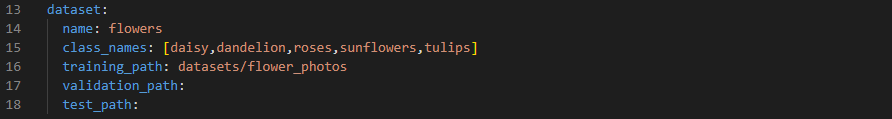
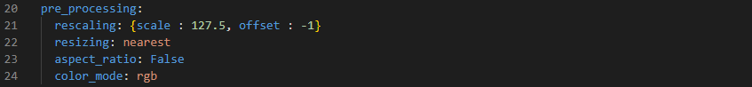
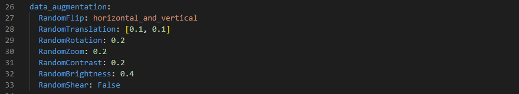
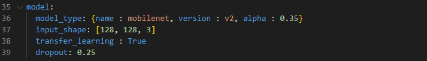
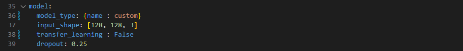
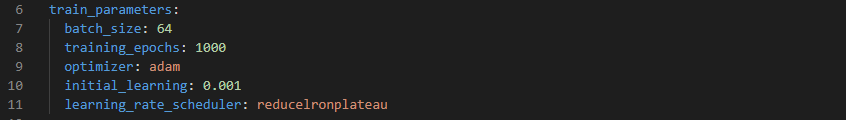
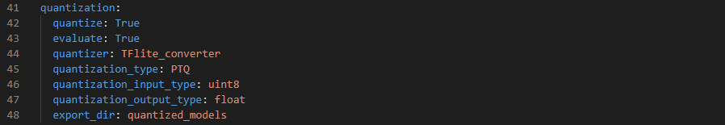
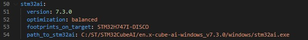

# Image classification STM32 model training

This tutorial shows how to train from scratch or apply transfer learning on an image classification model using a custom dataset.
As an example we will demonstrate the workflow on the [tf_flowers](https://storage.googleapis.com/download.tensorflow.org/example_images/flower_photos.tgz) classification dataset.

`Note:` If you are training a model in order to deploy it with the [Getting Started](../../getting_started/README.md), please check out first the application specifications [here](../deployment/README.md).

## Table of contents

* <a href='#Data'>Prepare dataset</a><br>
* <a href='#training'>Train and evaluate model</a><br>
* <a href='#results'>Visualize training results</a><br>

## Prepare Dataset
<a id='Data'></a>

### **1. Download the dataset and extract it**

The dataset directory should look as the following:
```bash
flower_photo/
  daisy/
  dandelion/
  roses/
  sunflowers/
  tulips/
```
- In general your dataset should respect the following structure:
```bash
dataset_directory/
...class_a/
......a_image_1.jpg
......a_image_2.jpg
...class_b/
......b_image_1.jpg
......b_image_2.jpg
```

PS: Except for Cifar10/Cifar100 datasets, we support their official format in batches.

### **2. Configure the yaml file**
**2.1. General settings:**

Configure the **general** section in **[user_config.yaml](user_config.yaml)** as the following:




where:

- `project_name` - *String*, name of the project.
- `logs_dir` - Path to save tensorboard logs.
- `saved_models_dir` - Path to save the trained model.

**2.2. Loading the dataset:**

Configure the **dataset** section in **[user_config.yaml](user_config.yaml)** as the following:



where:

- `name` - Dataset name. Exception for *Cifar  datasets*, the name should be "*cifar10*" or "*cifar100*".
- `class_names` - A list containing the classes name.
- `training_path` - The directory where the training set is located, or the dataset path. 
- `validation_path` - Path to the validation set, if not provided 20% of the training set will be used for validation.
- `test_path` - Path to the test_set, if not provided the validation set will be used for evaluation.

**2.3. Apply preprocessing:**

Apply preprocessing by modifiying the **preprocessing** parameters in **[user_config.yaml](user_config.yaml)** as the following:



- `rescaling` - A *dictonary* with keys *(scale, offset)* to rescale input values to a new range. To scale input image **[0:255]** in the range **[-1:1]** you should pass **{scale = 127.5, offset = -1}**, else in the range **[0:1]** you should pass **{scale = 255, offset = 0}**.
- `resizing` - *String*, the interpolation method used when resizing images, e.g. *bilinear*, *nearest*, *bicubic*, *area*, *gaussian*.
- `aspect_ratio` - *Boolean*, if *True* resize the images without aspect ratio distortion, else aspect ratio may not be preserved.
- `color_mode` - One of "*grayscale*", "*rgb*" or "*bgr*".

**2.4. Use data augmentation:**

When you don't have a large image dataset, it's a good practice to artificially introduce sample diversity by applying random, yet realistic, transformations to the training images. This helps exposing the model to different aspects of the training data and reduces the overfitting.

You can apply data augmentation by configuring the **data_augmentation** section in **[user_config.yaml](user_config.yaml)**:



If you don't want to use a specific data augmentation technique set it to **False**, else provide an adequat value to be applied:

- `RandomFlip` - One of "*horizontal*", "*vertical*", or "*horizontal_and_vertical*".
- `RandomTranslation` - A *list* on float values **[height_factor,width_factor]**, with "height_factor" a float between -1.0 and 1.0 (a negative value means shifting image up, while a positive value means shifting image down), and "width_factor" a float between -1.0 and 1.0 (negative value means shifting image left, while a positive value means shifting image right), e.g. *[0.2, 0.3]* results in a height shift of [-20%, +20%] and a width shift of [-30%, +30%].
- `RandomRotation` - A *float* represented as fraction of *2Pi*, a positive values means rotating counter clock-wise, while a negative value means clock-wise, e.g. 0.2 results in an output rotating by a random amount in the range [-20% * 2pi, 20% * 2pi].
- `RandomZoom` - A *float* between -1.0 and 1.0, a positive value means zooming out while a negative value means zooming in.
- `RandomContrast` - A *float* between -1.0 and 1.0 used to generate a random factor to apply contrast. Contrast is adjusted independently for each channel of each image during training.
- `RandomBrightness` - A positive *float* represented as fraction of value, or a tuple of size 2 representing lower and upper bound. When represented as a single float, lower = upper. The brightness factor will be randomly picked between [1.0 - lower, 1.0 + upper], and adjusted independently for each channel of each image during training.
- `RandomShear` - A *float* factor used to randomly shears images during training, the range is interpreted as (0, factor). Values represent a percentage of the image to shear over. For example, 0.3 shears pixels up to 30% of the way across the image. All provided values should be positive.

## Train and evaluate model
<a id='training'></a>

### **1. Configure training parameters**

**1.1. Choose a model with pre-trained weights:**

You can pick a *MobileNet V2* model for transfer learning. The model weights are pre-trained on the ImageNet dataset, a large dataset consisting of 1.4M images and 1000 classes.
As an example we will use a *MobileNet V2* with *alpha = 0.35*, to do so we will need to configure the **model** section in **[user_config.yaml](user_config.yaml)** as the following:



where:

- `model_type` - A *dictonary* with keys relative to the model topology (see [more](./doc/models.json)). Example for mobilenets *{name : mobilenet, version : v2, alpha : 0.35}*, else for a custom model use *{name : custom}*.
- `input_shape` -  A *list of int* *[H, W, C]* for the input resolution, e.g. *[128, 128, 3]*.
- `transfer_learning` - *Boolean*, if True the base model is freezed for training with pretrained weights from 'imagenet', else we start a training from scratch with randomly initialized weights.
- `dropout` - A *float* value between 0 and 1.

**1.2. Choose a custom model:**

If you want to define and train your custom model, you need to modify the **model** section in **[user_config.yaml](user_config.yaml)** as the following:



Under [utils](../utils/models/custom_model.py), we provide a template `custom_model.py` where you can define the feature extraction layers of your custom model in Keras/Tensorflow. Your topology should be described in the function `get_model(cfg)` as follows:


**1.3. Set training hyperparameters:**

To choose the right hyperparameters for training your model, simply modify the **train_parameters** section in **[user_config.yaml](user_config.yaml)** as the following:



where:

- `batch_size` - *Integer*. Size of the batches of data, e.g. 32.
- `training_epochs` - *Integer*. Number of epochs to train the model. 
- `optimizer` - One of "Adam", "SGD" or "RMSprop".
- `initial_learning` - A *float* value, e.g. 0.001.
- `learning_rate_scheduler` - One of "Constant", "ReduceLROnPlateau", "Exponential" or "Cosine".


### **2. Configure evaluation parameters**

**2.1. Model quantization:**

Quantization optimizes your model to be deployed more efficiently on your embedded device by reducing its memory usage(Flash/RAM) and accelerating its inference time, with little degradation in model accuracy.

Configure the **quantization** section in **[user_config.yaml](user_config.yaml)** as the following:  



where:

- `quantize` - *Boolean*, if True model will be quantized, else False.
- `evaluate` - *Boolean*, if True evaluate quantized model, else False.
- `quantizer` - *String*, only option is "TFlite_converter" which will convert model trained weights from float to integer values. The quantized model will be saved in TensorFlow Lite format.
- `quantization_type` - *String*, only option is "PTQ",i.e. "Post-Training Quantization". 
- `quantization_input_type` - *String*, can be "int8", "uint8" or "float", represents the quantization type for the model input.
- `quantization_output_type` - *String*, can be "int8", "uint8" or "float", represents the quantization type for the model output.
- `export_dir` - *String*, referres to directory name to save the quantized model.

**2.2. Benchmark your model with STM32Cube.AI:**

STM32CubeAI will allow you to benchmark your model and estimate its footprints for STM32 target devices.

Make Sure to add the path to the stm32ai excutable under **path_to_stm32ai**, else you will need to provide your credentials to use the **Developer Cloud Services**:



where:
- `optimization` - *String*, defines the optimization used to generate the C model, options: "*balanced*", "*time*", "*ram*".
- `footprints_on_target` - Specifies a board name to evaluate the model inference time on real stm32 target using the **Developer Cloud Services**, e.g. **'STM32H747I-DISCO'** (see [more](./doc/boards.json)), else keep **False** (i.e. only local download on **STM32Cube.AI** will be used to evaluate footprints w/o inference time).
- `path_to_stm32ai` - *Path* to stm32ai executable file to use local download, else **False**.


### **3. Train your model** 


Run the following command:


```bash
python train.py
```


## Visualize training results
<a id='results'></a>

### **1. Saved results**

All training and evaluation artificats are saved under the current output simulation directory **"outputs/{run_time}"**.

For example, you can retrieve the plots of the accuracy/loss curves, as well as the confusion matrix generated after evaluating the float/quantized model on the test set as follows:


### **2. Run tensorboard**

To visualize the training curves logged by tensorboard, go to **"outputs/{run_time}"** and run the following command:

```bash
tensorboard --logdir logs
```

And open the URL `http://localhost:6006` in your browser.

### **3. Run MLFlow**

MLflow is an API for logging parameters, code versions, metrics, and artifacts while running machine learning code and for visualizing results.
To view and examine the results of multiple trainings, you can simply access the MLFlow Webapp by running the following command:
```bash
mlflow ui
```
And open the given IP adress in your browser.