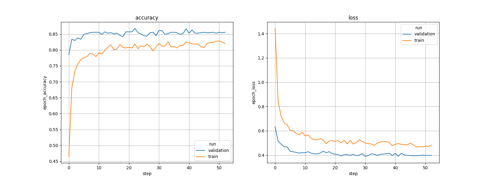

# <a id="">Image classification STM32 model training</a>

This readme shows how to train from scratch or apply transfer learning on an image classification model using a custom dataset.
As an example we will demonstrate the workflow on the [tf_flowers](https://storage.googleapis.com/download.tensorflow.org/example_images/flower_photos.tgz) classification dataset.


<details open><summary><a href="#1"><b>1. Prepare the dataset</b></a></summary><a id="1"></a>

After downloading and extracting the dataset files, the dataset directory tree should look as below:

```bash
dataset_root_directory/
   class_a/
      a_image_1.jpg
      a_image_2.jpg
   class_b/
      b_image_1.jpg
      b_image_2.jpg
```
The names of the subdirectories under the dataset root directory are the names of the classes.

As an example, the directory tree of the Flowers dataset is shown below:

```bash
flowers/
   daisy/
   dandelion/
   roses/
   sunflowers/
   tulips/
```

Other dataset formats are not supported. The only exceptions are the Cifar10/Cifar100 datasets. For these datasets, the official format in batches is supported.
</details>

<details open><summary><a href="#2"><b>2.  Create your training configuration file</b></a></summary><a id="2"></a>
<ul><details open><summary><a href="#2-1">2.1  Overview</a></summary><a id="2-1"></a>

All the proposed services like the training of the model are driven by a configuration file written in the YAML language.

For training, the configuration file should include at least the following sections:

- `general`, describes your project, including project name, directory where to save models, etc.
- `operation_mode`, describes the service or chained services to be used
- `dataset`, describes the dataset you are using, including directory paths, class names, etc.
- `preprocessing`, specifies the methods you want to use for rescaling and resizing the images. 
- `training`, specifies your training setup, including batch size, number of epochs, optimizer, callbacks, etc.
- `mlflow`, specifies the folder to save MLFlow logs.
- `hydra`, specifies the folder to save Hydra logs.

This tutorial only describes the settings needed to train a model. In the first part, we describe basic settings.
At the end of this readme, you can also find more advanced settings and callbacks supported.
</details></ul>

<ul><details open><summary><a href="#2-2">2.2  General settings</a></summary><a id="2-2"></a>

The first section of the configuration file is the `general` section that provides information about your project.

```yaml
general:
   project_name: my_project
   logs_dir: logs
   saved_models_dir: saved_models
   deterministic_ops: True
```
If you want your experiments to be fully reproducible, you need to activate the `deterministic_ops` attribute and set it to True.
Enabling the `deterministic_ops` attribute will restrict TensorFlow to use only deterministic operations on the device, but it may lead to a drop in training performances. It should be noted that not all operations in the used version of TensorFlow can be computed deterministically. 
If your case involves any such operation, a warning message will be displayed and the attribute will be ignored.
The `logs_dir` attribute is the name of the directory where the MLFlow and TensorBoard files are saved. The `saved_models_dir` attribute is the name of the directory where trained models are saved. These two directories are located under the top level "hydra" directory (please see [chapter 2.8](#2-8) for hydra informations).
</details></ul>

<ul><details open><summary><a href="#2-3">2.3  Dataset specification</a></summary><a id="2-3"></a>

Information about the dataset you want use is provided in the `dataset` section of the configuration file, as shown in the YAML code below.

```yaml
dataset:
   name: flowers
   class_names: [daisy, dandelion, roses, sunflowers, tulips]
   training_path: ../datasets/flower_photos
   validation_path:
   validation_split: 0.15
   test_path:
```

In this example, no validation set path is provided, so the available data under the *training_path* directory is splitted in two to create a training set and a validation set. 
By default, 80% of the data is used for the training set and the remaining 20% is used for the validation set.
If you want to use a different split ratio, you need to specify in `validation_split` the ratio to be used for the validation set (value between 0 and 1).

No test set path is provided in this example to evaluate the model accuracy after training and quantization. Therefore, the validation set is used as the test set.
</details></ul>

<ul><details open><summary><a href="#2-4">2.4  Dataset preprocessing</a></summary><a id="2-4"></a>

The images from the dataset need to be preprocessed before they are presented to the network. This includes rescaling and resizing, as illustrated in the YAML code below.

```yaml
preprocessing:
   rescaling: {scale : 1/127.5, offset : -1}
   resizing: {interpolation: nearest, aspect_ratio: "fit"}
   color_mode: rgb
```

The pixels of the input images are in the interval [0, 255], that is UINT8. If you set `scale` to 1./255 and `offset` to 0, they will be rescaled to the interval [0.0, 1.0]. If you set *scale* to 1/127.5 and *offset* to -1, they will be rescaled to the interval [-1.0, 1.0].

The `resizing` attribute specifies the image resizing methods you want to use:
- The value of `interpolation` must be one of *{"bilinear", "nearest", "bicubic", "area", "lanczos3", "lanczos5", "gaussian", "mitchellcubic"}*.
- The value of `aspect_ratio` must be either *"fit"* or *"crop"*. If you set it to *"fit"*, the resized images will be distorted if original aspect ratio is not the same as in the resizing size. If you set it to *"crop"*, images will be cropped as necessary to preserve the aspect ratio.

The `color_mode` attribute must be one of "*grayscale*", "*rgb*" or "*rgba*".
</details></ul>

<ul><details open><summary><a href="#2-5">2.5  Data augmentation</a></summary><a id="2-5"></a>

Data augmentation is an effective technique to reduce the overfit of a model when the dataset is too small or the classification problem to solve is too easy for the model.

The data augmentation functions to apply to the input images are specified in the `data_augmentation` section of the configuration file file as illustrated in the YAML code below.

```yaml
data_augmentation:
  random_contrast:
    factor: 0.4
  random_brightness:
    factor: 0.2
  random_flip:
    mode: horizontal_and_vertical
  random_translation:
    width_factor: 0.2
    height_factor: 0.2
  random_rotation:
    factor: 0.15
  random_zoom:
    width_factor: 0.25
    height_factor: 0.25
```

The data augmentation functions with their parameter settings are applied to the input images in their order of appearance in the configuration file. 
Refer to the data augmentation documentation **[README.md](../data_augmentation/README.md)** for more information about the available functions and their arguments.

A script called *test_data_augment.py* is available in the **data_augmentation** directory. This script reads your configuration file, picks some images from the dataset, applies the data augmentation functions you specified to the images, and displays before/after images side by side. We strongly encourage you to run this script to develop your data augmentation and make sure that it is neither too aggressive nor too weak.
</details></ul>

<ul><details open><summary><a href="#2-6">2.6  Loading a model</a></summary><a id="2-6"></a>

Information about the model you want to train is provided in the `training` section of the configuration file.

The YAML code below shows how you can use a MobileNet V2 model from the Model Zoo.

```yaml
training:
   model:
      name: mobilenet
      version: v2
      alpha: 0.35
      pretrained_weights: imagenet
      input_shape: (224, 224, 3)
```

The `pretrained_weights` attribute is set to "ImageNet", which indicates that you want to load the weights pretrained on the ImageNet dataset and do a *transfer learning* type of training. 

If `pretrained_weights` was set to "None", no pretrained weights would be loaded in the model and the training would start *from scratch*, i.e. from randomly initialized weights.
</details></ul>

<ul><details open><summary><a href="#2-7">2.7  Training setup</a></summary><a id="2-7"></a>

The training setup is described in the `training` section of the configuration file, as illustrated in the example below.

```yaml
training:
   batch_size: 64
   epochs: 400
   dropout: 0.3
   optimizer: 
      Adam: {learning_rate: 0.001}
   callbacks:
      ReduceLROnPlateau:
         monitor: val_accuracy
         factor: 0.5
         patience: 10
      EarlyStopping:
         monitor: val_accuracy
         patience: 60
```

The `batch_size`, `epochs` and `optimizer` attributes are mandatory. All the others are optional.

The `dropout` attribute only makes sense if your model includes a dropout layer. 

All the Tensorflow optimizers can be used in the `optimizer` subsection. All the Tensorflow callbacks can be used in the `callbacks` subsection, except the ModelCheckpoint and TensorBoard callbacks that are built-in and can't be redefined.

A number of learning rate schedulers are provided with the Model Zoo as custom callbacks. The YAML code below shows how to use the LRCosineDecay scheduler that implements a cosine decay function.

```yaml
training:
   batch_size: 64
   epochs: 400
   optimizer: Adam
   callbacks:
      LRCosineDecay:
         initial_learning_rate: 0.01
         decay_steps: 170
         alpha: 0.001
```

A variety of learning rate schedulers are provided with the Model Zoo. If you want to use one of them, just include it in the `callbacks` subsection. Refer to [the learning rate schedulers README](../../../common/training/lr_schedulers_README.md) for a description of the available callbacks and learning rate plotting utility.

</details></ul>

<ul><details open><summary><a href="#2-8">2.8  Hydra and MLflow settings</a></summary><a id="2-8"></a>

The `mlflow` and `hydra` sections must always be present in the YAML configuration file. The `hydra` section can be used to specify the name of the directory where experiment directories are saved and/or the pattern used to name experiment directories. With the YAML code below, every time you run the Model Zoo, an experiment directory is created that contains all the directories and files created during the run. The names of experiment directories are all unique as they are based on the date and time of the run.

```yaml
hydra:
   run:
      dir: ./experiments_outputs/${now:%Y_%m_%d_%H_%M_%S}
```

The `mlflow` section is used to specify the location and name of the directory where MLflow files are saved, as shown below:

```yaml
mlflow:
   uri: ./experiments_outputs/mlruns
```
</details></ul>
</details>

<details open><summary><a href="#3"><b>3. Train your model</b></a></summary><a id="3"></a>

To launch your model training using a real dataset, run the following command from **src/** folder:
```bash
python stm32ai_main.py --config-path ./config_file_examples/ --config-name training_config.yaml
```
Trained h5 model can be found in corresponding **experiments_outputs/** folder.
</details>

<details open><summary><a href="#4"><b>4. Visualize training results</b></a></summary><a id="4"></a>
<ul><details open><summary><a href="#4-1">4.1  Saved results</a></summary><a id="4-1"></a>

All training and evaluation artifacts are saved under the current output simulation directory **"outputs/{run_time}"**.

For example, you can retrieve the plots of the accuracy/loss curves as below:


</details></ul>
<ul><details open><summary><a href="#4-2">4.2  Run tensorboard</a></summary><a id="4-2"></a>

To visualize the training curves logged by tensorboard, go to **"outputs/{run_time}"** and run the following command:

```bash
tensorboard --logdir logs
```

And open the URL `http://localhost:6006` in your browser.
</details></ul>
<ul><details open><summary><a href="#4-3">4.3  Run MLFlow</a></summary><a id="4-3"></a>

MLflow is an API for logging parameters, code versions, metrics, and artifacts while running machine learning code and for visualizing results.
To view and examine the results of multiple trainings, you can simply access the MLFlow Webapp by running the following command:
```bash
mlflow ui
```
And open the given IP adress in your browser.
</details></ul>
</details>

<details open><summary><a href="#5"><b>5. Advanced settings</b></a></summary><a id="5"></a>
<ul><details open><summary><a href="#5-1">5.1  Training your own model</a></summary><a id="5-1"></a>

You may want to train your own model rather than a model from the Model Zoo.

This can be done using the `model_path` attribute of the `general:` section to provide the path to the model file to use as illustrated in the example below.

```yaml
general:
   model_path: <path-to-a-Keras-model-file>    # Path to the model file to use for training

operation_mode: training

dataset:
   training_path: <training-set-root-directory>    # Path to the root directory of the training set.
   validation_split: 0.2                           # Use 20% of the training set to create the validation set.
   test_path: <test-set-root-directory>            # Path to the root directory of the test set.

training:
   batch_size: 64
   epochs: 150
   dropout: 0.3
   frozen_layers: (0, -1)
   optimizer:
      Adam:                               
         learning_rate: 0.001
   callbacks:                    
      ReduceLROnPlateau:
         monitor: val_loss
         factor: 0.1
         patience: 10
```

The model file must be a Keras model file with a '.h5' filename extension.

The `model:` subsection of the `training:` section is not present as we are not training a model from the Model Zoo. An error will be thrown if it is present when `model_path` is set.

About the model loaded from the file:
- if some layers are frozen in the model, they will be reset to trainable before training. You can use the `frozen_layers` attribute if you want to freeze these layers (or different ones).
- If you set the `dropout` attribute but the model does not include a dropout layer, an error will be thrown. Reciprocally, an error will also occur if the model includes a dropout layer but the `dropout` attribute is not set.
- If the model was trained before, the state of the optimizer won't be preserved as the model is compiled before training.

</details></ul>
<ul><details open><summary><a href="#5-2">5.2  Resuming a training</a></summary><a id="5-2"></a>

You may want to resume a training that you interrupted or that crashed.

When running a training, the model is saved at the end of each epoch in the **'saved_models'** directory that is under the experiment directory (see section "2.2 Output directories and files"). The model file is named 'last_augmented_model.h5' .

To resume a training, you first need to choose the experiment you want to restart from. Then, set the `resume_training_from` attribute of the 'training' section to the path to the 'last_augmented_model.h5' file of the experiment. An example is shown below.

```yaml
operation_mode: training

dataset:
   training_path: <training-set-root-directory>
   validation_split: 0.2
   test_path: <test-set-root-directory>

training:
   batch_size: 64
   epochs: 150      # The number of epochs can be changed for resuming.
   dropout: 0.3 
   frozen_layers: (0:1)
   optimizer:
      Adam:
         learning_rate: 0.001
   callbacks:         
      ReduceLROnPlateau:
         monitor: val_accuracy
         factor: 0.1
         patience: 10
   resume_training_from: <path to the 'last_augmented_model.h5' file of the interrupted/crashed training>
```

When setting the `resume_training_from` attribute, the `model:` subsection of the `training:` section and the `model_path` attribute of the `general:` section should not be used. An error will be thrown if you do so.

The configuration file of the training you are resuming should be reused as is, the only exception being the number of epochs. If you make changes to the dropout rate, the frozen layers or the optimizer, they will be ignored and the original settings will be kept. Changes made to the batch size or the callback section will be taken into account. However, they may lead to unexpected results.

The state of the optimizer is saved in the **last_augmented_model.h5** file, so you will restart from where you left it. The model is called 'augmented' because it includes the rescaling and data augmentation preprocessing layers.

There are two other model files in the **saved_models** directory. The one that is called **best_augmented_model.h5** is the best augmented model that was obtained since the beginning of the training. The other one that is called **best_model.h5** is the same model as **best_augmented_model.h5**, but it does not include the preprocessing layers and cannot be used to resume a training. An error will be thrown if you attempt to do so.

</details></ul>
<ul><details open><summary><a href="#5-3">5.3  Transfer learning</a></summary><a id="5-3"></a>

Transfer learning is a popular training methodology that is used to take advantage of models trained on large datasets, such as ImageNet.
The Model Zoo features that are available to implement transfer training are presented in the next sections.
<ul><details open><summary><a href="#5-3-1">5.3.1 Using ImageNet pretrained weights</a></summary><a id="5-3-1"></a>

Weights pretrained on the ImageNet dataset are available for the MobileNet-V1 and MobileNet-V2 models.

If you want to use these pretrained weights, you need to add the `pretrained_weights` attribute to the `model:` subsection of the 'training' section of the configuration file and set it to 'imagenet', as shown in the YAML code below.

```yaml
training:
   model:
      name: mobilenet
      version: v2
      alpha: 0.35
      input_shape: (224, 224, 3)
      pretrained_weights: imagenet
```

By default, no pretrained weights are loaded. If you want to make it explicit that you are not using the ImageNet weights, you may add the `pretrained_weights` attribute and left it unset or set to *None*.
</details></ul>
<ul><details open><summary><a href="#5-3-2">5.3.2 Using weights from another model</a></summary><a id="5-3-2"></a>

When you train a model, you may want to take advantage of the weights from another model that was previously trained on another, larger dataset.

Assume for example that you are training a MobileNet-V2 model on the Flowers dataset and you want to take advantage of the weights of another MobileNet-V2 model that you previously trained on the Plant Leaf Diseases dataset (for illustration purposes, this may not give valuable results).
This can be specified using the `pretrained_model_path` attribute in the `model:` subsection as shown in the YAML code below.

```yaml
training:
   model:
      name: mobilenet
      version: v2
      alpha: 0.35
      input_shape: (224, 224, 3)
      pretrained_model_path: ../pretrained_models/mobilenetv2/ST_pretrainedmodel_public_dataset/plant-village/mobilenet_v2_0.35_224_fft/mobilenet_v2_0.35_224_fft.h5
```

Weights are transfered between backbone layers (all layers but the classifier). The two models must have the same backbones, obviously. You could not transfer weights between two MobileNet-V2 models that have different 'alpha' parameter values, or from an FD-MobileNet model to a ResNet model.

This weights transfer feature is available for all the models from the Model Zoo. Note that for MobileNet models, the `pretrained_weights` and `pretrained_model_path` are mutually exclusive and an error will be raised if you use both.
</details></ul>

<ul><details open><summary><a href="#5-3-3">5.3.3 Freezing layersl</a></summary><a id="5-3-3"></a>

Once the pretrained weights have been loaded in the model to train, some layers are often frozen, that is made non-trainable, before training the model. A commonly used approach is to freeze all the layers but the last one, which is the classifier.

By default, all the layers are trainable. If you want to freeze some layers, then you need to add the optional `frozen_layers` attribute to the `training:` section of your configuration file. The indices of the layers to freeze are specified using the Python syntax for indexing into lists and arrays. Below are some examples.


```yaml
training:
   frozen_layers: (0:-1)    # Freeze all the layers but the last one
   
training:
   frozen_layers: (10:120)   # Freeze layers with indices from 10 to 119

training:
   frozen_layers: (150:)     # Freeze layers from index 150 to the last layer

training:
   frozen_layers: (8, 110:121, -1)  # Freeze layers with index 8, 110 to 120, and the last layer
```

Note that if you want to make it explicit that all the layers are trainable, you may add the `frozen_layers` attribute and left it unset or set to *None*.
</details></ul>

<ul><details open><summary><a href="#5-3-4">5.3.4 Multi-step training</a></summary><a id="5-3-4"></a>

In some cases, better results may be obtained using multiple training steps.

The first training step is generally done with only a few trainable layers, typically the classifier only. Then, more and more layers are made trainable in the subsequent training steps. Some other parameters may also be adjusted from one step to another, in particular the learning rate. Therefore, a different configuration file is needed at each step.

The `model_path` attribute of the `general:` section and the `trained_model_path` attribute of the `training:` section are available to implement such a multi-step training. At a given step, `model_path` is used to load the model that was trained at the previous step and `trained_model_path` is used to save the model at the end of the step.

Assume for example that you are doing a 3 steps training. Then, your 3 configurations would look as shown below.

**Training step #1 configuration file (initial training):**

```yaml
training:
   model:
      name: mobilenet
      version: v2
      alpha: 0.35
      input_shape: (128, 128, 3)
      pretrained_weights: imagenet
   frozen_layers: (0:-1)
   trained_model_path: ${MODELS_DIR}/step_1.h5
```

**Training step #2 configuration file:**

```yaml
general:
   model_path: ${MODELS_DIR}/step_1.h5

training:
   frozen_layers: (50:)
   trained_model_path: ${MODELS_DIR}/step_2.h5
```

**Training step #3 configuration file:**

```yaml
general:
   model_path: ${MODELS_DIR}/step_2.h5

training:
   frozen_layers: None
   trained_model_path: ${MODELS_DIR}/step_3.h5

```
</details></ul>
</details></ul>

<ul><details open><summary><a href="#5-4">5.4  Creating your own custom model</a></summary><a id="5-4"></a>

You can create your own custom model and get it handled as any built-in Model Zoo model. If you want to do that, you need to modify a number of Python source code files that are all located under the *\<MODEL-ZOO-ROOT>\/image_classification/src* directory root.

An example of custom model is given in the **models/custom_model.py** located in the *\<MODEL-ZOO-ROOT\>/image_classification/src/models/*. The model is constructed in the body of the *get_custom_model()* function that returns the model. Modify this function to implement your own model.

In the provided example, the *get_custom_model()* function takes in arguments:
- `num_classes`, the number of classes.
- `input_shape`, the input shape of the model.
- `dropout`, the dropout rate if a dropout layer must be included in the model.

As you modify the *get_custom_model()* function, you can add your own arguments. Assume for example that you want to have an argument `alpha` that is a float. Then, just add it to the interface of the function.

Then, your custom model can be used as any other Model Zoo model using the configuration file as shown in the YAML code below:
```yaml
training:
   model:
      name: custom
      alpha: 0.5       # The argument you added to get_custom_model().
      input_shape: (128, 128, 3)
   dropout: 0.2
```

If you want to use transfer learning with your custom model, you need to modify the value of the argument `last_layer_index` in the call to the function `transfer_pretrained_weights()` in file *common/utils/models_utils.py*. This argument needs to be set to the index of the last layer of the model backbone, i.e. the last layer before the classifier begins. Layer indices are numbered from 0 (the input layer has index 0).

After doing this, you will be able to use transfer learning as shown below:

```yaml
training:
   model:
      name: custom
      alpha: 0.5
      input_shape: (128, 128, 3)
      pretrained_model_path: ${MODELS}/pretrained_model.h5
   dropout: 0.2
```
</details></ul>

<ul><details open><summary><a href="#5-5">5.5  Train, quantize, benchmark and evaluate your model</a></summary><a id="5-5"></a>

In case you want to train and quantize a model, you can either launch the training operation mode followed by the quantization operation on the trained model (please refer to quantization **[README.md](../quantization/README.md)** that describes in details the quantization part) or you can use chained services like launching [chain_tqe](../config_file_examples/chain_tqe_config.yaml) example with command below:
```bash
python stm32ai_main.py --config-path ./config_file_examples/ --config-name chain_tqe_config.yaml
```
This specific example trains a mobilenet v2 model with imagenet pre-trained weights, fine tunes it by retraining latest seven layers but the fifth one (this only as an example), aand quantizes it 8-bits using quantization_split (30% in this example) of the train dataset for calibration before evaluating the quantized model.

In case you also want to execute a benchmark on top of training and quantize services, it is recommended to launch the chain service called [chain_tbqeb](../config_file_examples/chain_tbqeb_config.yaml) that stands for train, benchmark, quantize, evaluate, benchmark like the example with command below:
```bash
python stm32ai_main.py --config-path ./config_file_examples/ --config-name chain_tbqeb_config.yaml
```
This specific example uses the "Bring Your Own Model" feature using `model_path`, then fine tunes the initial model by retraining all the layers but the twenty first (as an example), benchmarks the float model STM32H747I-DISCO board using the STM32Cube.AI developer cloud, quantizes it 8-bits using quantization_split (30% in this example) of the train dataset for calibration before evaluating the quantized model and benchmarking it.
</details></ul>
</details>
