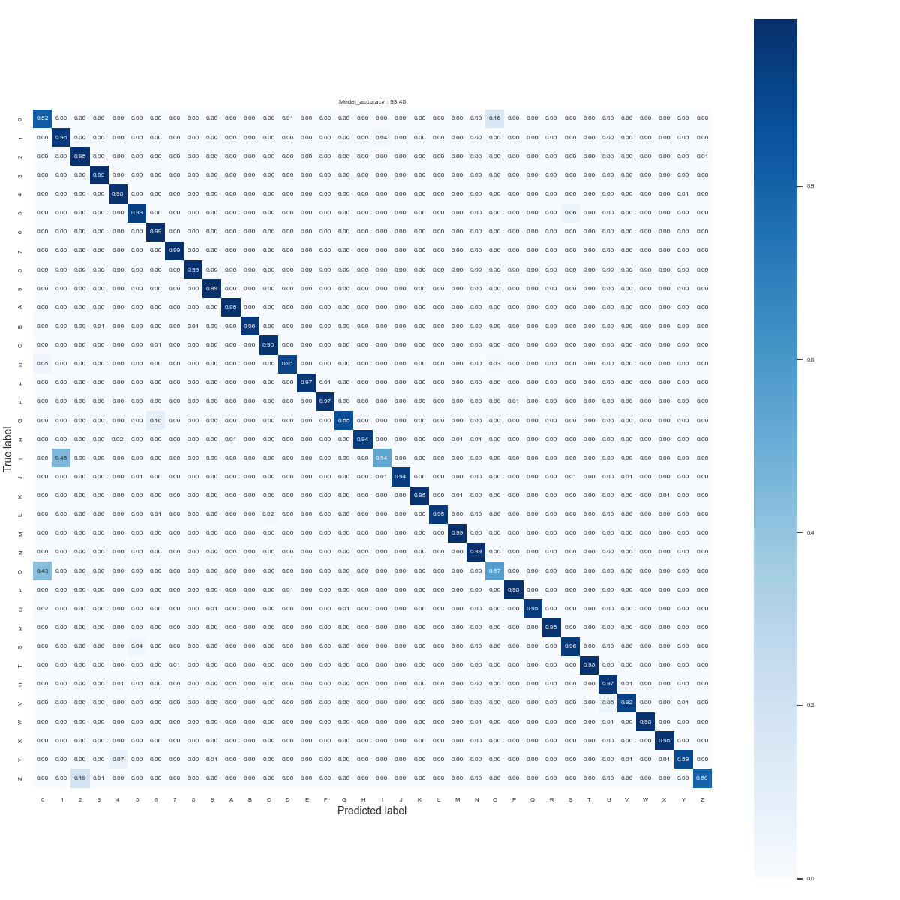
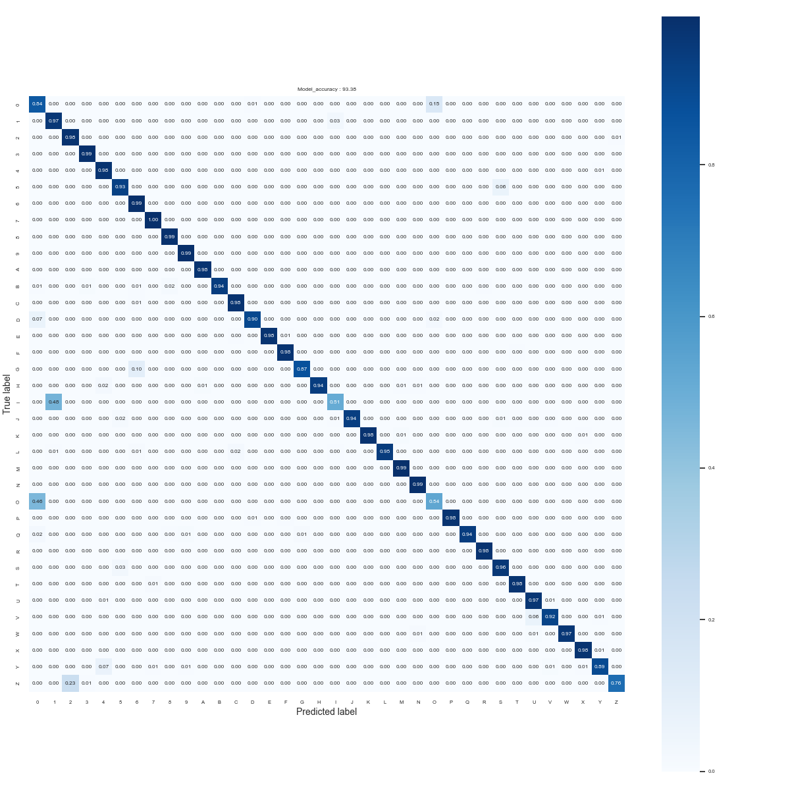

# ST MNIST v1

## **Use case** : `Image classification`

# Model description

This folder contains a custom model ST-MNIST for MNIST type datasets. ST-MNIST model is a depthwise separable convolutional based model architecture and can be used for different MNIST use-cases, e.g. alphabet recognition, digit recognition, or fashion MNIST etc.

ST-MNIST model accepts an input shape of 28 x 28, which is standard for MNIST type datasets.  The pretrained model is also quantized in int8 using tensorflow lite converter.

## Network information

| Network Information     |  Value          |
|-------------------------|-----------------|
|  Framework              | TensorFlow Lite |
|  Quantization           | int8            |

## Network inputs / outputs

For an image resolution of 28x28 and 36 classes : 10 integers (from 0-9) and 26 alphabets (upper-case A-Z)

| Input Shape | Description |
| ----- | ----------- |
| (1, 28, 28, 1) | Single 28x28 grey-scale image with UINT8 values between 0 and 255 |

| Output Shape | Description |
| ----- | ----------- |
| (1, 36) | Per-class confidence for 36 classes in FLOAT32|

## Recommended Platforms

| Platform | Supported | Recommended |
|----------|-----------|-----------|
| STM32L0  |[]|[]|
| STM32L4  |[x]|[x]|
| STM32U5  |[x]|[x]|
| STM32H7  |[x]|[x]|
| STM32MP1 |[x]|[]|
| STM32MP2 |[x]|[]|
| STM32N6  |[x]|[]|

# Performances

## Metrics

- Measures are done with default STM32Cube.AI configuration with enabled input / output allocated option.
- `tfs` stands for "training from scratch", meaning that the model weights were randomly initialized before training.

### Reference **MCU** memory footprint based on EMNIST-Byclass dataset (see Accuracy for details on dataset)

| Model             | Format | Resolution | Series  | Activation RAM | Runtime RAM | Weights Flash | Code Flash | Total RAM   | Total Flash | STEdgeAI Core version  |
|-------------------|--------|------------|---------|----------------|-------------|---------------|------------|-------------|-------------|-----------------------|
| [ST MNIST Byclass v1 tfs](./ST_pretrainedmodel_public_dataset/emnist_byclass/st_mnistv1_28_tfs/st_mnistv1_28_tfs_int8.tflite) | Int8   | 28x28x1    | STM32H7 | 17.21 KiB     | 0.3 KiB     | 10.08 KiB    | 27.99 KiB  | 17.51 KiB   | 38.07 KiB   | 3.0.0                 |

### Reference **MCU** inference time based on EMNIST-Byclass dataset (see Accuracy for details on dataset)

| Model             | Format | Resolution | Board            |   Frequency   | Inference time (ms) | STEdgeAI Core version  |
|-------------------|--------|------------|------------------|---------------|---------------------|-----------------------|
| [ST MNIST Byclass v1 tfs](./ST_pretrainedmodel_public_dataset/emnist_byclass/st_mnistv1_28_tfs/st_mnistv1_28_tfs_int8.tflite) | Int8   | 28x28x1    | STM32H747I-DISCO | 400 MHz       | 3.48 ms             | 3.0.0                 |

### Reference **MPU** inference time based on EMNIST-Byclass dataset (see Accuracy for details on dataset)

| Model                                                                                                                           | Format | Resolution | Quantization   | Board           | Execution Engine | Frequency | Inference time (ms) | %NPU  | %GPU  | %CPU | X-LINUX-AI version |       Framework       |
|---------------------------------------------------------------------------------------------------------------------------------|--------|------------|----------------|-----------------|------------------|-----------|---------------------|-------|-------|------|--------------------|-----------------------|
| [ST MNIST Byclass v1 tfs](./ST_pretrainedmodel_public_dataset/emnist_byclass/st_mnistv1_28_tfs/st_mnistv1_28_tfs_int8.tflite) | Int8   | 28x28x1    | per-channel**  | STM32MP257F-DK2 | 2 CPU            | 1500 MHz  | 0.87                | 64.23 | 35.77 | 0    | v6.1.0             | TensorFlowLite 2.18.0 |
| [ST MNIST Byclass v1 tfs](./ST_pretrainedmodel_public_dataset/emnist_byclass/st_mnistv1_28_tfs/st_mnistv1_28_tfs_int8.tflite) | Int8   | 28x28x1    | per-channel    | STM32MP157F-DK2 | 2 CPU            | 800 MHz   | 0.70                | NA    | NA    | 100  | v6.1.0             | TensorFlowLite 2.18.0 |
| [ST MNIST Byclass v1 tfs](./ST_pretrainedmodel_public_dataset/emnist_byclass/st_mnistv1_28_tfs/st_mnistv1_28_tfs_int8.tflite) | Int8   | 28x28x1    | per-channel    | STM32MP135F-DK2 | 1 CPU            | 1000 MHz  | 1.02                | NA    | NA    | 100  | v6.1.0             | TensorFlowLite 2.18.0 |

** **To get the most out of MP25 NPU hardware acceleration, please use per-tensor quantization**

** **Note:** On STM32MP2 devices, per-channel quantized models are internally converted to per-tensor quantization by the compiler using an entropy-based method. This may introduce a slight loss in accuracy compared to the original per-channel models.

### Accuracy with EMNIST-Byclass dataset

Dataset details: [link](https://www.nist.gov/itl/products-and-services/emnist-dataset) , by_class, digits from [0-9] and capital letters [A-Z]. Number of classes: 36, Number of train images: 533,993, Number of test images: 89,264.

| Model | Format | Resolution | Top 1 Accuracy |
|-------|--------|------------|----------------|
| [ST MNIST Byclass v1 tfs](./ST_pretrainedmodel_public_dataset/emnist_byclass/st_mnistv1_28_tfs/st_mnistv1_28_tfs.keras) | Float | 28x28x1     | 91.89 % |
| [ST MNIST Byclass v1 tfs](./ST_pretrainedmodel_public_dataset/emnist_byclass/st_mnistv1_28_tfs/st_mnistv1_28_tfs_int8.tflite) | Int8 | 28x28x1    | 91.47 % |

Following we provide the confusion matrix for the model with Float32 weights.

Following we provide the confusion matrix for the quantized model with INT8 weights.

## Retraining and Integration in a simple example:

Please refer to the stm32ai-modelzoo-services GitHub [here](https://github.com/STMicroelectronics/stm32ai-modelzoo-services)

# References

<a id="1">[1]</a>
"EMNIST : NIST Special Dataset," [Online]. Available: https://www.nist.gov/itl/products-and-services/emnist-dataset.

<a id="2">[2]</a>
"EMNIST: an extension of MNIST to handwritten letters". https://arxiv.org/abs/1702.05373
