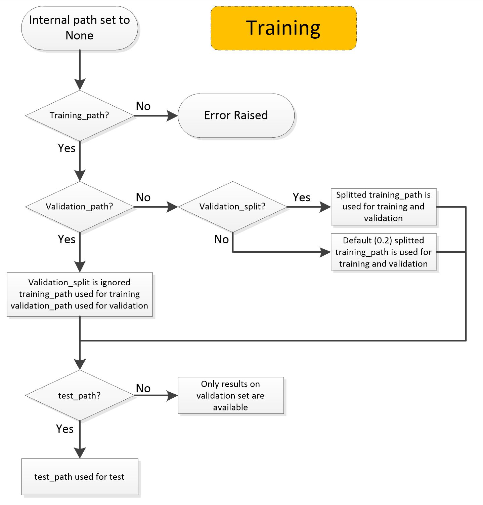

# <a id="">Object Detection STM32 Model Training</a>

This readme shows how to train from scratch or apply transfer learning on an torch object detection model using a MS COCO 2017 dataset or custom dataset in COCO format. 

<details open><summary><a href="#1"><b>1. Prepare the dataset</b></a></summary><a id="1"></a>

<ul><details open><summary><a href="#1-1">1.1 COCO (Common Objects in Context) dataset</a></summary><a id="1-1"></a>

The COCO is a large-scale benchmark widely used for object detection, instance segmentation, and keypoint detection, containing everyday scenes with multiple objects labeled using rich annotations such as bounding boxes, segmentation masks, and class labels. The official COCO dataset folder structure, as released by the COCO team, is organized by year-based splits and separates images from annotations. At the top level, COCO contains an images/ directory with subfolders like train2017/, val2017/, and test2017/ that store the actual JPEG images, and an annotations/ directory that holds JSON files describing labels and metadata. The most common annotation files are instances_train2017.json and instances_val2017.json (object detection and segmentation), along with others such as captions_*.json (image captions) and person_keypoints_*.json (human keypoints) but for object detection, only instances_train2017.json and instances_val2017.json files are used. A typical layout looks like this:
COCO dataset can be directly downloaded from from [here](https://cocodataset.org/#download).

An example of this structure is shown below:

```yaml
coco/
├── annotations/
│   ├── instances_train2017.json # json with all training annotation 
│   ├── instances_val2017.json
│   ├── captions_train2017.json
│   ├── captions_val2017.json
│   ├── person_keypoints_train2017.json
│   └── person_keypoints_val2017.json
└── images/
    ├── train2017/ # training images files 
    ├── val2017/
    └── test2017/
```

For custom datasets or for custom classes one can create new instances files as below (for eg. _person for person class only or _small for a small dataset for testing purposes) without modifying the structure of images folder. 
```yaml
/neutrino/datasets/coco/annotations/
├── instances_train2017.json
├── instances_train2017_person.json
├── instances_train2017_small.json
├── instances_val2017.json
├── instances_val2017_person.json
├── instances_val2017_small.json
├── custom_train2017.json
└── custom_val2017.json
```

Pascal VOC dataset can be converted to coco format by using open source services like [voc2coco](https://github.com/yukkyo/voc2coco) or [tiny_coco_dataset](https://github.com/lizhogn/tiny_coco_dataset) to create a minimalistic training set in coco format. 

<b><u>Download Instructions</u></b>

The most commonly used version for object detection and instance segmentation is **COCO 2017**, which includes training, validation, and test splits.

<b>Option 1: Command-Line Download (Recommended)</b>

```bash
mkdir -p ~/datasets/coco
cd ~/datasets/coco

# Download images
wget http://images.cocodataset.org/zips/train2017.zip
wget http://images.cocodataset.org/zips/val2017.zip

# (Optional) test images
wget http://images.cocodataset.org/zips/test2017.zip

# Download annotations
wget http://images.cocodataset.org/annotations/annotations_trainval2017.zip

# unzip 
unzip train2017.zip
unzip val2017.zip
unzip test2017.zip        # optional
unzip annotations_trainval2017.zip
```

<b>Option 2: Manual Download</b>

1. Go to the official COCO dataset page https://cocodataset.org and navigate to Download → COCO 2017 Dataset

2. Download:
```yaml
train2017.zip
val2017.zip
annotations_trainval2017.zip
(Optional) test2017.zip
```
3. Extract all files into a single coco/ directory.

<b>Create custom coco dataset</b>
Following code can be used to create coco dataset annotation with specific class(es) only. To train using few classes only the new json file generated by following script can be used. 

```yaml
import json
from collections import defaultdict

INPUT_JSON = "/neutrino/datasets/coco/annotations/instances_val2017.json"
OUTPUT_JSON = "/neutrino/datasets/coco/annotations/instances_val2017_person.json"
PERSON_CAT_ID = 1

with open(INPUT_JSON, "r") as f:
    coco = json.load(f)

# 1. Keep only "person" category
categories = [
    {
        "id": 1,
        "name": "person",
        "supercategory": "person"
    }
]

# 2. Filter annotations
person_annotations = [
    ann for ann in coco["annotations"]
    if ann["category_id"] == PERSON_CAT_ID
]

# 3. Collect image IDs that contain persons
image_ids = set(ann["image_id"] for ann in person_annotations)

# 4. Filter images
images = [
    img for img in coco["images"]
    if img["id"] in image_ids
]

# 5. Optional: remap category_id → 0 (ST_YOLOD prefers 0-based)
for ann in person_annotations:
    ann["category_id"] = 0

categories[0]["id"] = 0

# 6. Save new COCO json
new_coco = {
    "images": images,
    "annotations": person_annotations,
    "categories": categories
}

with open(OUTPUT_JSON, "w") as f:
    json.dump(new_coco, f)

print(f"Saved {OUTPUT_JSON}")
print(f"Images: {len(images)}")
print(f"Annotations: {len(person_annotations)}")
```

</details></ul>

<ul><details open><summary><a href="#1-1">1.2 Pascal VOC dataset</a></summary><a id="1-1"></a>


The Pascal Visual Object Classes (VOC) dataset is a classic benchmark for object detection, image classification, and semantic segmentation. It contains images annotated with bounding boxes, object class labels, and (for segmentation tasks) pixel-level masks. Pascal VOC is widely used for prototyping, debugging, and benchmarking detection pipelines because of its lean annotations, fixed class set (20 object classes), and relatively smaller size compared to COCO.

<b>Folder Structure (VOC 2007 / VOC 2012)</b>

After extraction, the Pascal VOC dataset follows a standardized directory layout. The root folder is named `VOCdevkit`, which may contain one or more dataset versions such as `VOC2007` and `VOC2012`.
```yaml
VOCdevkit/
└── VOC2012/ # or VOC2007/
├── Annotations/ # XML files (one per image) with object labels & boxes
├── ImageSets/
│ ├── Main/ # train/val/test splits for detection & classification
│ │ ├── train.txt
│ │ ├── val.txt
│ │ ├── trainval.txt
│ │ └── test.txt
│ └── Segmentation/ # splits for segmentation tasks
├── JPEGImages/ # all images (.jpg)
├── SegmentationClass/ # pixel-wise semantic segmentation masks
├── SegmentationObject/ # instance-level segmentation masks
└── README.md
```


<b><u>Download Instructions</u></b>

<b>Option 1: Official Pascal VOC Website (Manual)</b>

1. Visit the official Pascal VOC site  
   http://host.robots.ox.ac.uk/pascal/VOC/

2. Download one or both datasets:
   - **VOC2007** (commonly used for detection benchmarks)
   - **VOC2012** (larger and more recent)

3. Extract the tar files:
   ```bash
   tar -xvf VOCtrainval_11-May-2012.tar
   tar -xvf VOCtrainval_06-Nov-2007.tar
   ```


**Option 2: Command Line Download (Recommended)**
```
mkdir -p ~/datasets
cd ~/datasets

# VOC 2012
wget http://host.robots.ox.ac.uk/pascal/VOC/voc2012/VOCtrainval_11-May-2012.tar
tar -xvf VOCtrainval_11-May-2012.tar

# VOC 2007 (optional)
wget http://host.robots.ox.ac.uk/pascal/VOC/voc2007/VOCtrainval_06-Nov-2007.tar
tar -xvf VOCtrainval_06-Nov-2007.tar
```

Please note that we have provided support for SSD models to be trained and evaluated with Pascal VOC dataset (standard) for the purpose of quick experimentation/evaluation purpose. Pascal dataset in its standard format should be used for this purpose. For any finetuning, model training on your own dataset should use coco format. 

</details></ul>

</details>


<details open><summary><a href="#2"><b>2. Create your training configuration file</b></a></summary><a id="2"></a>
<ul><details open><summary><a href="#2-1">2.1 Overview</a></summary><a id="2-1"></a>

All the proposed services like the training of the model are driven by a configuration file written in the YAML
language.

For training, the configuration file should include at least the following sections:
- `operation_mode`, describes the service or chained services to be used
- `general`, describes your project, including project name, directory where to save models, etc.
- `model`, specifies model name, resolution, model configurations etc. 
- `dataset`, describes the dataset you are using, including directory paths, annotations path, class names, preprocessing etc.
- `training`, specifies your training setup, including batch size, number of epochs, optimizer, etc.
- `postprocessing`, parameter refers to the techniques used to refine the output of the model. This can include methods
  such as non-maximum suppression (NMS), which removes overlapping bounding boxes and retains only the most confident
  detections. Other postprocessing techniques may include filtering out detections below a certain confidence threshold,
  or applying additional heuristics to improve the accuracy of the model's predictions. By specifying the appropriate
  postprocessing methods, you can fine-tune the performance of your object detection model and achieve more accurate
  results.
- `preprocessing` specifies preprocessing parameters such as scale, offset, mean, standard deviation, resizing method, color model etc. 
- `mlflow`, specifies the folder to save MLFlow logs.
- `hydra`, specifies the folder to save Hydra logs.

This tutorial describes all the settings needed to train a model. 
</details></ul>

<ul><details open><summary><a href="#2-2">2.2 General settings</a></summary><a id="2-2"></a>

The first section of the configuration file is the `general` section that provides information about your project.

```yaml
general:
    saved_models_dir: 'st_yolodv2milli_actrelu_pt' # sub-dir, concat with output_dir
    logger: 'tensorboard'
    global_seed: 42

```

The `saved_models_dir` attribute is the name of the directory where models are saved, which includes the trained model
and the quantized model. These two directories are located under the top level <hydra> directory.

The `global_seed` attribute specifies the value of the seed to use to seed the Python, numpy, and PyTorch random generators at the beginning of the main script. This is an optional attribute, the default value being 123. If you don't want random generators to be seeded, then set `global_seed` to 'None' (not recommended as this would make training results less reproducible).

</details></ul>

<ul><details open><summary><a href="#2-3">2.3 Model specification</a></summary><a id="2-3"></a>

<ul><details open><summary><a href="#2-3-1">2.3.1 SSD Models</a></summary><a id="2-3-1"></a>


```yaml
model:
  framework: 'torch' 
  model_type : ssd
  model_path : ''
  # model_name options for SSD model 
  # ['ssd_mobilenetv1_pt', 'ssdlite_mobilenetv1_pt', 'ssd_mobilenetv2_pt', 'ssdlite_mobilenetv2_pt', 'ssdlite_mobilenetv3small_pt', 'ssdlite_mobilenetv3large_pt']
  model_name: "ssdlite_mobilenetv2_pt"
  width_mult: 1.0
  pretrained: True
  # dataset name coco_person is for pretrained dataset coco_person
  pretrained_dataset : coco_person
  input_shape: [3, 300, 300]
  num_classes: 1
```

The `framework` attribute specifies the deep learning framework used for this model. In this example, `'torch'` indicates **PyTorch** is used.  

The `model_type` attribute defines the type of model architecture. Here, `ssd` is selected, indicating that a Single Shot MultiBox Detector (SSD) will be used.  

The `model_name` attribute specifies the exact SSD variant to use. Available options for SSD models include:
- `ssd_mobilenetv1_pt`
- `ssdlite_mobilenetv1_pt`
- `ssd_mobilenetv2_pt`
- `ssdlite_mobilenetv2_pt`
- `ssdlite_mobilenetv3small_pt`
- `ssdlite_mobilenetv3large_pt`  

In this example, `"ssdlite_mobilenetv2_pt"` is chosen for its balance of efficiency and accuracy on edge devices.  

The `width_mult` attribute controls the width multiplier for the backbone network, scaling the number of channels in the network. A value of `1.0` uses the standard width.  

The `pretrained` attribute indicates whether to use **pretrained weights**. Setting it to `True` allows the model to leverage weights trained on a larger dataset for better initialization.  

The `pretrained_dataset` attribute specifies the dataset used for pretraining. In this example, `coco_person` means the pretrained weights were trained specifically on the COCO person class.  

The `input_shape` attribute defines the expected input tensor dimensions as `[channels, height, width]`. Here, `[3, 300, 300]` corresponds to standard RGB images resized to 300×300 pixels.  

The `num_classes` attribute specifies the number of output classes for detection. Here, `1` indicates that only a single class (person) is being detected.  
</details></ul>

<ul><details open><summary><a href="#2-3-1">2.3.1 ST_YOLOD Models</a></summary><a id="2-3-1"></a>


```yaml
# ---------------- Model Configuration ---------------- #
model:
  framework: 'torch' 
  model_type : st_yolod # this config is for st_yolod model family 
  model_path : '' 
  # following are supported models 
  # ['st_yolodv2milli_actrelu_pt', 'st_yolodv2tiny_actrelu_pt']
  model_name: st_yolodv2milli_actrelu_pt 
  pretrained: True
  # dataset name coco_person is for pretrained dataset coco_person
  pretrained_dataset: coco # this yaml is for coco style annotation only 
  input_shape: [3, 640, 640]  # (channel, height, width)
  pretrained_input_shape : [3, 640, 640]
  num_classes: 1 # number of classes 
```

The `framework` attribute specifies the deep learning framework used for this model. Here, `'torch'` indicates that **PyTorch** is used.  

The `model_type` attribute defines the model family. In this example, `st_yolod` indicates that this configuration is for the **ST_YOLOD model family**, an in-house efficient object detector.  

The `model_name` attribute specifies the exact ST_YOLOD variant to use. Supported models include:
- `st_yolodv2milli_actrelu_pt` – an ultra-lightweight variant optimized for extremely constrained devices.  
- `st_yolodv2tiny_actrelu_pt` – a slightly larger variant with improved accuracy while remaining efficient.  

The `pretrained` attribute indicates whether to use **pretrained weights**. Setting it to `True` allows the model to leverage previously trained weights for better initialization.  

The `pretrained_dataset` attribute specifies the dataset used for pretraining. In this case, `coco` indicates that the pretrained weights were trained on the COCO dataset with COCO-style annotations.  

The `input_shape` attribute defines the expected input tensor dimensions as `[channels, height, width]`. Here, `[3, 640, 640]` corresponds to RGB images resized to 640×640 pixels.  

The `pretrained_input_shape` attribute specifies the input shape used during pretraining, ensuring compatibility when loading pretrained weights.  

The `num_classes` attribute specifies the number of detection classes. Here, `1` indicates that the model is configured to detect a single class (e.g., person).  

The `model_path` attribute is common and it is utilized to indicate the path to the model file that you wish to use for the selected
operation mode. The accepted formats for `model_path` are listed in the table below:


</details></ul>

<ul><details open><summary><a href="#2-4">2.4 Dataset specification</a></summary><a id="2-4"></a>

Information about the dataset you want to use is provided in the `dataset` section of the configuration file, as shown in the YAML code below.

As explained in the <a href="#1">Dataset</a> section, object detection for torch framework supports Pascal VOC and COCO datasets for training. The `dataset` section and its attributes are shown in the YAML code below. 

<ul><details open><summary><a href="#2-4">2.4.1 COCO Dataset</a></summary><a id="2-4-1"></a>

```yaml
dataset : 
    format : coco 
    dataset_name : coco
    class_names: ["person"]
    training_path : " " # leave empty 
    train_images_path : ../../datasets/coco/train2017
    train_annotations_path: ../../datasets/coco/annotations/instances_train2017.json  # Name of annotation file for training
    val_images_path : ../../datasets/coco/val2017
    val_annotations_path: ../../datasets/coco/annotations/instances_val2017.json  # Name of annotation file for evaluation, 
    seed : 123
    num_worker : 4 
```

The `format` attribute is optional and can be used to specify format `coco` or `voc`

The `dataset_name` attribute is to specify the name of dataset `coco` or `voc`. Based on this attribute dataloader is selected. 

The `class_names` attribute specifies the classes in the dataset. This information must be provided in the YAML file (only for evaluation, prediction, quantization), class_names is directly accessible from coco or pascal voc annotations in `training` operation. If the `class_names` attribute is absent, the `classes_file_path` argument can be used as an alternative, pointing to a text file containing the class names.

The `train_images_path` is set to the image folder on COCO format dataset 

The `train_annotations_path` is set to json annotations path. Both images and annotations path are mandatory
`val_images_path`. `val_annotations_path`, `test_images_path`, `test_annotations_path` is used in similar way for validation and test data. 

When a model accuracy evaluation is run, the test set is used if there is one, otherwise the validation set is
used. 

The `seed` attribute specifies the seed value to use for randomly shuffling the dataset file before
splitting it (default value is 123).

The `num_workers` attribute sets number of workers for data management, the more is better but it depends upon the hardware capabilities. For training, we recommend to keep 4 workers. 

```training_path``` attribute is not used for torch but should be kept empty to ensure other pipelines work efficiently. 


images and annotations folders path are mandatory. Everything else remains same as the COCO format yaml file.


</details></ul>

<ul><details open><summary><a href="#2-4-2">2.4.2 Pascal VOC Dataset</a></summary><a id="2-4-2"></a>

```yaml
dataset: 
  train_images_path : ../../datasets/VOCdevkit/VOC2012/JPEGImages # image folder (image files)
  train_annotations_path: ../../datasets/VOCdevkit/VOC2012/Annotations # annotation folder *.xml files
  train_split :  ../../datasets/VOCdevkit/VOC2012/ImageSets/Main/trainval.txt # list of images (names) as in pascal voc
  val_images_path : ../../datasets/VOCdevkit/VOC2007/JPEGImages/
  val_annotations_path: ../../datasets/VOCdevkit/VOC2007/Annotations/  
  val_split : ../../datasets/VOCdevkit/VOC2007/ImageSets/Main/test.txt
  num_workers : 4 
```

yaml structure for Pascal voc differs only for data folder structure. 

The `train_images_path` is set to the image folder on voc format dataset (usually JPEGImages in standard voc data) 

The `train_annotations_path` is set to xmls annotations folder. 

The `train_split` is set to .txt with list of images for train, test, validation etc. 

The `num_workers` attribute sets number of workers for data management, the more is better but it depends upon the hardware capabilities. For training, we recommend to keep 4 workers. 

images, annotations folders and train_split file path are mandatory. Everything else remains same as the COCO format yaml file. 


<!-- The state machine below describes the rules to follow when handling dataset paths for the training.
<div align="center" style="width:50%; margin: auto;">


</div> -->

Dataset section also includes data augmentation used for particular model specifically for ST_YOLOD models as ST_YOLOD uses advanced augmentations as follows. Please note that SSD models do not have these advanced augmentations and it relies of basic augmentations. 

```yaml 
  multiscale_range: 5  # Actual multiscale ranges: [640 - 5 * 32, 640 + 5 * 32]. To disable multiscale training, set the value to 0.
  random_size: [10, 20] # You can uncomment this line to specify a multiscale range
  mosaic_prob: 0.5  # Probability of applying mosaic augmentation
  mixup_prob: 1.0  # Probability of applying mixup augmentation
  hsv_prob: 1.0  # Probability of applying HSV augmentation
  flip_prob: 0.5  # Probability of applying flip augmentation
  degrees: 10.0  # Rotation angle range, for example, if set to 2, the true range is (-2, 2)
  translate: 0.1  # Translate range, for example, if set to 0.1, the true range is (-0.1, 0.1)
  mosaic_scale: (0.5, 1.5)  # Scale range for mosaic augmentation
  enable_mixup: False  # Apply mixup augmentation or not
  mixup_scale: (0.5, 1.5)  # Scale range for mixup augmentation
  shear: 2.0  # Shear angle range, for example, if set to 2, the true range is (-2, 2)

``` 

The `multiscale_range` is set to number of different scales to be used during training with a granularity of 32 (eg.640 - 5 * 32, 640 + 5 * 32 if we set it to 5)

The `random_size` enables multiscale training by randomly resizing input images within a range (e.g., (10xtimes 32) to (20x32) pixels, typically in multiples of 32) 

The `mosaic_prob` is set to the probability of applying mosaic augmentation during training.

The `mixup_prob` is set to the probability of applying mixup augmentation during training.

The `hsv_prob` is set to the probability of applying HSV color augmentation.

The `flip_prob` is set to the probability of applying random flip augmentation.

The `degrees` is set to the rotation angle range applied to images.

The `translate` is set to the maximum fraction for translating images.

The `mosaic_scale` is set to the scaling range used in mosaic augmentation.

The `enable_mixup` is set to control whether mixup augmentation is applied.

The `mixup_scale` is set to the scaling range used for mixup augmentation.

The `shear` is set to the shear angle range applied to images.

</details></ul>

<ul><details open><summary><a href="#2-5">2.5 Training </a></summary><a id="2-5"></a>

The training setup is described in the training section of the configuration file, as illustrated in the example below (separately for ST_YOLOD and SSD models).

<ul><details open><summary><a href="#2-5-1">2.5.1 SSD Models </a></summary><a id="2-5-1"></a>

```yaml
training:
  trainer_name : ssd
  batch_size: 32
  epochs: 300
  validation_epochs: 2
  print_interval : 100
  base_net_lr: null             
  extra_layers_lr: null
  momentum: 0.9
  weight_decay: 0.0005
  gamma: 0.1
  scheduler: "cosine"  
  t_max: 200
  optimizer: 
    SGD:
      learning_rate: 0.01 
      momentum: 0.9
      weight_decay: 0.0005
```


The `trainer_name` is set to specify the training strategy or trainer used for model optimization.

The `batch_size` is set to the number of samples processed in one training iteration.

The `epochs` is set to the total number of training epochs.

The `validation_epochs` is set to the frequency (in epochs) at which validation is performed.

The `print_interval` is set to control how often training logs are printed.

The `base_net_lr` is set to define the learning rate for the base network layers (not used unless backbone layers).

The `extra_layers_lr` is set to define the learning rate for the extra or head layers (not used unless backbone layers).

The `momentum` is set to control the momentum factor used in optimization.

The `weight_decay` is set to control L2 regularization applied to model weights.

The `gamma` is set to define the learning rate decay factor.

The `scheduler` is set to specify the learning rate scheduling strategy.

The `t_max` is set to define the maximum number of iterations for the scheduler cycle.

The `optimizer` is set to specify the optimization algorithm used for training.

The `learning_rate` is set to define the initial step size for parameter updates.

The `SGD` is set to configure stochastic gradient descent as the optimizer.

</details></ul>


<ul><details open><summary><a href="#2-5-2">2.5.2 ST_YOLOD Models </a></summary><a id="2-5-2"></a>


```yaml
training:
  trainer_name : 'yolod' # ['yolod' trainer supported only]
  batch_size: 64
  warmup_epochs: 1 # epoch number used for warmup
  epochs: 300 # max training epoch
  scheduler: "yoloxwarmcos"  # Name of LRScheduler
  no_aug_epochs: 15 # Last #epoch to close augmentation like mosaic
  ema: True  # Apply EMA during training
  print_interval: 1  # Log period in iterations. For example, if set to 1, user could see log every iteration.
  eval_interval: 1  # Evaluation period in epochs. For example, if set to 1, model will be evaluated after every epoch.
  save_history_ckpt: True  # Save history checkpoint or not. If set to False, YOLOD will only save the latest and best checkpoint.
  optimizer: 
    SGD:
      learning_rate: 0.01 
      momentum: 0.9  # Momentum of optimizer
      warmup_lr: 0.0  # minimum learning rate during warmup
      min_lr_ratio: 0.05  # Minimum learning rate ratio
      weight_decay: 5e-4  # Weight decay of optimizer
  resume_training_from: '' # 
  start_epoch: 0
  fp16: True
```

The `trainer_name` is set to use the training pipeline for ST_YOLOD

The `batch_size` is set to control the number of images processed per iteration.

The `warmup_epochs` is set to define the number of epochs used for learning rate warmup.

The `epochs` is set to specify the maximum number of training epochs.

The `scheduler` is set to define the ST_YOLOD learning rate scheduling policy.

The `no_aug_epochs` is set to disable strong augmentations (e.g., mosaic) during the final training epochs.

The `ema` is set to enable exponential moving average of model weights during training.

The `print_interval` is set to control how frequently training logs are printed.

The `eval_interval` is set to specify how often the model is evaluated during training.

The `save_history_ckpt` is set to control whether intermediate checkpoints are saved.

The `optimizer` is set to define the optimization method used for ST_YOLOD training.

The `SGD` is set to configure stochastic gradient descent as the optimizer. You can replace this with other optimizers such as Adam. 

The `learning_rate` is set to define the base learning rate for optimization.

The `momentum` is set to stabilize SGD updates by accumulating past gradients.

The `warmup_lr` is set to define the minimum learning rate during the warmup phase.

The `min_lr_ratio` is set to define the minimum learning rate relative to the base rate.

The `weight_decay` is set to apply L2 regularization to model parameters.

The `resume_training_from` is set to specify a checkpoint path for resuming training. This can be used if your training ends abruptly and you want to continue training from a specific checkpoints. 

The `start_epoch` is set to define the starting epoch when resuming training from a specific checkpoints.

The `fp16` is set to enable mixed-precision training for faster computation and lower memory usage.

</details></ul>

</details></ul>

<ul><details open><summary><a href="#2-6">2.6 Dataset preprocessing</a></summary><a id="2-6"></a>

The images from the dataset need to be preprocessed before they are presented to the network. This includes rescaling
and resizing, as illustrated in the YAML code below.

```yaml
preprocessing:
  rescaling:
    # Image rescaling parameters
    scale: 1/127.5
    offset: -1
  resizing:
    # Image resizing parameters
    interpolation: nearest
    aspect_ratio: fit
  color_mode: rgb
```

The pixels of the input images are in the interval [0, 255], that is UINT8. If you set `scale` to 1./255 and `offset` to
0, they will be rescaled to the interval [0.0, 1.0]. If you set *scale* to 1/127.5 and *offset* to -1, they will be
rescaled to the interval [-1.0, 1.0].

The `resizing` attribute specifies the image resizing methods you want to use:

- The value of `interpolation` must be one of *{"bilinear", "nearest", "bicubic", "area", "lanczos3", "lanczos5", "gaussian", "mitchellcubic"}*.
- The value of `aspect_ratio` must be *"fit"* as we do not support other values such as *"crop"*. If you set it to *"fit"*, the resized images will be distorted if their original aspect ratio is not the same as in the resizing size.

The `color_mode` attribute must be one of "*grayscale*", "*rgb*" or "*rgba*".

When you define the preprocessing parameter in the configuration file, the annotation file for the object detection
dataset will be automatically modified during preprocessing to ensure that it is aligned with the preprocessed images.
This typically involves updating the bounding box coordinates to reflect any resizing or cropping that was performed
during preprocessing.

This automatic modification of the annotations file is an important step in preparing
the dataset for object detection, as it ensures that the annotations accurately reflect the preprocessed images and
enables the model to learn from the annotated data.

Please note that ST_YOLOD models do not use scale and offset as it consumes raw inputs (0-255 values). It also does not normalize for mean and standard deviation. So, you can just leave those values to default values in the configuration file. For SSD models, standard values are provided in relevant configuration file and update as needed based on your dataset requirements. 

</details></ul>


<ul><details open><summary><a href="#2-7">2.7 Apply post-processing</a></summary><a id="2-7"></a>

Apply post-processing by modifying the **postprocessing** parameters in **[user_config.yaml](../user_config.yaml)** as follows:

- `confidence_thresh` - A *float* between 0.0 and 1.0, the score threshold to filter detections.
- `NMS_thresh` - A *float* between 0.0 and 1.0, NMS threshold to filter and reduce overlapped boxes.
- `IoU_eval_thresh` - A *float* between 0.0 and 1.0, IoU threshold to calculate TP and FP.
</details></ul>

<ul><details open><summary><a href="#2-8">2.8 Hydra and MLflow settings</a></summary><a id="2-8"></a>

The `mlflow` and `hydra` sections must always be present in the YAML configuration file. The `hydra` section can be used
to specify the name of the directory where experiment directories are saved and/or the pattern used to name experiment
directories. With the YAML code below, every time you run the Model Zoo, an experiment directory is created that
contains all the directories and files created during the run. The names of experiment directories are all unique as
they are based on the date and time of the run.

```yaml
hydra:
  run:
    dir: ./pt/src/experiments_outputs/${now:%Y_%m_%d_%H_%M_%S}
```

The `mlflow` section is used to specify the location and name of the directory where MLflow files are saved, as shown below:

```yaml
mlflow:
  uri: ./pt/src/experiments_outputs/mlruns
```

</details></ul>
</details>
<details open><summary><a href="#3"><b>3. Train your model</b></a></summary><a id="3"></a>

To launch your model training using a real dataset, run the following command from the **stm32ai-modelzoo-services/object_detection/** folder:

**CPU Mode** 
To train the model on CPU (not recommended as the model training is very intensive and needs a lot of computational resources and needs GPUs for realistic training)

```bash
CUDA_VISIBLE_DEVICES=-1 python stm32ai_main.py --config-path ./config_file_examples_pt/yolod/st_yolodv2_pt/ --config-name training_config_coco.yaml
```

```CUDA_VISIBLE_DEVICES=-1``` is used when training the model on CPU where GPU is also present and CUDA is installed. 


**GPU Mode** 
To train the model on GPU, use the following command:

```bash
CUDA_VISIBLE_DEVICES=0 python stm32ai_main.py --config-path ./config_file_examples_pt/yolod/st_yolodv2_pt/ --config-name training_config_coco.yaml
```
```CUDA_VISIBLE_DEVICES=0``` is used when training the model on GPU:0. This is optional if you have only one GPU in your machine and if not provided, training uses GPU:0 by default. 

**Multi Mode**
Multi GPU model is only supported for ST_YOLOD models using following command.  

```bash
CUDA_VISIBLE_DEVICES=0,1,2,3,4,5,6,7 torchrun --standalone --nproc_per_node=8 stm32ai_main.py --config-path ./config_file_examples_pt/yolod/st_yolodv2_pt/ --config-name training_config_coco.yaml
```

Above command runs the model on multiple GPUs (in this case, 8 GPUs). Please make sure to use multi-GPU mode in case more than one GPU is available to speedup the training process. Another important point to be considered is that the `batch_size` provided in config file gets multiplied by number of GPUs used for training which means a default `batch_size` of 32 provided in cfg file effectively becomes 32*8 batch size while training on 8 GPUs using multi GPU mode. 


The trained model checkpoints and logs model can be found in the corresponding **pt/src/experiments_outputs/** folder.

</details>
<details open><summary><a href="#4"><b>4. Visualise your results</b></a></summary><a id="4"></a>
<ul><details open><summary><a href="#4-1">4.1 Saved results</a></summary><a id="4-1"></a>

All training and evaluation artifacts are saved under the current output simulation directory **pt/src/experiments_outputs/YYYY_MM_DD_HH_MM/<model_name>**.

</details></ul>
<ul><details open><summary><a href="#4-2">4.2 Run TensorBoard</a></summary><a id="4-2"></a>

To visualize the training curves logged by TensorBoard, go to **pt/src/experiments_outputs/YYYY_MM_DD_HH_MM/<model_name>**   and run the following command:

```bash
tensorboard --logdir **pt/src/experiments_outputs/YYYY_MM_DD_HH_MM/<model_name>/tensorboard** --port 6006
```

And open the URL `http://localhost:6006` in your browser since the default port used by Tensorboard is 6006. You can also select a different port in case port 6006 is busy or not available. 

</details></ul>
<ul><details open><summary><a href="#4-3">4.3 Run MLflow</a></summary><a id="4-3"></a>

MLflow is an API for logging parameters, code versions, metrics, and artifacts while running machine learning code and
for visualizing results.
To view and examine the results of multiple trainings, you can simply access the MLFlow Webapp by running the following
command:

```bash
mlflow ui
```

</details></ul>
</details>
<details open><summary><a href="#5"><b>5. Train, quantize, benchmark, and evaluate your models</b></a></summary><a id="5"></a>

In case you want to train and quantize a model, you can either launch the training operation mode followed by the quantization operation on the trained model (please refer to the quantization **[README.md](./README_QUANTIZATION.md)** that describes in detail the quantization part) or you can use chained services like launching [chain_tqe](../config_file_examples_pt/yolod/st_yolodv2_pt/chain_tqe_config.yaml) example with the command below:

```bash
python stm32ai_main.py --config-path ./config_file_examples_pt/yolod/st_yolodv2_pt/ --config-name chain_tqe_config.yaml
```

This specific example trains a st_yolodv2milli_actrelu_pt model on coco dataset by selecting `pretrained` as False in the yaml file and quantizes it to 8-bits using quantization_split (1% of the data in this example) of the train dataset for calibration before evaluating the quantized model.

In case you also want to execute a benchmark on top of training and quantize services, it is recommended to launch the chain service called chain_tqeb that stands for train, quantize, evaluate, benchmark like the example with the command below:

```bash
python stm32ai_main.py --config-path ./config_file_examples_pt/yolod/st_yolodv2_pt/ --config-name chain_tqeb_config.yaml
```

This specific example uses the "Bring Your Own Data" feature if you replace pretrained to `True` and replace train images, annotaitons, validation images, annotations etc with your own dataset (in coco format). it is important to select right value of learning rate by changing `lr` in this yaml file. For finetuning, it is recommended to lower the learning by 1/10 or less compared to the training from scratch learning rate. For eg. if training from scratch on coco used 0.01 as learning rate, for finetuning on your own dataset you can use 0.001. This example also quantizes the model to 8-bits using quantization_split (1% in this example) of the train dataset for calibration before evaluating the quantized model and benchmarking it.

</details>

