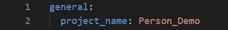
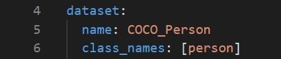
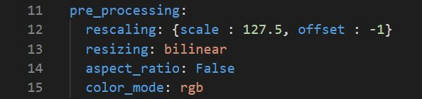
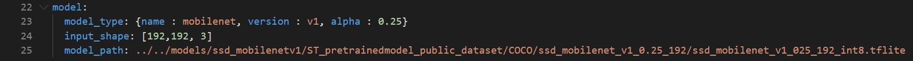
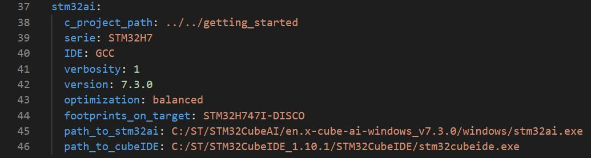
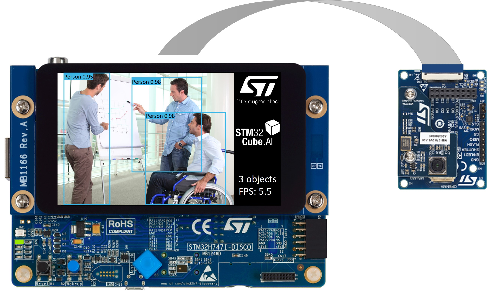
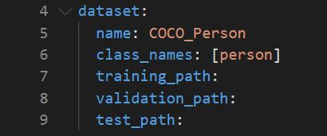
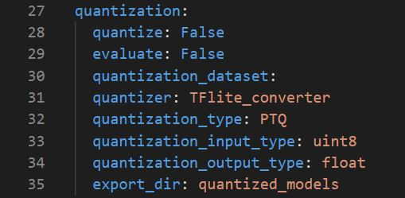

# Object detection STM32 model deployment

This tutorial shows how to quantize and deploy a pre-trained object detection model on an *STM32 board* using *STM32Cube.AI*.


## Table of contents

* <a href='#prereqs'>Before you start</a><br>
* <a href='#deploy'>Deploy pretrained tflite model on STM32 board</a><br>
* <a href='#quantize'>Quantize your model before deployment</a><br>

## Before you start
<a id='prereqs'></a>


Please check out [STM32 model zoo](../../models/README.md) for object detection.

### **1. Hardware setup**

The [Getting Started](../../getting_started/README.md) is running on a hardware setup made up of an STM32 microcontroller board connected to a camera module board. This version supports the following boards only:

- [STM32H747I-DISCO](https://www.st.com/en/product/stm32h747i-disco)
- [B-CAMS-OMV](https://www.st.com/en/product/b-cams-omv)

### **2. Software requirements**

You need to download and install the following software:

- [STM32CubeIDE](https://www.st.com/en/development-tools/stm32cubeide.html)
- If using [STM32Cube.AI](https://www.st.com/en/embedded-software/x-cube-ai.html) locally, open link and download the package, then `extract here` both `'.zip'` and `'.pack'` files.

### **3. Specifications**

- `serie` : STM32H7
- `IDE` : GCC
- `resizing` : bilinear
- Supports only 8-bits quantized TFlite model, i.e. `quantize` : True if model not quantized
- `quantization_input_type` : uint8
- `quantization_output_type` : float


## Deploy pretrained tflite model on STM32 board
<a id='deploy'></a>

### **1. Configure the yaml file**

You can run a demo using a pretrained model from [STM32 model zoo](../../models/README.md). Please refer to the YAML file provided alongside the TFlite model to fill the following sections in [user_config.yaml](user_config.yaml) (namely `Dataset Configuration` and `Load model`).

As an example, we will show how to deploy the model [ssd_mobilenet_v1_025_192_int8.tflite](../../models/ssd_mobilenetv1/ST_pretrainedmodel_public_dataset/COCO/ssd_mobilenet_v1_0.25_192/ssd_mobilenet_v1_025_192_int8.tflite) pretrained on Flowers dataset using the necessary parameters provided in [ssd_mobilenet_v1_025_192_int8_config.yaml](../../models/ssd_mobilenetv1/ST_pretrainedmodel_public_dataset/COCO/ssd_mobilenet_v1_0.25_192/ssd_mobilenet_v1_025_192_config.yaml).

**1.1. General settings:**

Configure the **general** section in **[user_config.yaml](user_config.yaml)** as the following:




where:

- `project_name` - *String*, name of the project.

**1.2. Dataset configuration:**

You need to specify some parameters related to the dataset and the preprocessing of the data in the **[user_config.yaml](user_config.yaml)** which will be parsed into a header file used to run the C application.

**1.2.1. Dataset info:**

Configure the **dataset** section in **[user_config.yaml](user_config.yaml)** as the following:



where:

- `name` - Dataset name.
- `class_names` - A list containing the classes name.

**1.2.2. Preprocessing info:**

To run inference in the C application, we need to apply on the input data the same preprocessing used when training the model.

To do so, you need to specify the **preprocessing** configuration in **[user_config.yaml](user_config.yaml)** as the following:




- `rescaling` - A *dictonary* with keys *(scale, offset)* to rescale input values to a new range. To scale input image **[0:255]** in the range **[-1:1]** you should pass **{scale = 127.5, offset = -1}**, else in the range **[0:1]** you should pass **{scale = 255, offset = 0}**.
- `resizing` - **nearest**, only supported option for *Getting Started*.
- `aspect_ratio` - One of *False*, *crop* or *padding*. If *crop* resize the images without aspect ratio distortion by cropping the image as a square, if *padding* add black borders above and below the image to make it as square, otherwise *False* aspect ratio may not be preserved.
- `color_mode` - One of "*grayscale*", "*rgb*" or "*bgr*".

**1.3. Post processing info:**

Apply post-processing by modifiying the post_processing parameters in **[user_config.yaml](user_config.yaml)** as the following:


- `type` - A *string* could be "*SSD*", "*CENTER_NET*", "*YOLO*".
- `confidence_thresh` - A *float* between 0.0 and 1.0, the score thresh to filter detections .
- `NMS_thresh` - A *float* between 0.0 and 1.0, NMS thresh to filter and reduce overlapped boxes.
- `max_boxes_limit` - An *int* to filter the number of bounding boxes.

**1.4. Load model:**

You can run a demo using a pretrained model provided in [STM32 model zoo](../../models/README.md) for object detection. These models were trained and quantized on specific datasets (e.g. People...).

Also, you can directly deploy your own pretrained model if quantized using *TFlite Converter* and respecting the specified [intput/output types](#3-specifications), else you can quantize your model before deploying it by following these [steps](#quantize).

To do so, you need to configure the **model** section in **[user_config.yaml](user_config.yaml)** as the following:



where:

- `model_type` - A *dictionary* with keys relative to the model topology (see [more](../training/doc/models.json)). Example for mobilenet family *{name : mobilenet, version : v2, alpha : 0.35}*, else for a custom model use *{name : custom}*.
- `input_shape` -  A *list of int* *[H, W, C]* for the input resolution, e.g. *[224, 224, 3]*.
- `model_path` - *Path* to pretained model. Please check out pretrained models from STM32 model zoo [here](../../models/README.md).


**1.5. C project configuration:**

To deploy the model in **STM32H747I-DISCO** board, we will use *STM32Cube.AI* to convert the model into optimized C code and *STM32CubeIDE* to build the C application and flash the board.

These steps will be done automatically by configuring the **stm32ai** section in **[user_config.yaml](user_config.yaml)** as the following:



where:
- `c_project_path` - *Path* to [Getting Started](../../getting_started/README.md) project.
- `serie` - **STM32H7**, only supported option for *Getting Started*.
- `IDE` -**GCC**, only supported option for *Getting Started*.
- `verbosity` - *0* or *1*. Mode 0 is silent, and mode 1 displays messages when building and flashing C application on STM32 target.
- `version` - Specify the **STM32Cube.AI** version used to benchmark the model, e.g. **8.0.1**.
- `optimization` - *String*, define the optimization used to generate the C model, options: "*balanced*", "*time*", "*ram*".
- `footprints_on_target` - **'STM32H747I-DISCO'** to use **Developer Cloud Services** to benchmark model and generate C code, else keep **False** (i.e. only local download of **STM32Cube.AI** will be used to get model footprints and C code w/o inference time).
- `path_to_stm32ai` - *Path* to stm32ai executable file to use local download, else **False**.
- `path_to_cubeIDE` - *Path* to stm32cubeide executable file.


### **2. Run deployment:**

First you need to connect the camera board to the *STM32H747I-DISCO* discovery board, then connect the discovery board to your computer using an usb cable.

The picture below shows how to connect the camera board to the *STM32H747I-DISCO* board using a flat flex cable:


Then, run the following command to build and flash the application on your board:


```bash
python deploy.py
```


### **3. Run the application:**

When the application is running on the *STM32H747I-DISCO* discovery board, the LCD displays the following information:
- Data stream from camera board
- Bounding boxes with confidence score between 0 and 1 attached
probability
- The number of object detected
- The number of frames processed per second (FPS) by the model



## Quantize your model before deployment
<a id='quantize'></a>

### **1. Configure the yaml file**

In addition to the [previous steps](#1-configure-the-yaml-file), you can configure the following sections to quantize your model for the [Getting Started](../../getting_started/README.md) deployment. Also, you can evaluate its accuracy after quantization if a path to the `validation set` or `test set` is provided.

**1.1. Loading the dataset:**

Configure the **dataset** section in **[user_config.yaml](user_config.yaml)** as the following:



where:

- `name` - Dataset name. Exception for *Cifar  datasets*, the name should be "*cifar10*" or "*cifar100*".
- `class_names` - A list containing the classes name.
- `training_path` - The directory where the training set is located, or the dataset path.
- `validation_path` - Path to the validation set, needs to be provided to evaluate the model accuracy.
- `test_path` - Path to the test_set, if not provided the validation set will be used for evaluation.

**1.2. Model quantization:**

Configure the **quantization** section in **[user_config.yaml](user_config.yaml)** as the following:



where:

- `quantize` - *Boolean*, if True model will be quantized, else False.
- `evaluate` - *Boolean*, if True evaluate quantized model if validation or test sets are provided, else False.
- `quantization_dataset` - Path to the quantization dataset, the dataset should respect the same structure of the training set described in [Download the dataset and extract it](../training/README.md#1-download-the-dataset-and-extract-it),  if not provided the training set is used by default to quantize the model.
- `quantizer` - *String*, only option is "TFlite_converter" which will convert model trained weights from float to integer values. The quantized model will be saved in TensorFlow Lite format.
- `quantization_type` - *String*, only option is "PTQ",i.e. "Post-Training Quantization".
- `quantization_input_type` - **int8** or **uint8**, only supported options for *getting started*.
- `quantization_output_type` - **float**, only supported option for *getting started*.
- `export_dir` - *String*, referres to directory name to save the quantized model.
