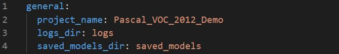
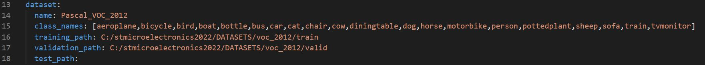
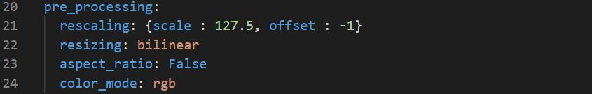
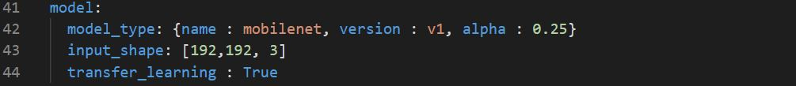
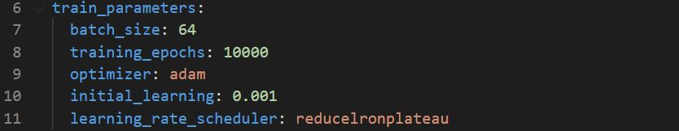
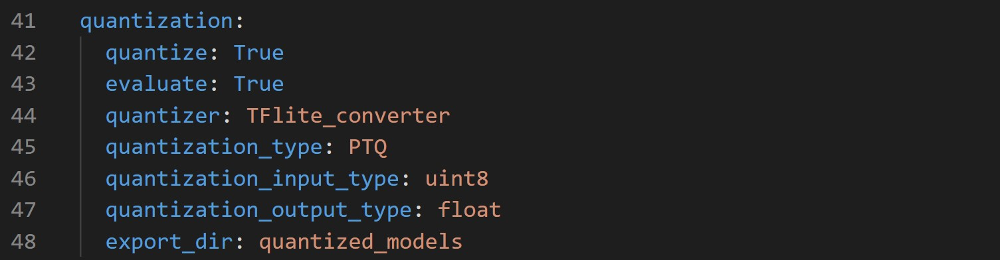
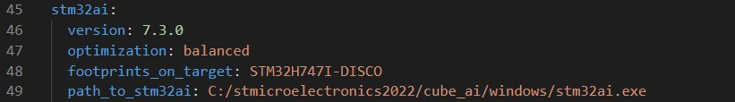
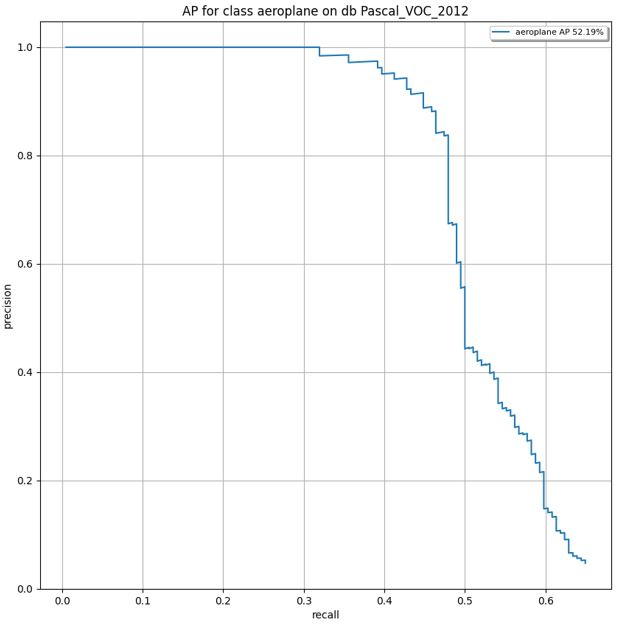

# Object detection STM32 model training

This tutorial shows how to train a MobileNet SSD v1 model from scratch or with transfer learning on a specific dataset.
As an example we will be demonstrating the workflow on the [Pascal VOC 2012 ](https://public.roboflow.com/object-detection/pascal-voc-2012/1/download/darknet) object detection dataset.

## Table of contents

* <a href='#Data'>Prepare dataset</a><br>
* <a href='#training'>Train and evaluate model</a><br>
* <a href='#results'>Visualize training results</a><br>

## Prepare dataset
<a id='Data'></a>

### **1. Download the dataset and extract it**

This project support only [YOLO Darknet TXT](https://roboflow.com/formats/yolo-darknet-txt) format.
You can download the Pascal VOC 2012 dataset directly in YOLO Darknet TXT format from [here](https://public.roboflow.com/object-detection/pascal-voc-2012/1/download/darknet):
- In general your dataset should respect the following structure:
```bash
dataset_directory/
...train/
......train_image_1.jpg
......train_image_1.txt
......train_image_2.jpg
......train_image_2.txt
...val/
......val_image_1.jpg
......val_image_1.txt
......val_image_2.jpg
......val_image_2.txt
```


### **2. Configure the yaml file**
**2.1. General settings:**

Configure the **general** section in **[user_config.yaml](user_config.yaml)** as the following:




where:

- `project_name` - *String*, name of the project.
- `logs_dir` - Path to save tensorboard logs.
- `saved_models_dir` - Path to save the trained model.

**2.2. Loading the dataset:**

Configure the **dataset** section in **[user_config.yaml](user_config.yaml)** as the following:



where:

- `name` - Dataset name.
- `class_names` - A list containing the classes name *in order*.
- `training_path` - The directory where the training set is located. 
- `validation_path` - The directory where the validation set is located.
- `test_path` - Path to the test_set, if not provided the validation set will be used for evaluation.

**2.3. Apply preprocessing:**

Apply preprocessing by modifiying the **pre_processing** parameters in **[user_config.yaml](user_config.yaml)** as the following:



- `rescaling` - A *dictonary* with keys *(scale, offset)* to rescale input values to a new range. To scale input image **[0:255]** in the range **[-1:1]** you should pass **{scale = 127.5, offset = -1}**, else in the range **[0:1]** you should pass **{scale = 255, offset = 0}**.
- `resizing` - *String*, the interpolation method used when resizing images, *only bilinear is supported for the moment*.
- `aspect_ratio` - *Boolean*, if *True* resize the images without aspect ratio distortion, else aspect ratio may not be preserved.*only False is supported for the moment*.
- `color_mode` - One of "*grayscale*", "*rgb*" or "*bgr*", "*rgba*". Whether the images will be converted to have 1, 3, or 4 channels.*only rgb is supported for the moment*.

**2.4. Apply post-processing:**

Apply post-processing by modifiying the **post_processing** parameters in **[user_config.yaml](user_config.yaml)** as the following:


- `confidence_thresh` - A *float* between 0.0 and 1.0, the score thresh to filter detections .
- `NMS_thresh` - A *float* between 0.0 and 1.0, NMS thresh to filter and reduce overlapped boxes.
- `IoU_eval_thresh` - A *float* between 0.0 and 1.0, IOU thresh to calculate TP and FP.

**2.5. Use data augmentation:**

When you don't have a large image dataset, it's a good practice to artificially introduce sample diversity by applying random, yet realistic, transformations to the training images. This helps exposing the model to different aspects of the training data and reduces overfitting.

You can apply data augmentation by configuring the **data_augmentation** section in **[user_config.yaml](user_config.yaml)**:


If you don't want to use data augmentation set `augment` to **False**, else set `augment` to **True** and provide adequat values to the data augmentation parameters:

- `rotation` - An integer value , for example a value of 30 will rotate the images by -30 to 30 degrees.
- `shearing` - An integer value , for example a value of 15 will shear the images by -15 to 15 degrees
- `translation` - A *float* between 0.0 and 1.0 , for example a value of 0.2 will translate images by -20 to +20% on x- and y-axis.
- `vertical_flip` - A *float* between 0.0 and 1.0, Probability of each image to get flipped vertically.
- `horizantal_flip` - A *float* between 0.0 and 1.0, Probability of each image to get flipped horizontally.
- `gaussian_blur` - A *float* value, for example a value of 3.0 will blur each image with a gaussian kernel with a sigma of 3.0.
- `linear_contrast` - A *float* interval, Adjust contrast by scaling each pixel to 127 + alpha x (pixel_value-127), where alpha is sampled uniformly from the interval.

## Train and evaluate model
<a id='training'></a>

### **1. Configure training parameters**

**1.1. Choose a model with pre-trained weights:**

Currently only *MobileNet V1* pre trained weights could be used for transfer learning. The model weights are pre-trained on the ImageNet dataset, a large dataset consisting of 1.4M images and 1000 classes.
As an example we will use a *MobileNet V1 SSD* with *alpha = 0.25*, to do so we will need to configure the **model** section in **[user_config.yaml](user_config.yaml)** as the following:



where:

- `model_type` - A *dictonary* with keys relative to the model topology. Currently only *{name : mobilenet, version : v1, alpha : 0.25 or 0.5}*, is supported.
- `input_shape` -  A *list of int* *[H, W, C]* for the input resolution, currently only *[256, 256, 3]*, *[224, 224, 3]*, *[192, 192, 3]* are supported.
- `transfer_learning` - *Boolean*, if True the base model is freezed for training with pretrained weights from 'imagenet', else we start a training from scratch with randomly initialized weights.

**1.2. Set training hyperparameters:**

To choose the right hyperparameters for training your model, simply modify the **train_parameters** section in **[user_config.yaml](user_config.yaml)** as the following:



where:

- `batch_size` - *Integer*. Size of the batches of data, e.g. 64.
- `training_epochs` - *Integer*. Number of epochs to train the model. 
- `optimizer` - One of "Adam", "SGD" or "RMSprop".
- `initial_learning` - A *float* value, e.g. 0.001.
- `learning_rate_scheduler` - One of "Constant", "ReduceLROnPlateau", "Exponential" or "Cosine".


### **2. Configure evaluation parameters**

**2.1. Model quantization:**

Quantization optimizes your model to be deployed more efficiently on your embedded device by reducing its memory usage(Flash/RAM) and accelerating its inference time, with little degradation in model accuracy.

Configure the **quantization** section in **[user_config.yaml](user_config.yaml)** as the following:  



where:

- `quantize` - *Boolean*, if True model will be quantized, else False.
- `evaluate` - *Boolean*, if True evaluate quantized model, else False.
- `quantizer` - *String*, only option is "TFlite_converter" which will convert model trained weights from float to integer values. The quantized model will be saved in TensorFlow Lite format.
- `quantization_type` - *String*, only option is "PTQ",i.e. "Post-Training Quantization". 
- `quantization_input_type` - *String*, can be "int8", "uint8" or "float", represents the quantization type for the model input.
- `quantization_output_type` - *String*, can be "int8", "uint8" or "float", represents the quantization type for the model output.
- `export_dir` - *String*, referres to directory name to save the quantized model.

**2.2. Benchmark your model with STM32Cube.AI:**

STM32CubeAI will allow you to benchmark your model and estimate its footprints for STM32 target devices.

Make Sure to add the path to the stm32ai excutable under **path_to_stm32ai**, else you will need to provide your credentials to use the **Developer Cloud Services**:



where:
- `optimization` - *String*, defines the optimization used to generate the C model, options: "*balanced*", "*time*", "*ram*".
- `footprints_on_target` - Specifies board name to evaluate the model inference time on real stm32 target, e.g. **'STM32H747I-DISCO'** (see [more](./doc/boards.json)), else keep **False**.
- `path_to_stm32ai` - *Path* to stm32ai executable file.


### **3. Train your model** 


Run the following command:


```bash
python train.py
```


## Visualize training results
<a id='results'></a>

### **1. Saved results**

All training and evaluation artificats are saved under the current output simulation directory **"outputs/{run_time}"**.

For example, you can retrieve the plots of the Precision/Recall curves, after evaluating the float/quantized model on the test set as follows:




### **2. Run Tensorboard**

To visualize the training curves logged by tensorboard, go to **"outputs/{run_time}"** and run the following command:

```bash
tensorboard --logdir logs
```

And open the URL `http://localhost:6006` in your brower.

### **3. Run MLFlow**

MLflow is an API for logging parameters, code versions, metrics, and artifacts while running machine learning code and for visualizing results.
To view and examine the results of multiple trainings, you can simply access the MLFlow Webapp by running the following command:
```bash
mlflow ui
```
And open the given IP adress in your browser.