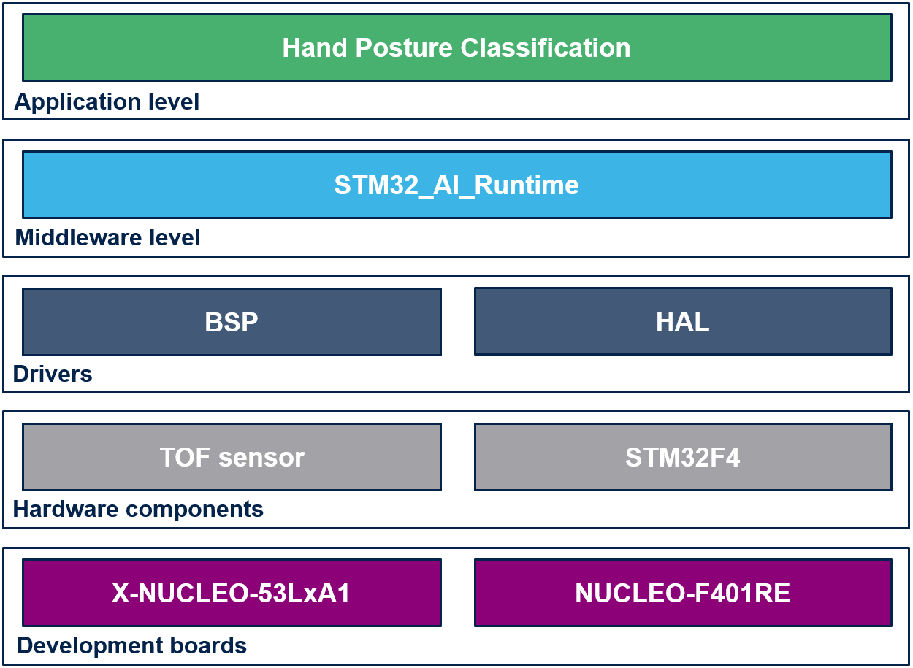

# Hand posture Getting Started Package
## Table of Contents

### <a href="#1">1. Handposture application code</a>
### <a href="#2">2. Directory contents</a>
### <a href="#3">3. Before you start</a>
### <a href="#3-1">3.1. Hardware and Software environment</a>
### <a href="#3-2">3.2. Tools installations</a>
### <a href="#4">4. Deployment</a>
#### <a href="#4-1">4.1. Generate C code from tflite file</a>
#### <a href="#4-2">4.2. Build and deploy</a>
### <a href="#5">5. Getting started deep dive</a>
#### <a href="#5-1">5..1 Processing workflow</a>
#### <a href="#5-2">5.2. Model configuration</a>
### <a href="#6">6. Limitations</a>
__________________________________________

### <a id="1">1. Handposture application code</a>

The purpose of this package is to enable handposture application on a STM32 board.

This project provides an STM32 microcontroller embedded real time environnement to execute [X-CUBE-AI](https://www.st.com/en/embedded-software/x-cube-ai.html) generated model targeting hand posture classification application.

### <a id="2">2. Directory contents</a>

This repository is structured as follows:

| Directory                                                              | Content                                                   |
|:---------------------------------------------------------------------- |:--------------------------------------------------------- |
| Application\\<STM32_Board_Name>\STM32CubeIDE              | cubeIDE project files; only IDE files related             |
| Application\\<STM32_Board_Name>\Inc                       | Application include files                                 |
| Application\\<STM32_Board_Name>\Src                       | Application source files                                  |
| Application\Network\\*                                                 | *Place holder* for AI C-model; files generated by STM32Cube.AI  |
| Drivers\CMSIS                                                          | CMSIS Drivers                                             |
| Drivers\BSP                                                            | Board Support Package and Drivers                         |
| Drivers\STM32XXxx_HAL_Driver                                           | Hardware Abstraction Layer for STM32XXxx family products  |
| Middlewares\ST\STM32_AI_Runtime                                        | *Place holder* for AI runtime library                     |

### <a id="3">3. Before you start</a>

#### <a id="3-1">3.1 Hardware and Software environment</a>

In order to run this hand posture classification application examples you need to have the following hardware:

- [NUCLEO-F401RE](https://www.st.com/en/evaluation-tools/nucleo-f401re.html) Nucleo board
- [X-NUCLEO-53LxA1](https://www.st.com/en/ecosystems/x-nucleo-53l8a1.html) Nucleo expansion board

Only this hardware is supported for now

#### <a id="3-2">3.2 Tools installations</a>

This getting started needs [STM32CubeIDE](https://www.st.com/content/st_com/en/products/development-tools/software-development-tools/stm32-software-development-tools/stm32-ides/stm32cubeide.html) as well as [X-CUBE-AI](https://www.st.com/en/embedded-software/x-cube-ai.html) 

You can find the info to install the tools in the parents [README](../../hand_posture/deployment/README.md) of the deployment part and the general [README](../../README.md) of the model zoo. 

### <a id="4">4. Deployment</a>

#### <a id="4-1">4.1. Generate C code from tflite file</a>

This repo does not provide the AI C-model generated by X-CUBE-AI.

The user needs to generate the AI C-model.

It is directly generated by the deployment script of the model zoo.

#### <a id="4-2">4.2. Build and deploy</a>

You should use the deploy.py script to automatically build and deploy the program on the target (if the hardware is connected). Refer to the [README](../../hand_posture/deployment/README.md#2-run-deployment) of the deployment part, chapter `RUN DEPLOYMENT` and `RUN THE APPLICATION`. 

Once the deploy.py script has been launched, you can launch the `Application\NUCLEO-F401RE\STM32CubeIDE\.project` with STM32CubeIDE. With the IDE you can modify, build and deploy on the target.

### <a id="5">5. Getting started deep dive</a>

The purpose of this package is to enable hand posture classification application on a STM32 board. 


#### <a id="5-1">5..1 Processing workflow</a>

The software executes a hand posture classification on each frame captured by the TOF sensor. The framerate depends on the sensor configuration


The processing flow is the following one:

* The sensor frame is a 8 by 8 zones matrix with 2 data by zone: 
   - ranging: distance from the sensor
   - peak: number of photons that returned to the sensor

* Network_Preprocess is composed of 2 steps:
   -  ValidateFrame: check the subject is in the valid range of distance
   -  NormalizeData: normalize the ranging and peak data

* Network_Inference: call AI C-model network

* Network_Postprocess is composed of 2 steps:
   - apply an argmax function to retain the predicted label
   - apply a filter to avoid output pat

#### <a id="5-2">5.2. Model configuration</a>

The `<getting-start-install-dir>/Application/NUCLEO-F401RE/Inc/ai_model_config.h` file contains configuration information.

This file is generated by the deploy.py script.

The number of output class for the model:
```C
#define NB_CLASSES          (8)
```

The dimension of the model input tensor:
```C
#define INPUT_HEIGHT        (8)
#define INPUT_WIDTH         (8)
#define INPUT_CHANNELS      (2)
```

A table containing the list of the labels for the output classes:
```C
#define CLASSES_TABLE const char* classes_table[NB_CLASSES] = {\
   "None" ,   "FlatHand" ,   "Like" ,   "Love" ,   "Dislike" ,   "BreakTime" ,\
   "CrossHands" ,   "Fist"};\
```

A table containing the list of the identifiers for each label to be interpreted by the EVK software:
```C
#define EVK_LABEL_TABLE const int evk_label_table[NB_CLASSES] = {\
   0 ,   20 ,   21 ,   24 ,   25 ,   27 ,\
   28 ,   32};\
```

The limit used to remove the background and the minimum and maximum limits for the subject to be valid:
```C
#define BACKGROUND_REMOVAL (120)
#define MAX_DISTANCE (350)
#define MIN_DISTANCE (150)
```

The rest of the model details will be embedded in the `.c` and `.h` files generated by the tool [X-CUBE-AI](https://www.st.com/en/embedded-software/x-cube-ai.html). 

### <a id="6">6. Limitations</a>

- Supports only the NUCLEO-F401RE board with X-NUCLEO-53LxA1 TOF expansion board
- Supports only neural network model whom size fits in SoC internal memory
- Supports only non-quantized neural network models
- Supports only neural network model with a 8x8x2 input shape
- Input layer of the model supports only data in FLOAT32 format
- Output layer of the model provides data in only FLOAT32 format
- Limited to STM32CubeIDE / arm gcc toolchain; IAR and Keil are coming
- Manageable through STM32CubeIDE (open, modification, debug)
