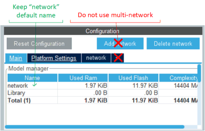

# Sensing and Audio Getting Started Package

This project provides an STM32 Microcontroler embedded real time environement to execute [X-CUBE-AI](https://www.st.com/en/embedded-software/x-cube-ai.html) generated model targetting sensing and audio applications

## Keywords

Getting Start, Model Zoo, Sensing, Audio, X-CUBE-AI

## Directory contents

This repository is structured as follows:

| Directory                                             | Content                                  |
|:----------------------------------------------------- |:---------------------------------------- |
| Projects\B-U585I-IOT02A\Applications\GS\STM32CubeIDE  | IDE project files                        |
| Projects\B-U585I-IOT02A\Applications\GS\Core          | Getting start application                |
| Projects\B-U585I-IOT02A\Applications\GS\X-Cube-AI     | *Place holder* for AI model              |
| Projects\eLooM_Components\DPU                         | Digital processing units                 |
| Projects\eLooM_Components\SensorManager               | Sensor manager                           |
| Projects\eLooM_Components\EMData                      | Data format definition                   |
| Projects\B-U585I-IOT02A\Applications\GS\mx            | Hardware related application files       |
| Middlewares\ST\eLooM                                  | Application Framework                    |
| Middlewares\ST\STM32_AI_Library                       | *Place holder* for AI runtime library    |
| Middlewares\ST\Third_Party\FreeRTOS                   | Real time operating system               |
| Drivers                                               | Hardware drivers & base port             |

## Hardware and Software environment

This example runs on [B-U585I-IOT02A](https://www.st.com/en/evaluation-tools/b-u585i-iot02a.html)

### STM32CubeIDE tool installation

The STM32CubeIDE tool is required to manage an STM32 AI C-project. It allows to install in a simple way, the requested tools to compile, build and flash a firmware on a STM32 development board.

Download [STM32CubeIDE](https://www.st.com/content/st_com/en/products/development-tools/software-development-tools/stm32-software-development-tools/stm32-ides/stm32cubeide.html), extract the package and execute the installer.

### X-CUBE-AI tool installation

[X-CUBE-AI](https://www.st.com/en/embedded-software/x-cube-ai.html) is an STM32Cube Expansion Package, which is part of the STM32Cube.AI ecosystem. It extends STM32CubeMX capabilities with automatic conversion of pretrained artificial intelligence algorithms, including neural network and classical machine learning models. It integrates also a generated optimized library into the user's project.

This software is tested with [X-CUBE-AI](https://www.st.com/en/embedded-software/x-cube-ai.html) `v8.1.0`. It is advised that the user uses the same version to avoid any potential compatibility issues.

The pack can be installed through [STM32CubeMX](https://www.st.com/content/st_com/en/products/development-tools/software-development-tools/stm32-software-development-tools/stm32-configurators-and-code-generators/stm32cubemx.html) through the  *STM32CubeExpansion* pack mechanism.

### Installation of the X-CUBE-AI runtime

Please copy

```bash
<X_CUBE_AI-directory-path>
  \- Middlewares/ST/AI/Inc/*.h
```

into the middleware project directory `'<getting-start-install-dir>/Middlewares/ST/STM32_AI_Library/Inc'`

and

```bash
<X_CUBE_AI-directory-path>
  \- Middlewares/ST/AI/Lib/GCC/ARMCortexM33/NetworkRuntime810_CM33_GCC.a
```

into the middleware project directory `'<getting-start-install-dir>/Middlewares/ST/STM32_AI_Library/Lib'`

Note: <X_CUBE_AI-directory-path> is by default \Users\\<windows_user_name\>\STM32Cube\Repository\Packs\STMicroelectronics\X-CUBE-AI\\<version\>. Also, in the name of the runtime library: `NetworkRuntime810_CM33_GCC.a`, `810` denotes that we are using [X-CUBE-AI](https://www.st.com/en/embedded-software/x-cube-ai.html) version `8.1.0`. For anyother version, update this name accordingly.

### Generation and Installation of the X-CUBE-AI model

This package does not provides the AI model generated by [X-CUBE-AI](https://www.st.com/en/embedded-software/x-cube-ai.html).
The user needs to generate the AI model either using the *GUI* (*G*raphical *U*ser *I*nterface) or the *CLI* (*C*ommand *L*ine *I*nterface).

The package does not support multiple network, hence please make sure to generate a unique AI network with its default name *network*:

With the *GUI*



With the *CLI*, just do *not* use the option ```-n/--name```

After generating the network, please copy the resulting following files:

```bash
<output-directory-path>
  \- App/network*
```

into the project directory `'<getting-start-install-dir>/Projects/B-U585I-IOT02A/Applications/GS/X-CUBE-AI/App'`

For more information, please refer to  [X-CUBE-AI](https://www.st.com/en/embedded-software/x-cube-ai.html) documentation.

### STM32CubeIDE tool launch

You can find the STM32 Cube IDE project here :
`'<getting-start-install-dir>/Projects/B-U585I-IOT02A/Applications/GS/STM32CubeIDE/.project'` It can be launched after [STM32CubeIDE](https://www.st.com/content/st_com/en/products/development-tools/software-development-tools/stm32-software-development-tools/stm32-ides/stm32cubeide.html) is installed by a double click on the file name in windows file explorer for instance.

## How to use it?

The purpose of this package is to stream physical data acquired by sensors into a processing chain including a preprocessing step that typically would preform a first level of feature extraction, the machine learning inference itself, and a post processing step before exposing the results to the user in real time.

The getting start application consists of 3 phases :

1. Configuration
2. Execution
3. Real Time synthesis

### Configuration

#### HAR example

The user has the possibility to override the default configuration by altering the user configuration header file, `'<getting-start-install-dir>/Projects/B-U585I-IOT02A/Applications/GS/Inc/ai_model_config.h'`.

In this file, you first can describe the number and the nature of the model output:

```C
#define CTRL_X_CUBE_AI_MODE_NB_OUTPUT          (1U) /* or (2U)*/
#define CTRL_X_CUBE_AI_MODE_OUTPUT_1           (CTRL_AI_CLASS_DISTRIBUTION)
```

This version supports one or two output, and each output can be:

```C
#define CTRL_AI_CLASS_DISTRIBUTION (1U)
#define CTRL_AI_CLASS_IDX          (2U)
```

Then you describe the class indexes and their labels in this way:

```C
#define CTRL_X_CUBE_AI_MODE_CLASS_NUMBER       (4U)
#define CTRL_X_CUBE_AI_MODE_CLASS_LIST         {"Stationary","Walking","Jogging","Biking"}
```

These parameters need to be consistent with the model topology that will be executed

The rest of the model details will be embedded in the `.c` and `.h` files generated by the tool [X-CUBE-AI](https://www.st.com/en/embedded-software/x-cube-ai.html).

Now you can choose to apply an available pre-processing from

```C
typedef enum {
CTRL_AI_GRAV_ROT_SUPPR,
CTRL_AI_GRAV_ROT,
CTRL_AI_PREPROC,
CTRL_AI_SPECTROGRAM_MEL,
CTRL_AI_SPECTROGRAM_LOG_MEL,
CTRL_AI_SPECTROGRAM_MFCC,
CTRL_AI_SCALING,
CTRL_AI_BYPASS
}Ctrl_preproc_t;
```

by defining, for gravity removal as an example:

```C
#define CTRL_X_CUBE_AI_PREPROC                 (CTRL_AI_GRAV_ROT_SUPPR)
```

You will now describe the sensor that will connect to the AI processing chain:

```C
#define CTRL_X_CUBE_AI_SENSOR_TYPE             (COM_TYPE_ACC)
#define CTRL_X_CUBE_AI_SENSOR_ODR              (26.0F)
#define CTRL_X_CUBE_AI_SENSOR_FS               (4.0F)
#define CTRL_X_CUBE_AI_NB_SAMPLES              (20U)
```

Today , 3D accelerometer (`COM_TYPE_ACC`) and microphone (`COM_TYPE_MIC`) types are available,  you can vary the *F*ull *S*cale (*FS*) parameter given in G and the *O*utput *D*ata *R*ate (*ODR*).

You can find Herebelow a typical configuration for HAR Deep Neural Network:

```C
#define CTRL_X_CUBE_AI_MODE_NB_OUTPUT          (1U)
#define CTRL_X_CUBE_AI_MODE_OUTPUT_1           CTRL_AI_CLASS_DISTRIBUTION
#define CTRL_X_CUBE_AI_MODE_CLASS_NUMBER       (4U)
#define CTRL_X_CUBE_AI_MODE_CLASS_LIST         {"Jogging","Stationary","Stairs","Walking"}
#define CTRL_X_CUBE_AI_SENSOR_TYPE             (COM_TYPE_ACC)
#define CTRL_X_CUBE_AI_SENSOR_ODR              (26.0F)
#define CTRL_X_CUBE_AI_SENSOR_FS               (4.0F)
#define CTRL_X_CUBE_AI_NB_SAMPLES              (0U)  // number of signals you want to run inference
                                                     // zero means undefined
#define CTRL_X_CUBE_AI_PREPROC                 (CTRL_AI_GRAV_ROT_SUPPR)
```

#### AED example

The example provided below is based on Yamnet 256 model provided in the ST model zoo.

First describe the number and the nature of the model output and its type:

```C
#define CTRL_X_CUBE_AI_MODE_NB_OUTPUT          (1U) /* or (2U)*/
#define CTRL_X_CUBE_AI_MODE_OUTPUT_1           (CTRL_AI_CLASS_DISTRIBUTION)
#define CTRL_AI_CLASS_DISTRIBUTION (1U)
```

Then you describe the class indexes and their labels in this way:

```C
#define CTRL_X_CUBE_AI_MODE_CLASS_NUMBER       (10U)
#define CTRL_X_CUBE_AI_MODE_CLASS_LIST         {"chainsaw","clock_tick","crackling_fire","crying_baby","dog","helicopter","rain","rooster","sea_waves","sneezing"}
```

Now you can select audio preprocessing type:

```C
#define CTRL_X_CUBE_AI_PREPROC                 (CTRL_AI_SPECTROGRAM_LOG_MEL)
```

For spectrogram log mel pre processing you need to specify the various parameters of the patch processing:


The parameters are:

```C
#define CTRL_X_CUBE_AI_SPECTROGRAM_NMEL          (64U)
#define CTRL_X_CUBE_AI_SPECTROGRAM_COL           (96U)
#define CTRL_X_CUBE_AI_SPECTROGRAM_HOP_LENGTH    (160U)
#define CTRL_X_CUBE_AI_SPECTROGRAM_NFFT          (512U)
#define CTRL_X_CUBE_AI_SPECTROGRAM_WINDOW_LENGTH (400U)
#define CTRL_X_CUBE_AI_SPECTROGRAM_NORMALIZE     (0U) // (1U)
#define CTRL_X_CUBE_AI_SPECTROGRAM_FORMULA       (MEL_HTK) //MEL_SLANEY
#define CTRL_X_CUBE_AI_SPECTROGRAM_FMIN          (125U)
#define CTRL_X_CUBE_AI_SPECTROGRAM_FMAX          (7500U)
#define CTRL_X_CUBE_AI_SPECTROGRAM_TYPE          (SPECTRUM_TYPE_MAGNITUDE)
#define CTRL_X_CUBE_AI_SPECTROGRAM_LOG_FORMULA   (LOGMELSPECTROGRAM_SCALE_LOG)
```

For optimizing Mel Spectrogram computational performances the following *L*ook *U*p *T*ables (*LUT*) needs to be provided:

* the smoothing window to be applied before the Fast Fourrier transform , this is typically an Hanning window the table is named with the following defines:

```C
#define CTRL_X_CUBE_AI_SPECTROGRAM_WIN           (user_win)
```

* the Mel filters taps. Only non nul taps are provided in a concatenated form, which is why start and stop indexes are provided in separated tables

```C
#define CTRL_X_CUBE_AI_SPECTROGRAM_MEL_LUT       (user_melFilterLut)
#define CTRL_X_CUBE_AI_SPECTROGRAM_MEL_START_IDX (user_melFilterStartIndices)
#define CTRL_X_CUBE_AI_SPECTROGRAM_MEL_STOP_IDX  (user_melFilterStopIndices)
```

The *LUT*s can be generated by the C-code provided in `'<getting-start-install-dir>/Projects/B-U585I-IOT02A/Applications/GS/Core/Src/PreProc_DPU.c'`
by uncomnenting the following define:

```C
#define MFCC_GEN_LUT
```

More typically, they will directlty be generated by the ST model zoo deployement script.

These *LUT*s are defined in `'<getting-start-install-dir>/Projects/B-U585I-IOT02A/Applications/GS/Core/Src/user_mel_tables.c'` and declared in `'<getting-start-install-dir>/Projects/B-U585I-IOT02A/Applications/GS/Core/Inc/user_mel_tables.h'`

You will now describe the digital microphone that will connect to the AI processing chain:

```C
#define CTRL_X_CUBE_AI_SENSOR_TYPE            (COM_TYPE_MIC)
#define CTRL_X_CUBE_AI_SENSOR_ODR             (16000.0F)
#define CTRL_X_CUBE_AI_SENSOR_FS              (112.5F)
```

### Execution

The package includes a project executing a controller task that is configurable (as described above) by user through the following header file `'<getting-start-install-dir>/Projects/B-U585I-IOT02A/Applications/GS/Inc/ai_model_config.h'`

The application itself is implemented in :

```bash
<getting-start-install-dir>
  |- Projects/B-U585I-IOT02A/Applications/GS/Core/Inc/*
  \- Projects/B-U585I-IOT02A/Applications/GS/Core/Src/*
```

During execution phase the AI model is first loaded and the hardware is set up.

On initialisation, the application loads and checks `X-CUBE-AI` model:

* Api version == `1.2.0` ( `X-CUBE-AI` `7.3.0` & `8.1.0` )
* Input buffers number == `1`
* Outputs buffer number must be less or equal than 2
* Input buffers type : `AI_BUFFER_FMT_TYPE_FLOAT` or `AI_BUFFER_FMT_TYPE_Q` (signed 8 bits)
* Input buffers size is within boundaries (batch < `1`, height < `100`, width <`100`, channels <`100`)
* Output buffers type : `AI_BUFFER_FMT_TYPE_FLOAT`
* Ouput buffers size is within boundaries (batch < `1`, height < `100`, width <`100`, channels <`100`)

A sensor among the available ones is configured.

When data buffer is ready

* If sensor type is accelerometer, calls built-in pre-processing function
* Calls `X-CUBE-AI` model
* Serializes output (if more than one)
* The inference processing is sent on serial port , json formatted.

To orchester these various steps properly in sequence a real time operating system is used (ThreadX), on top of which an application framework is added composed of the following modules:

* *eLooM*, the application framework
* A *D*igital *P*rocessing *U*nit (*DPU*) to process data.
* The *S*ensor *M*anager (*SM*) to configure and get raw data from the sensors on the board.
* The *E*loo*M* *Data* (*EMData*) to manipulate any kind of data.

These various components can be found :

```bash
<getting-start-install-dir>
  |- Middlewares/ST/threadx/*
  |- Middlewares/ST/eLooM/*
  |- Projects/eLooM_Components/DPU/*
  |- Projects/eLooM_Components/SensorManager/*
  \- Projects/eLooM_Components/EMData/* 
```

More details can be found in [ST wiki](https://wiki.st.com/stm32mcu/wiki/AI:FP-AI-MONITOR1_an_introduction_to_the_technology_behind).

### Real time profiling informations

When the execution phase is stopped, either becuase the user stroke the keyboard or the porgrammed number of signals is reached, the realtime profiling is given

* First, the AI related information:

```bash
--------------------------------
         AI Statistics
--------------------------------
Processing time per inference

         Pre-process :  67.33 ms
                  AI : 318.21 ms
                     -----------
               Total : 385.55 ms
```

* finally system related informations are given

```bash
--------------------------------
       System Statistics
--------------------------------
STM32U5 MCU@160Mhz

                CTRL :   0.11 %
 System Timer Thread :   0.00 %
                INIT :   0.05 %
           IMP34DT05 :   1.59 %
          ISM330DHCX :   0.00 %
              I2CBUS :   0.02 %
            PRE_PROC :   5.98 %
                  AI :  28.24 %
                 ISR :   2.12 %
                     -----------
          Total Load :  35.98 %
```

## History
### V2.1 Migration to Thread X

* Upgraded to X-CUBE-AI version 8.1.0

### V2.0 Migration to Thread X

* Added audio preprocessing
* Added support for Audio Event Detection (AED)
* Added patch processing for AED
* Migrated to Thread X
* Ported to B-U585I-IOT02A

### V0.1 Initial version

* Includes sensor capture and pre-processing
* Outputs results on STLink VCom with inference time, class and confidence...
* Based on FP-AI-MONITOR technology eLoom and sensor manager but simplified
* Limited to CubeIDE / arm gcc toolchain
* Manageable through CubeIDE (open, modification, debug)
* STWIN1B Support
* Tested with HAR IGN, SVC & GMP models
